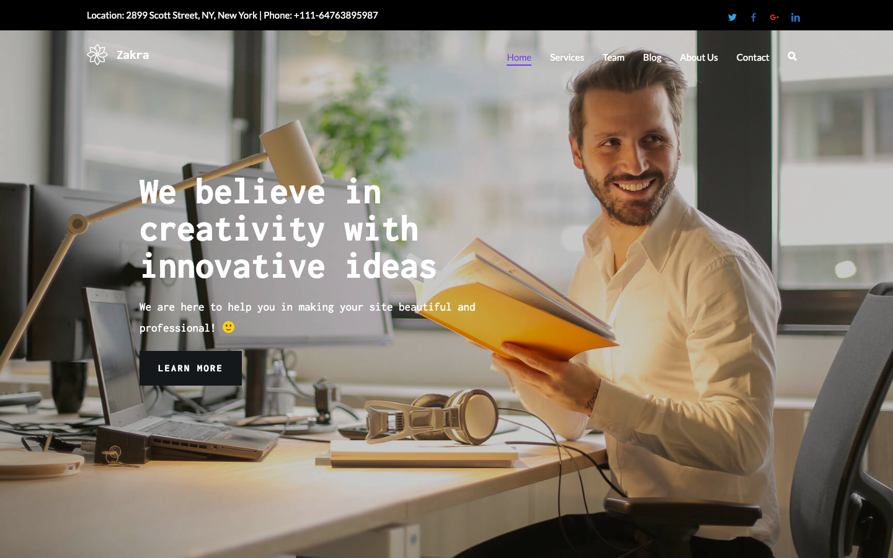
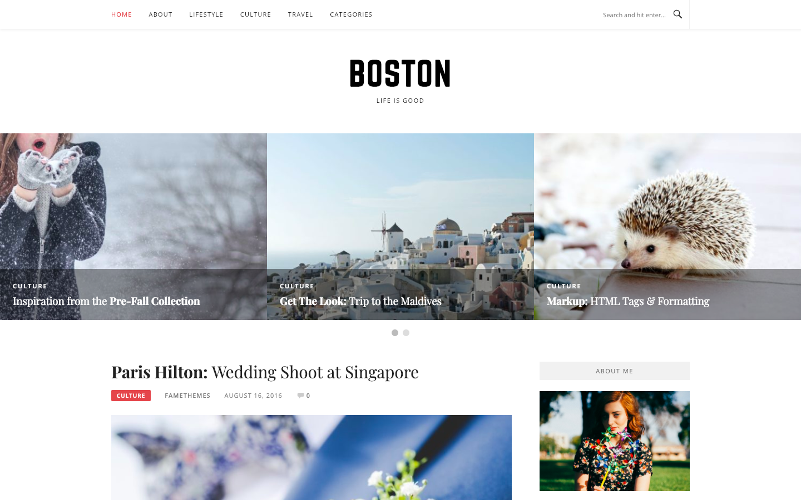
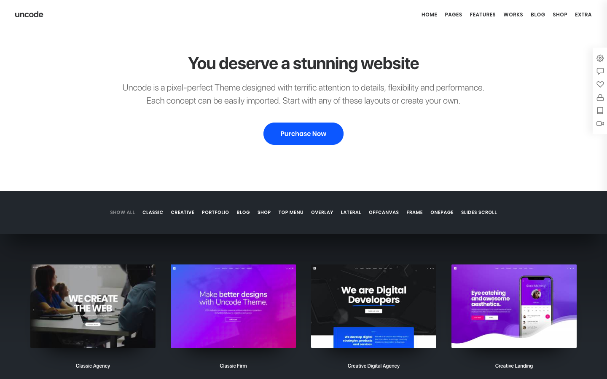
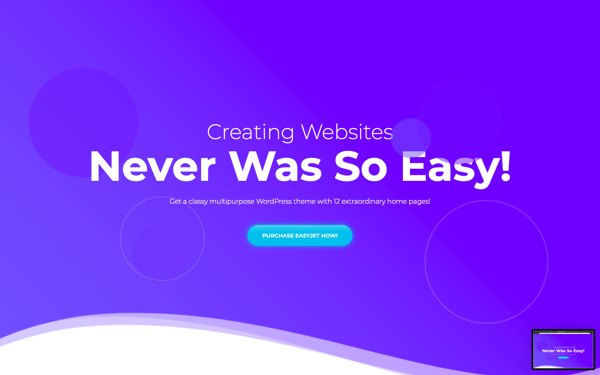

Są sytuacje gdy nie mamy możliwości stworzenia dedykowanej strony internetowej (np. budżet lub czas nam na to nie pozwala). Wtedy dobrym wyjściem z sytuacji będzie użycie czegoś gotowego, a jako że sam ostatnio mam sporo styczności z motywami przeznaczonymi dla WordPressa, które wpisują się w tę grupę, to właśnie o nich chciałbym Ci dziś opowiedzieć.

Przygotowałem listę 5 darmowych propozycji oraz tyle samo płatnych, z których najprzyjemniej mi się korzystało. Niektóre z nich są stricte przystosowane dla blogów, inne z kolei pozwalają na tworzenie wizytówek lub standardowych stron internetowych.

## Motywy darmowe:

### [1. Zakra](https://themegrill.com/themes/zakra/)

Motyw, o którym można powiedzieć, że naprawdę wyróżnia na tle darmowych konkurentów. Posiada bardzo przyjemny import wersji demo, których jest kilka, a całość można edytować za pomocą page buildera. Czego chcieć więcej w darmowej templatce?

### [2. Boston](https://www.famethemes.com/themes/boston/)

Osoby, które pamiętają odległe czasy (no dobrze, nie takie odległe), kiedy istniało coś takiego jak `robertorlinski.pl` może przypomną sobie, że właśnie ten motyw towarzyszył mi przez praktycznie cały tamten czas.

Całość jest bardzo prosta i nastawiona typowo na blogi, nie zrobimy cudów jeśli chodzi o elementy naszej strony, ale całość jest na tyle estetyczna i przyjemna w użytkowaniu, że z czystym sumieniem mogę o nim powiedzieć.

### [3. Talon](https://demo.athemes.com/talon/)

Bardzo ładny motyw. Niestety nie tak przyjemny w edycji jak pierwszy przykład, ale i tak wyróżnia się na tle innych konkurentów.

### [4. Monstroid 2 Lite](https://www.templatemonster.com/pl/free-templates/monstroid2-lite-responsive-business-wordpress-theme-59560.html)

Bardzo estetyczny i dość popularny motyw stworzony głównie dla blogów oraz prostych stron wizytówek. Będzie świetnym wyborem jeśli nie zależy nam na dużych możliwościach personalizacji.

Swoją drogą warto zaznaczyć, że produkt ten jest dostępny też na oficjalnej stronie WordPressa - to nam oszczędzi przechodzenia przez cały proces wymaganej rejestracji podczas pobierania.

### [5. Meridian One](https://meridianthemes.net/themes/meridian-one/)

Prosty motyw, bo będący tak naprawdę landing pagem z opcją importu demo oraz edycją dostępnycgh elementów za pomocą panelu personalizacji w WordPressie. Tylko tyle i aż tyle. :)

## Motywy płatne:

### [1. Norebro](https://norebro.colabr.io/)

Chyba mój ulubiony. Posiada naprawdę sporą liczbę przykładowych (i rozbudowanych) stron demo oraz pozwala tworzyć najróżniejsze strony za pomocą dostępnych opcji. A poza tym jest po prostu bardzo ładny. :)

### [2. Bridge](http://bridgelanding.qodeinteractive.com/)

Specyficzny motyw, który z jednej strony nie jest idealny w kwestii personalizacji (przynajmniej z mojego doświadczenia), ale za to posiada ogromną liczbę demo możliwych do zaimportowania. Przez to bardzo dobrze się sprawdzi jeśli po prostu wykupimy go dla nieograniczonej liczby witryn.

### [3. Uncode](https://undsgn.com/uncode/)

Niestety naturą płatnych motywów WordPressa przeznaczonych do ogólnego zastosowania jest ich mocne podobieństwo i tak jest w tym przypadku. Tak jak poprzednie, tak ten pozwala nam na tworzenie bardzo ładnych stron z wykorzystaniem edytora wizualnego i (jeśli tylko chcemy) na podstawie gotowych szablonów demo.

### [4. EasyJet](https://www.templatemonster.com/pl/szablony-wordpress-65626.html)

Troszkę droższy od konkurencji, ale może się podobać - szczególnie, że każdy z dostępnych szablonów znacząco się od siebie różni. Dodatkowo do użytku mamy Elementora znanego z innych motywów rozbudowanego o wtyczkę JetElements.

### [5. Art](http://www.uiueux.com/wp/art-entry/)

Chyba najładniejszy motyw z jakim miałem styczność, troszkę tańszy od magicznej granicy 59$, w której trzyma się 90% jego konkurentów. Ma tylko jedną wadę (przynajmniej wg mnie), czyli edytor wizualny, który może trochę odstawać.

## Podsumowanie

I tak oto dotrwaliśmy do końca. Mam nadzieję, że któryś z tych motywów okaże się dla Ciebie przydatny lub zajrzysz tu ponownie gdy będziesz poszukiwać czegoś dla swojego projektu.

Chociaż od siebie i tam zawsze mogę życzyć jak najwięcej okazji do tworzenia czegoś od podstaw 😌
