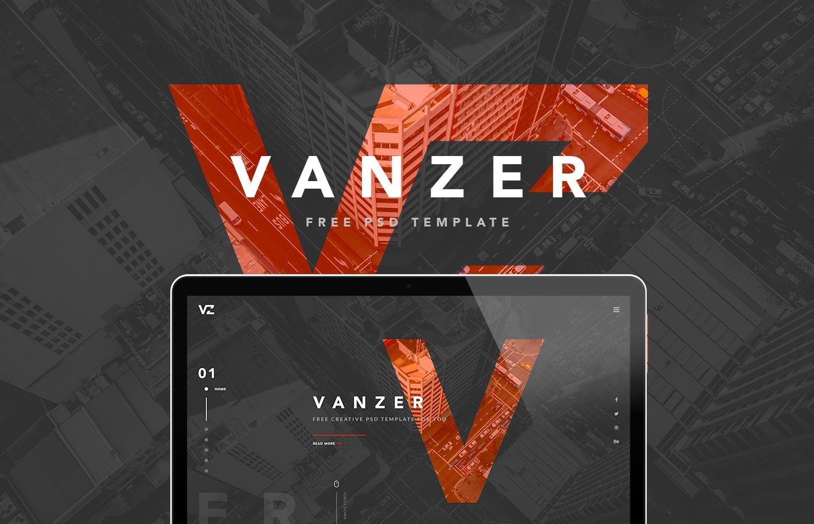
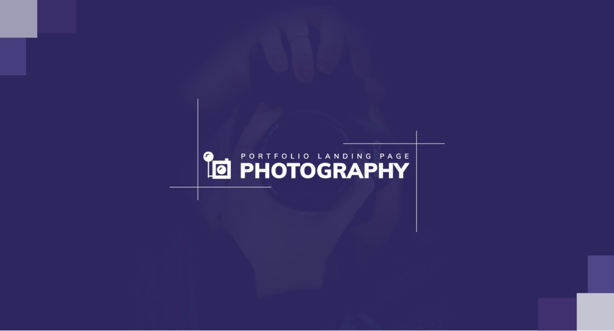
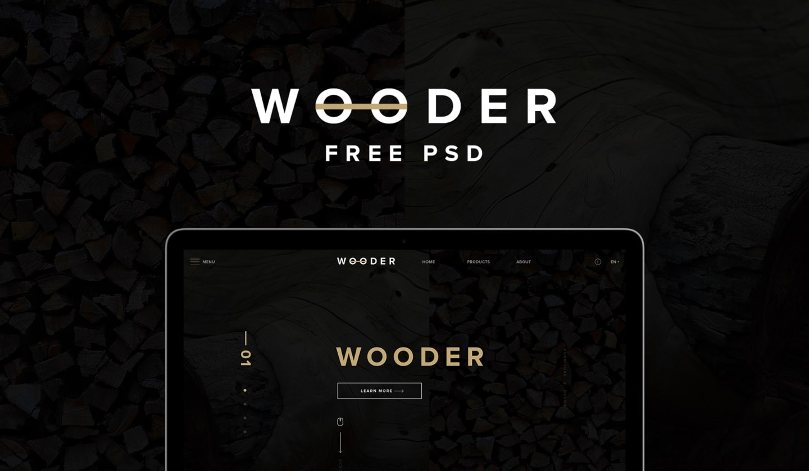
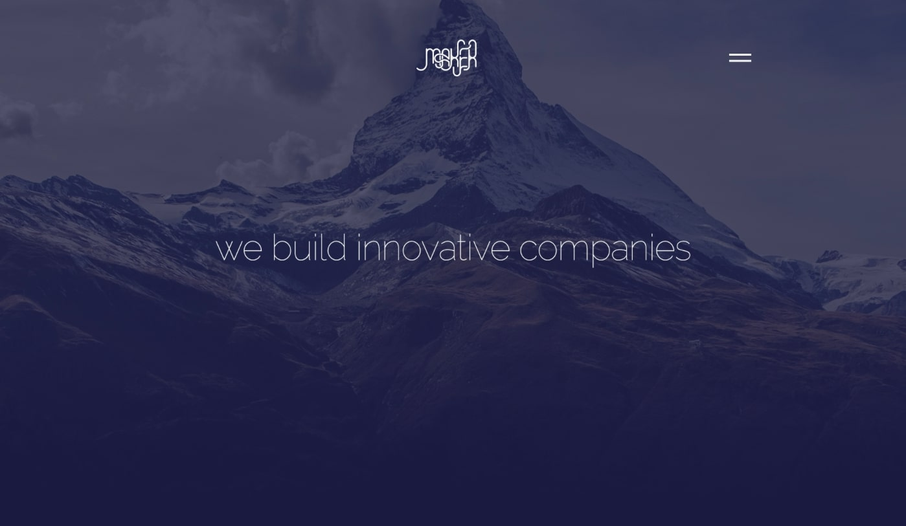
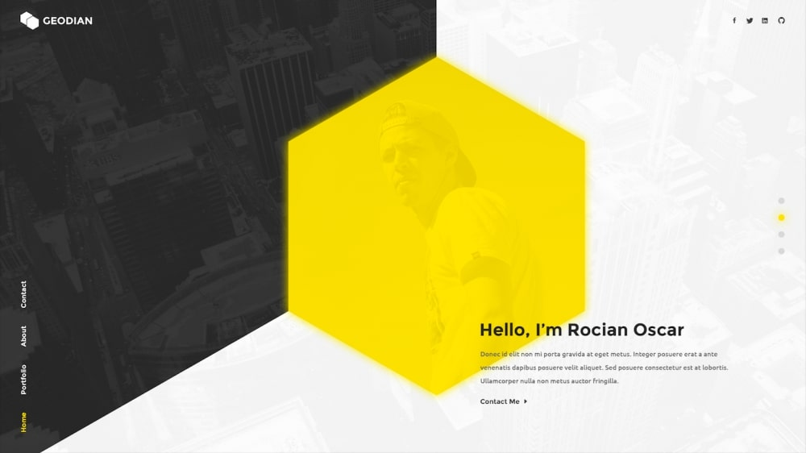
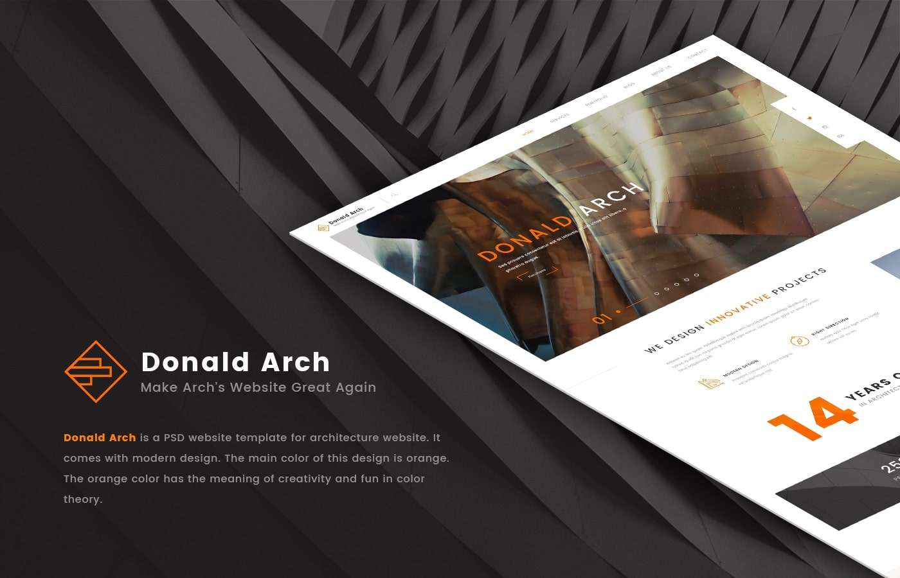
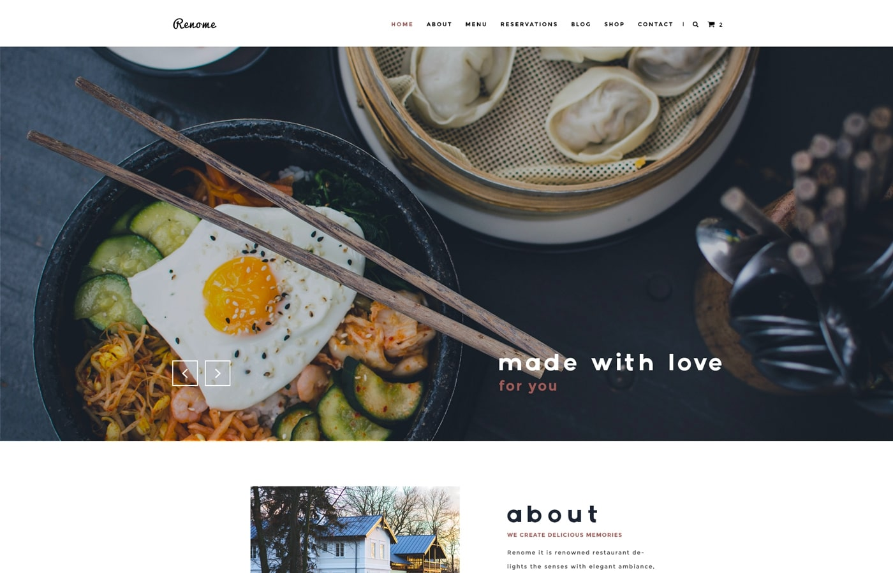
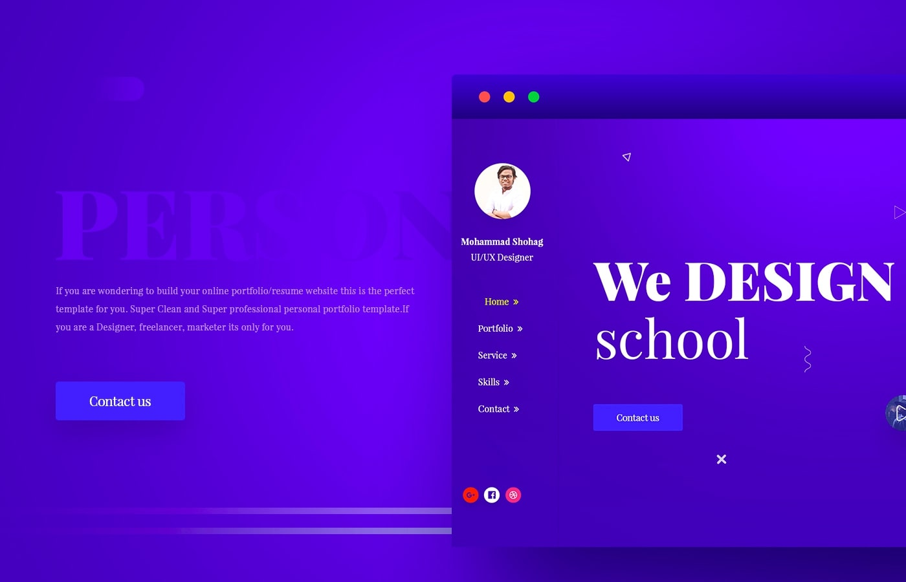
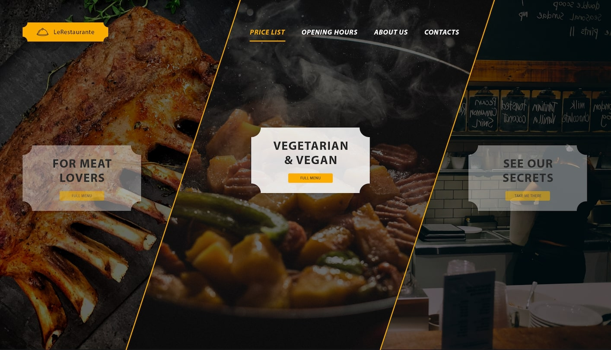
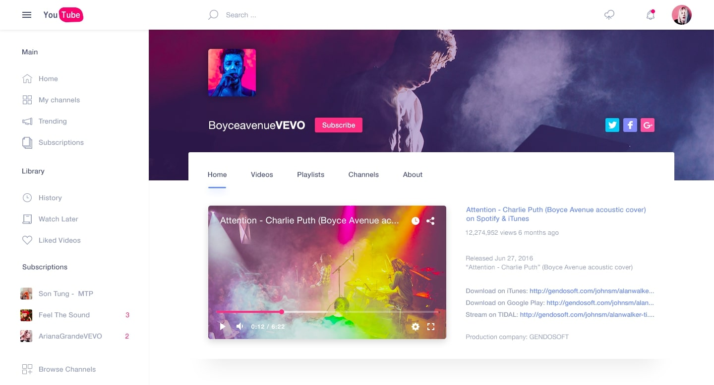

Chyba każda osoba, która kiedykolwiek chciała tworzyć strony internetowe zadała sobie jedno bardzo ważne pytanie: W jaki sposób mam się tego nauczyć? Często mogła otrzymać według mnie najlepszą odpowiedź: przez tworzenie własnych projektów.

Ale co robić gdy nie mamy pomysłu na żadną witrynę, ani tym bardziej nie chcemy jej wymyślać? W takiej sytuacji z pomocą przychodzą nam pliki z gotowymi projektami stron, zwanymi szablonami PSD!

W tym wpisie chcę pokazać Ci 10 świetnych oraz co ważne darmowych przykładów, gotowych do pobrania i zakodowania! Zapraszam!

## Numer 1: Vanzer

Link do szablonu: [Vanzer](https://www.behance.net/gallery/40103953/Vanzer-FREE-PSD-Portfolio-Website).

Pierwszy szablon powstał z myślą o agencjach reklamowych, studiach kreatywnych itd. Posiada nowoczesny design, który bardzo dobrze łączy się z tak zwanym efektem one page scroll.

## Numer 2: Photography

Link do szablonu: [Photography](https://www.behance.net/gallery/55757599/PHOTOGRAPHY-Free-PSD-Template).

Kolejny projekt to portfolio fotografa. Posiada kilka standardowych sekcji oraz dość ciekawy wygląd.

## Numer 3: Wooder

Link do szablonu: [Wooder](https://www.behance.net/gallery/33742162/WOODER-Free-PSD-Template).

Następny szablon został stworzony z myślą o firmie (w tym przypadku sprzedającej meble). Wyróżnia się bardzo ładnym (przynajmniej wg. mnie ?) wyglądem.

## Numer 4: Maker

Link do szablonu: [Maker](https://dribbble.com/shots/2622341-Maker-Free-PSD-Landing).

Kolejny, bardzo ciekawy projekt, który dodatkowo jest świetną okazją do poćwiczenia efektu parallax na tamtejszych elementach.

## Numer 5: Geodian

Link do szablonu: [Geodian](https://www.behance.net/gallery/47690649/Geodian-Free-Portfolio-Resume-Website-Template).

Kolejny plik PSD, w którym na pewno nie zabraknie nieszablonowych elementów.

import NewsletterInterlude from 'NewsletterInterlude';

<NewsletterInterlude />

## Numer 6: Donald Arch

Link do szablonu: [Donald Arch](https://www.behance.net/gallery/41404151/Donald-Arch-Make-Architect-Website-Great-Again).

Kolejny projekt powstał z myślą o firmie związanej z architekturą i również cała strona została zachowana w takiej konwencji.

## Numer 7: Renome

Link do szablonu: [Renome](https://www.behance.net/gallery/35481315/Renome-Free-PSD-Restaurant-Template).

Bardzo ładny szablon, który może się świetnie sprawdzić nie tylko jako strona restauracji. Dodatkowo posiada sporo elementów, dla których można zastosować ciekawe animacje.

## Numer 8: Free Template

Link do szablonu: [Free Template](https://www.behance.net/gallery/55350071/Free-Template)

Ten projekt niestety nie posiada własnej nazwy, ale nie przeszkadza mu to w byciu bardzo ciekawą propozycją do zakodowania!

## Numer 9: Restaurant Landing Page]

Link do szablonu: [Restaurant Landing Page](http://www.uipixels.com/restaurant-landing-page-psd/).

Bardzo mała strona, ale jednocześnie zawierająca dużo nieoczywistych elementów.

## Numer 10: YouTube Redesign

Link do szablonu: [YouTube Redesign](http://www.uipixels.com/youtube-redesign-free-psd/).

Ostatni szablon pozwoli nam na zakodowanie znanego wszystkim serwisu YouTube w odświeżonym stylu.

## Podsumowanie.

I tak oto dotrwaliśmy do końca tego zestawienia. Jak widać w razie braku pomysłów zawsze możemy liczyć na pomoc Internetu!
