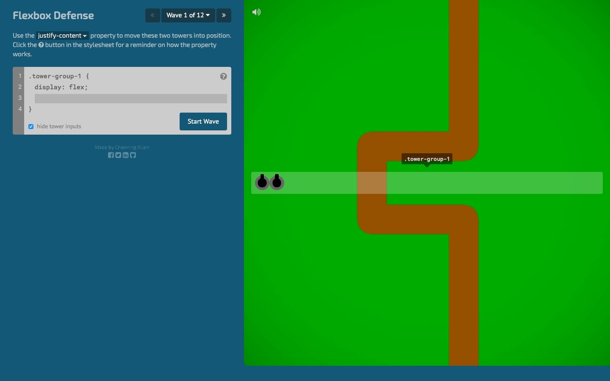
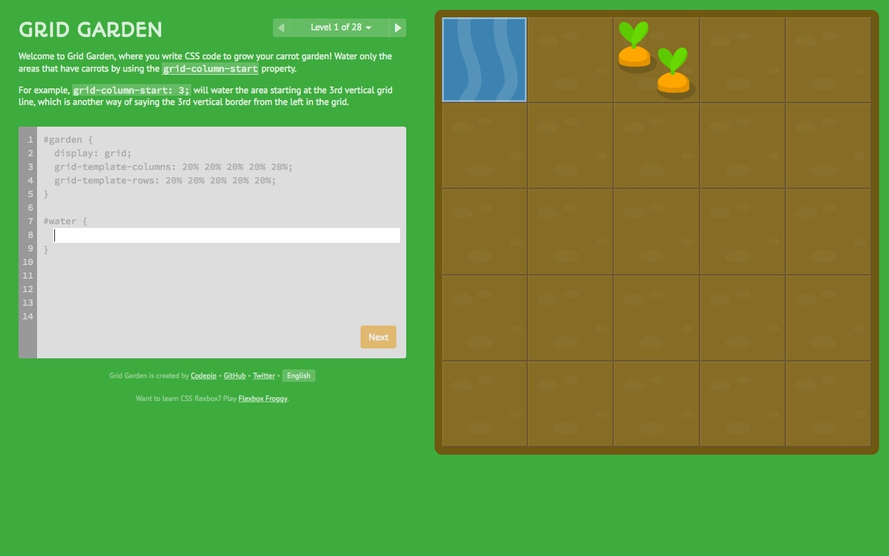
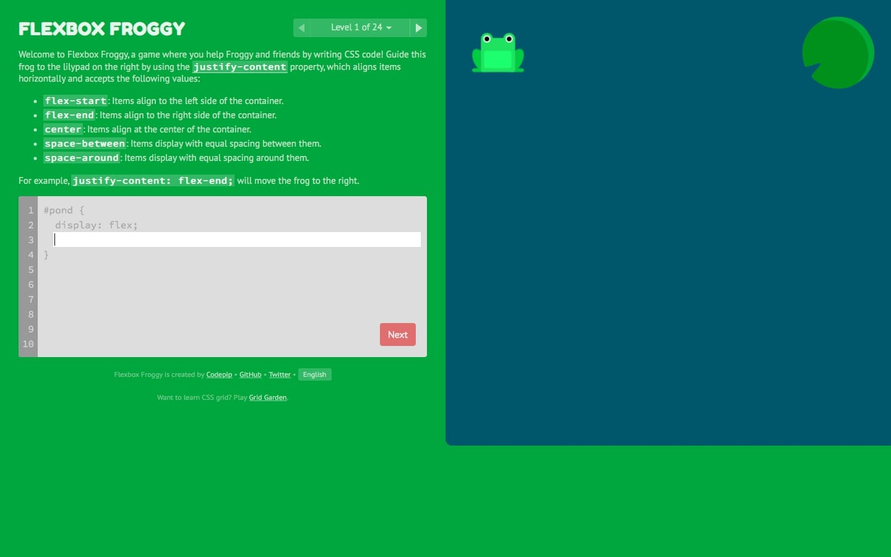
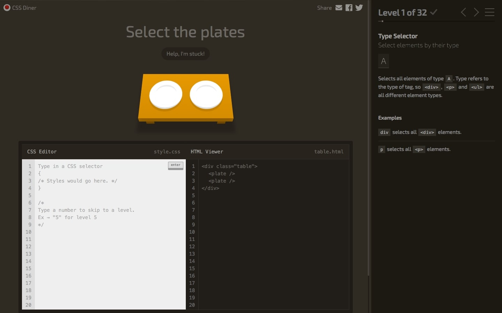
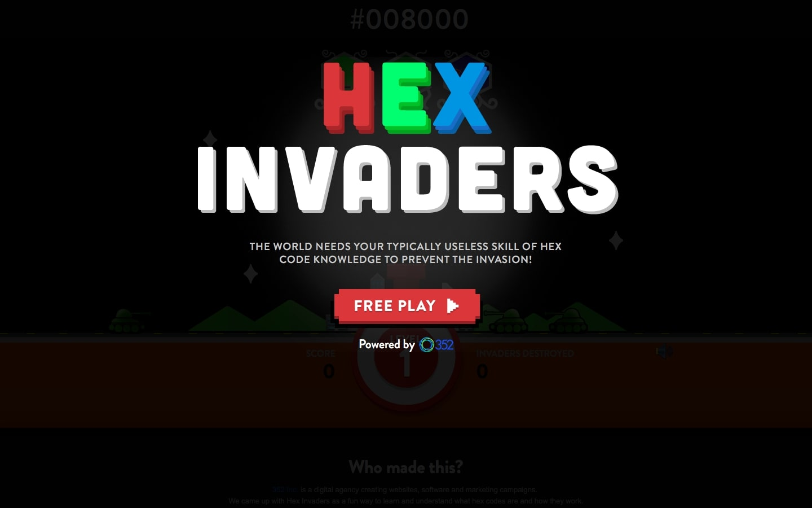
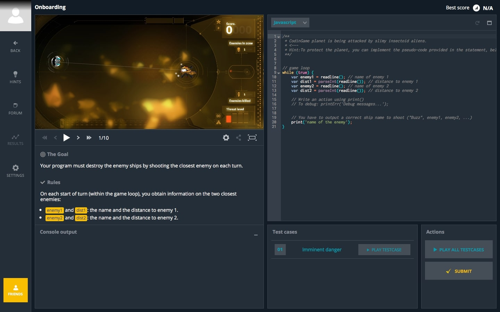
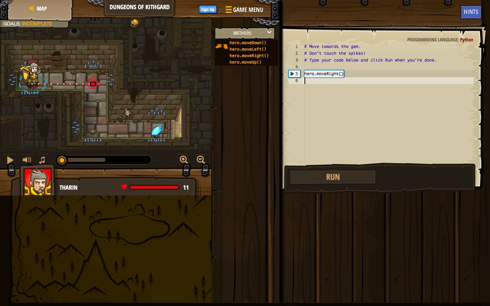
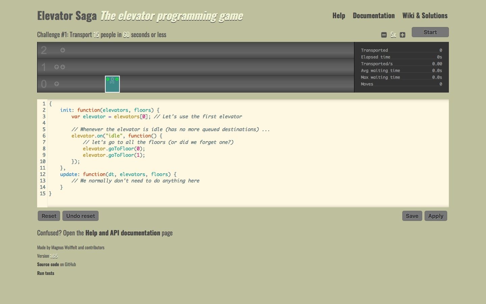
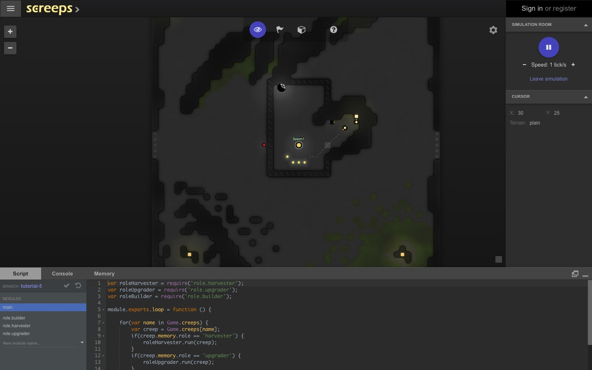
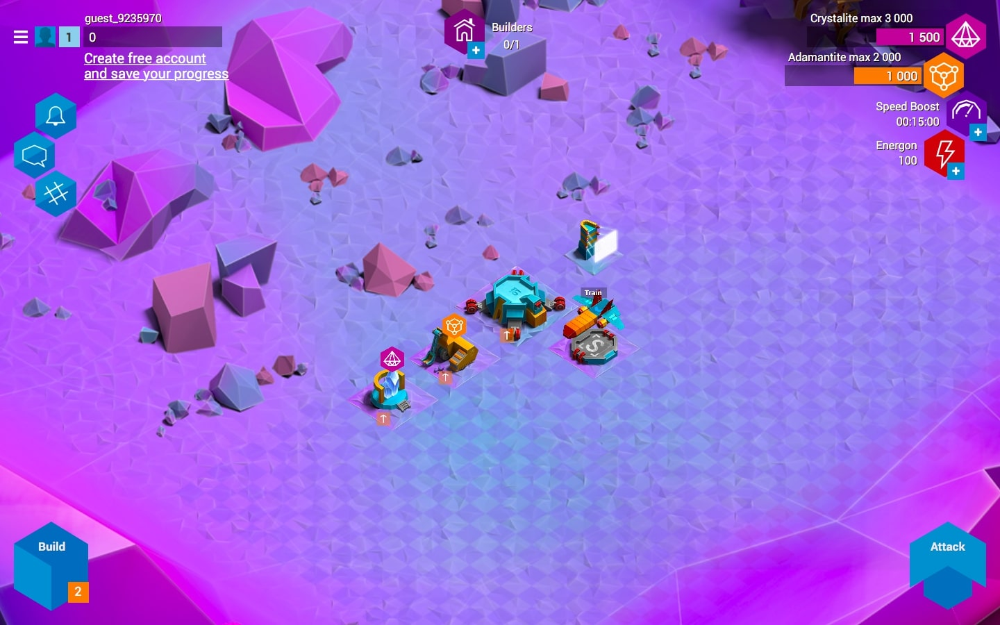

Kodowania możemy uczyć się na wiele różnych sposobów. Najpopularniejsze z nich to kursy, książki i przede wszystkim własne projekty, ale dziś chciałbym pomówić o czymś innym, czego można nie doceniać. Chodzi o gry, które możemy przechodzić za pomocą linii kodu wpisywanych z klawiatury i podczas tego uczyć się samego programowania!

W tym artykule przedstawiam Ci 10 przykładów związanych z tworzeniem stron internetowych. 5 z nich uczy CSSa, a kolejne JavaScriptu. Zapraszam do lektury!

## Gry, z których nauczysz się CSSa

### Numer 1: [Flexbox Defense](http://www.flexboxdefense.com)

Gdy byłem młodszy uwielbiałem gdy z gatunku tower defence, dlatego Flexboxa uczyłem się właśnie w ten sposób.

Stworzył ją Channing Allen i podzielona została na 12 etapów, w których uczymy się właściwości CSSa i oczywiście nie pozwalamy przejść dalej przeciwnikom.

### Numer 2: [Grid Garden](http://cssgridgarden.com)

Kolejna propozycja związana jest ze sposobem pozycjonowania elementów, który ostatnio zyskał bardzo dużą popularność, a mowa tu o CSS Grid.

W tym przypadku do przejścia mamy aż 28 etapów, które pozwolą nam solidnie przepracować ten temat.

### Numer 3: [Flexbox Froggy](http://flexboxfroggy.com)

Kolejna gra związana z Flexboxem i dodatkowo stworzona przez tego samego autora, co numer 2. Do dyspozycji mamy 24 poziomy, które przechodzimy przesuwając żaby na liście lilii wodnych za pomocą właściwości oferowanych nam przez arkusze stylów.

### Numer 4: [CSS Diner](http://flukeout.github.io)

Bardzo ciekawa gra, podzielona na 32 części, w której uczymy się używania selektorów w CSSie, jednocześnie tworząc posiłek.

### Numer 5: [Hex Invaders](http://www.hexinvaders.com)

Ostatnia pozycja nie jest bezpośrednio związana z CSSem. Naszym zadaniem jest zniszczenie jednego z trzech kosmitów (wydaje mi się, że tak wyglądają ?).

Skąd możemy wiedzieć, którego atakować? Na górze ekranu widzimy kod szesnastkowy odpowiadający barwie przeciwnika, w którego musimy celować.

import NewsletterInterlude from 'NewsletterInterlude';

<NewsletterInterlude />

## Gry, z których nauczysz się JavaScriptu

### Numer 1: [CodinGame](https://www.codingame.com)

Pierwszą propozycję stanowi naprawdę pokaźny zbiór gier pozwalających nam na naukę wszystkich najpopularniejszych języków programowania, w tym oczywiście JavaScriptu.

### Numer 2: [CodeCombat](https://codecombat.com)

Chyba najpopularniejsza gra do nauki programowania. Wszystko sprowadza się do RPGa, którego oczywiście przechodzimy pisząc coraz to nowe linie kodu.

Podobnie jak jej poprzednik pozwala nam wybrać jeden z wielu popularnych języków programowania.

### Numer 3: [Elevator Saga](http://play.elevatorsaga.com)

W kolejnym przykładzie tworzymy optymalny algorytm, który przejmie sterowanie nad windą i pozwoli jak najszybciej dostać się poszczególnym osobom do ich celu.

### Numer 4: [Screeps](https://screeps.com)

Ciekawe połączenie gatunków takich jak MMO oraz Sandbox i oczywiście kodu JavaScript, pozwalającego nam sterować kolonią, która to zajmie się eksploracją świata oraz walką z przeciwnikami.

### Numer 5: [Empire of Code](https://empireofcode.com)

Już ostatnia gra pozwala nam na naukę JavaScriptu oraz Pythona. Jest to strategia, w której tworzymy i rozwijamy własną cywilizację na obcej planecie, oczywiście wszystko za pomocą kodu.

## Podsumowanie

Jak możemy zauważyć nauka programowania nie musi skupiać się tylko na standardowych kursach, książkach i "klasycznych" źródłach wiedzy. W momencie gdy te metody okażą się nużące możemy sięgnąć do jednej z wymienionych gier, która na pewno urozmaici nasz proces zdobywania wiedzy!
