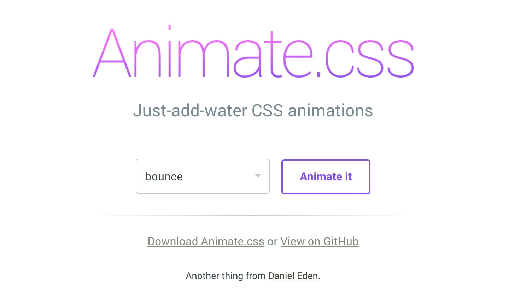
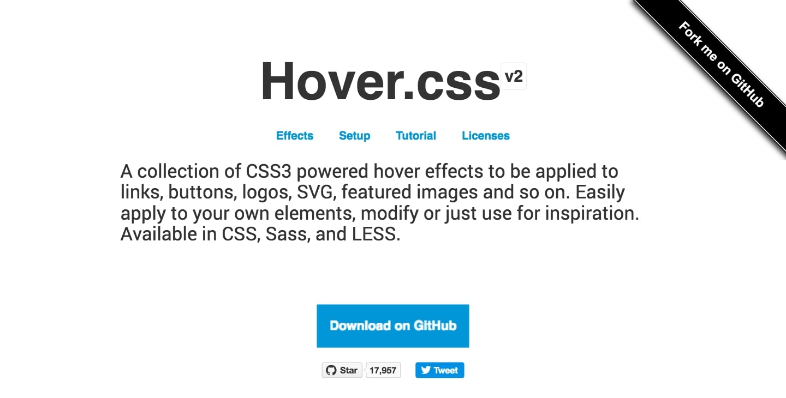
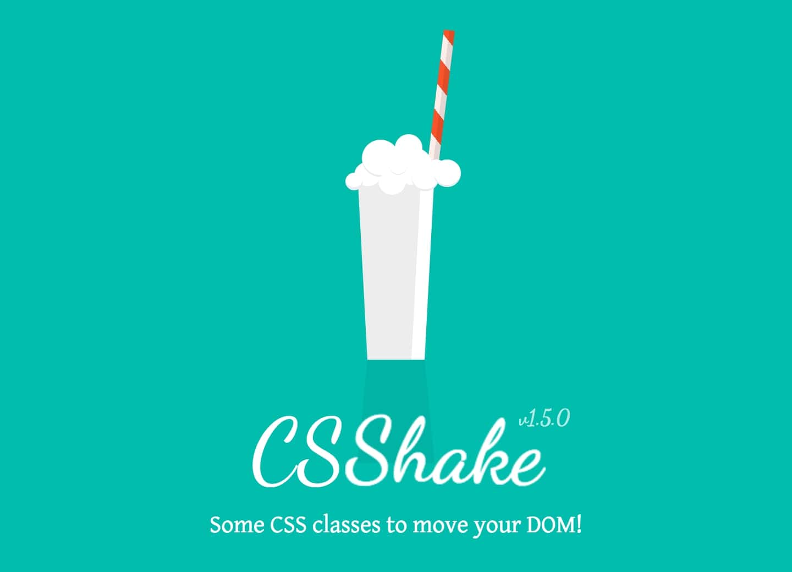
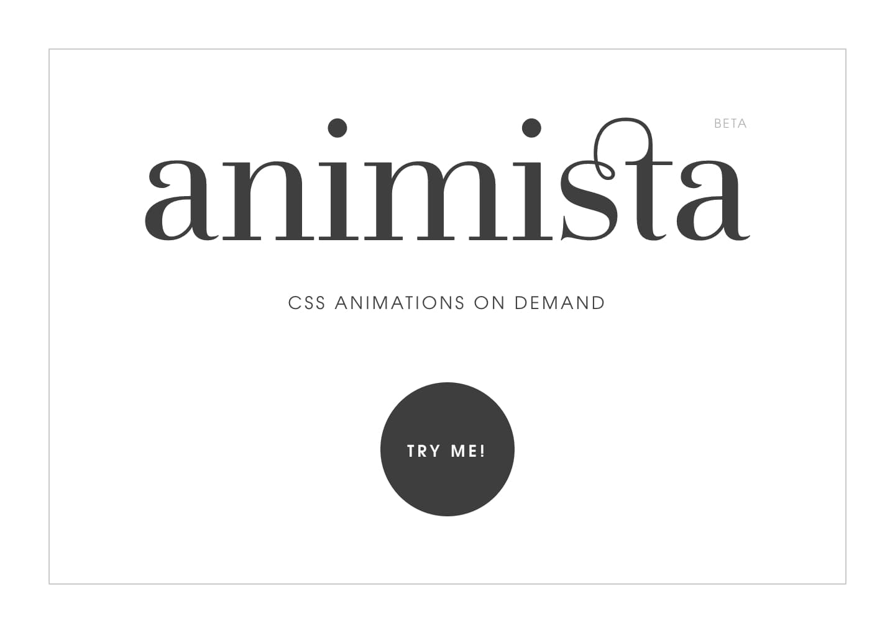
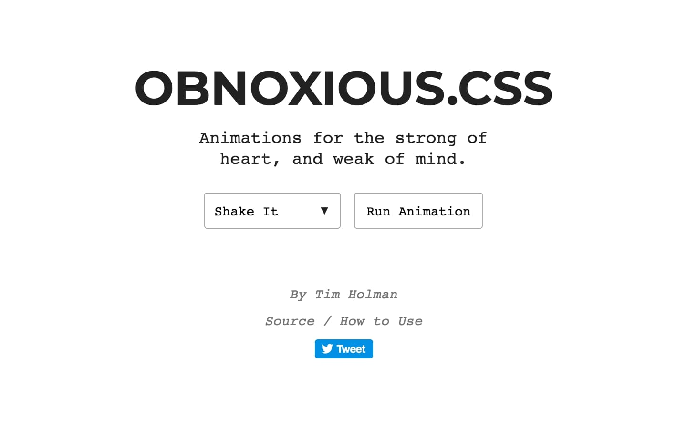
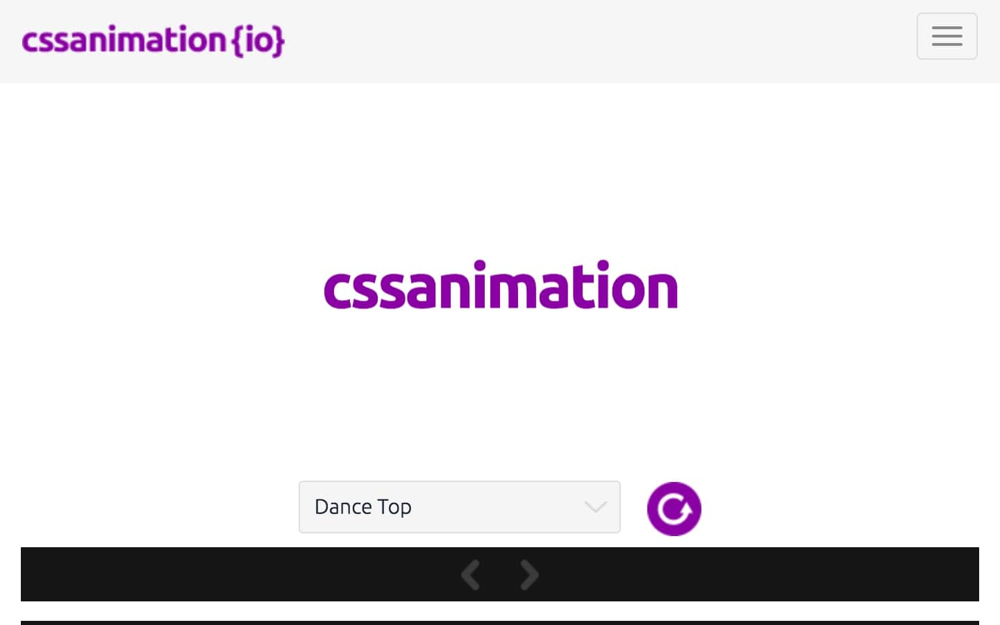
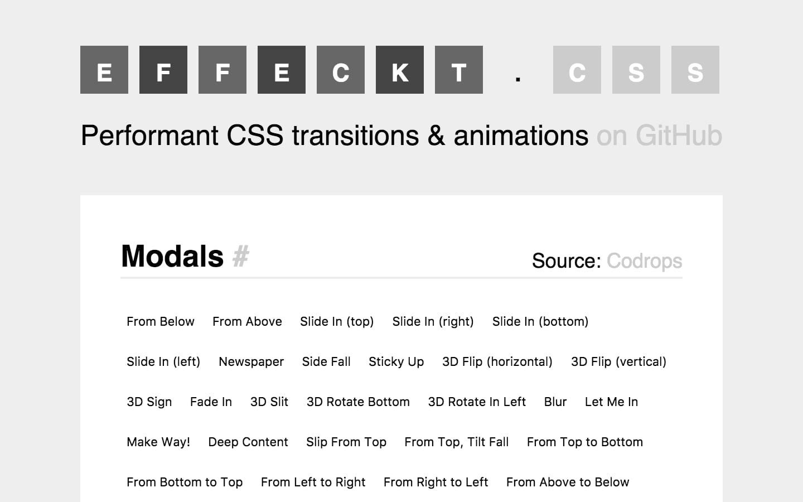
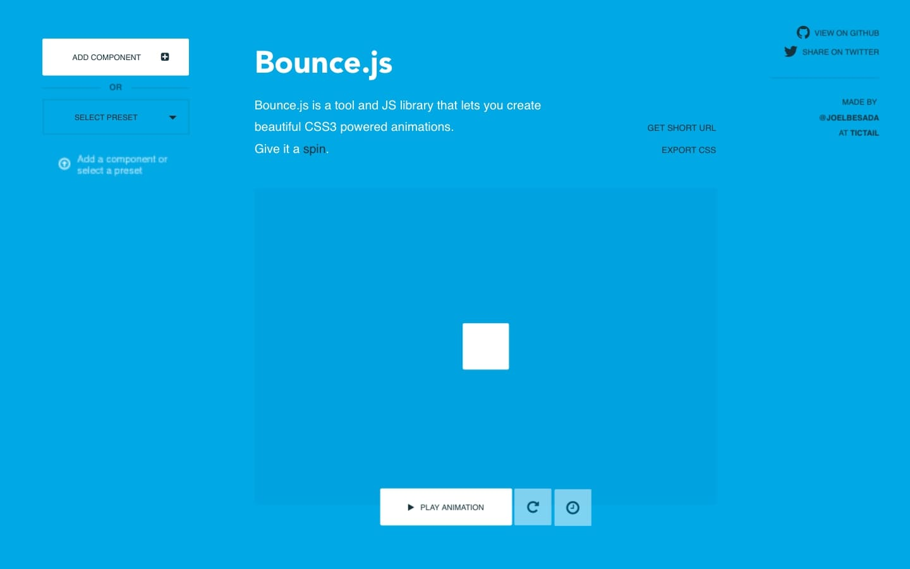
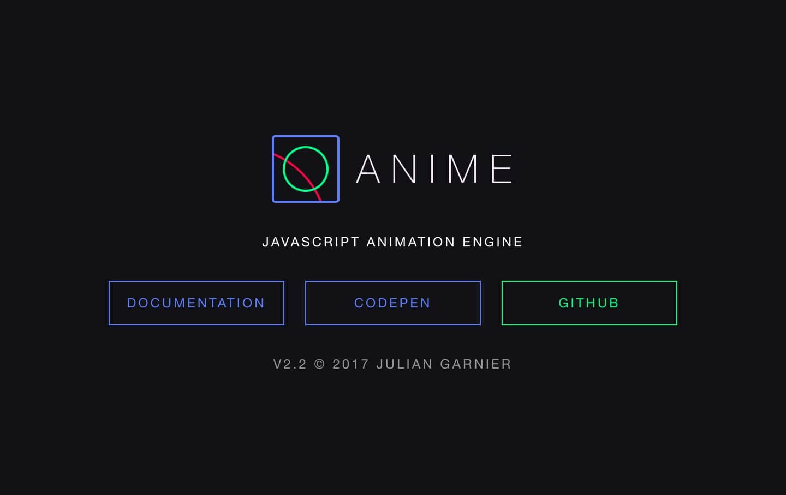

Nie da się ukryć, że jeśli nie przesadzimy z animacjami, to okazują się bardzo ciekawym elementem, który sprawia, że nasze witryny nabierają życia i stają się znacznie bardziej interaktywne.

Tylko, że nieraz stworzenie ciekawej animacji może wymagać sporej ilości pracy w stosunku do otrzymanego rezultatu i właśnie w tym przypadku z pomocą przychodzą nam biblioteki, zawierające stworzone już efekty, gotowe do wklejenia na stronę internetową!

Dziś chciałbym pokazać Ci 10 takich bibliotek. Niektóre z nich wymagają samego CSSa, inne, bardziej zaawansowane do działania potrzebują JavaScriptu, ale to co ich łączy, to to, że wszystkie zawierają ciekawe animacje, które urozmaicą nasze witryny! Zapraszam do lektury!

## Biblioteki wymagające samego CSSa

### 1. [Animate.css](https://daneden.github.io/animate.css/)

Tej biblioteki chyba nie trzeba nikomu przedstawiać. W bardzo przystępny sposób udostępnia wszystkie najpopularniejsze animacje, które zwykle powodują “pojawianie się treści” na stronach internetowych.

### 2. [Hover.css](http://ianlunn.github.io/Hover/)

Dość prosta, ale jednocześnie udostępniająca sporo możliwości biblioteka, która pozwala nam na dodawanie efektów*,* które uaktywniają się po najechaniu na element myszką. Dzięki niej możemy zarządzać tłem elementu, pokreśleniem, ikonami, cieniem i wieloma innymi atrybutami.

### 3. [CSShake](https://elrumordelaluz.github.io/csshake/)

Prosta i jednocześnie bardzo przyjemna biblioteka, która pozwala nam na “potrząsanie” elementami. Posiada 11 wersji animacji, gdzie w przypadku każdej z nich blok na stronie internetowej zachowuje się trochę inaczej.

### 4. [Animista](http://animista.net/)

Ciekawa biblioteka, udostępniająca nam dość pokaźny zbiór efektów, które dodatkowo można edytować. Po wybraniu animacji jesteśmy w stanie sprawdzić kod potrzebny do jej wykonania na stronie, a poza tym możemy wybrać kilka przykładów, klikając przy każdym ikonę serduszka i pobrać cały pakiet.

### 5. [Obnoxious.css](http://tholman.com/obnoxious/)

Najmniejsza z przytoczonych dziś bibliotek, z racji tego, że zawiera tylko 5 efektów, ale za to jakich! Każdy z nich jest tak świetny, że po prostu nie mogłem jej pominąć. :) ## Animacje wymagające CSSa oraz JavaScriptu.

### 1. [CSSAnimation](https://cssanimation.io)

Jedna z większych bibliotek do tworzenia animacji, posiadająca znacznie więcej efektów od jej poprzedników. Niekiedy do jej działania potrzebujemy samego CSSa, ale w przypadku bardziej rozbudowanych efektów musimy dodać trochę JavaScriptu, aby dana animacja się wykonała.

### 2. [Effeckt.css](https://h5bp.github.io/Effeckt.css/)

W tym przypadku nie mamy do czynienia ze standardową biblioteką, a ich zbiorem. Całość łączy się dając nam sporą ilość efektów, które od zaraz możemy użyć na naszych stronach internetowych!

### 3. [Bounce.js](http://bouncejs.com)

Bardzo ciekawa biblioteka, która pozwala nam na tworzenie animacji od zera za pomocą komponentów, które określają ich zachowanie, czas animacji oraz kilka innych parametrów.

### 4. [Dynamics.js](http://dynamicsjs.com)

Biblioteka ta pozwala nam tworzenie nowych efektów, jednocześnie skupiając uwagę na fizyce konkretnego bloku. Dzięki temu możemy manipulować każdym z etapów wykonywania się naszej animacji.

### 5. [Anime.js](http://animejs.com)

Ostatnia z wymienionych dziś bibliotek. Zawiera mnóstwo świetnych i nieraz bardziej skomplikowanych efektów, które od zaraz możemy wkleić na nasze strony internetowe.

## Podsumowanie

I tak oto prezentuje się 10 przykładów, które mogą przydać się podczas tworzenia najróżniejszych animacji na stronach internetowych. Mam nadzieję, że udało Ci się znaleźć coś dla siebie!
