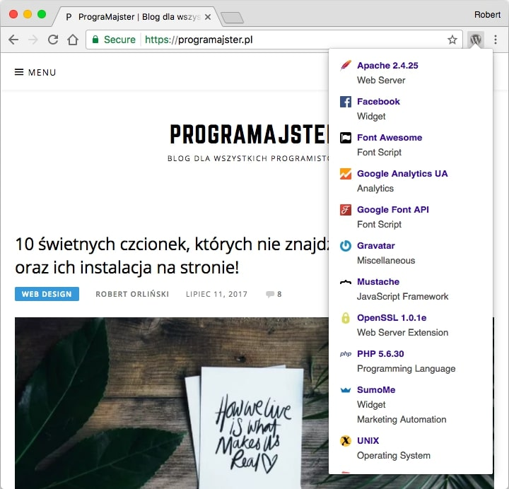
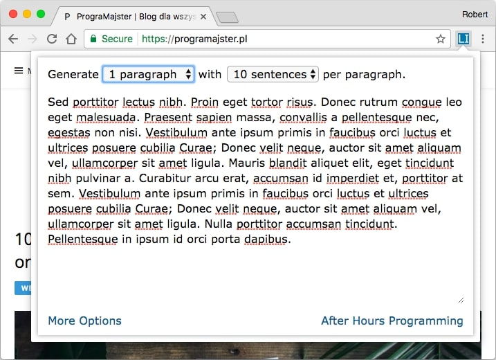
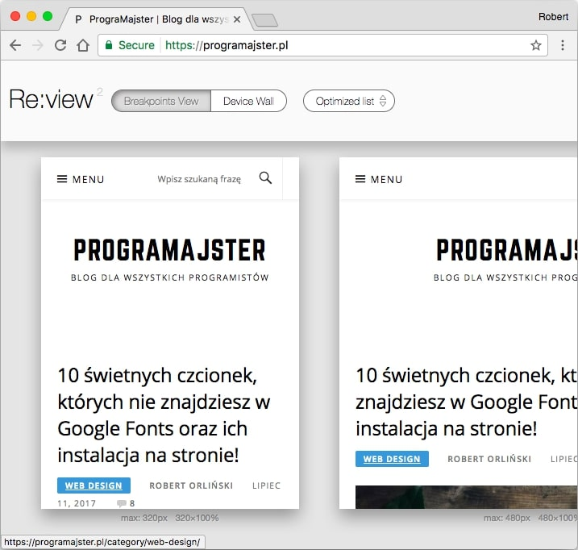
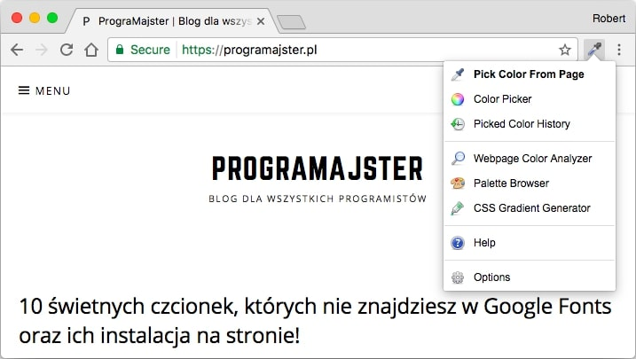
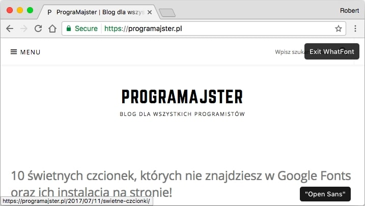
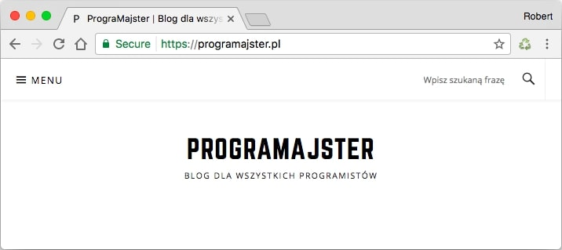
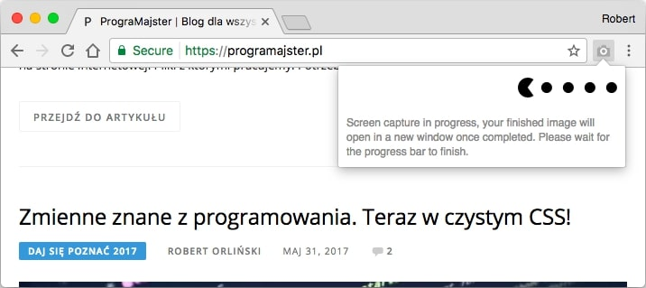
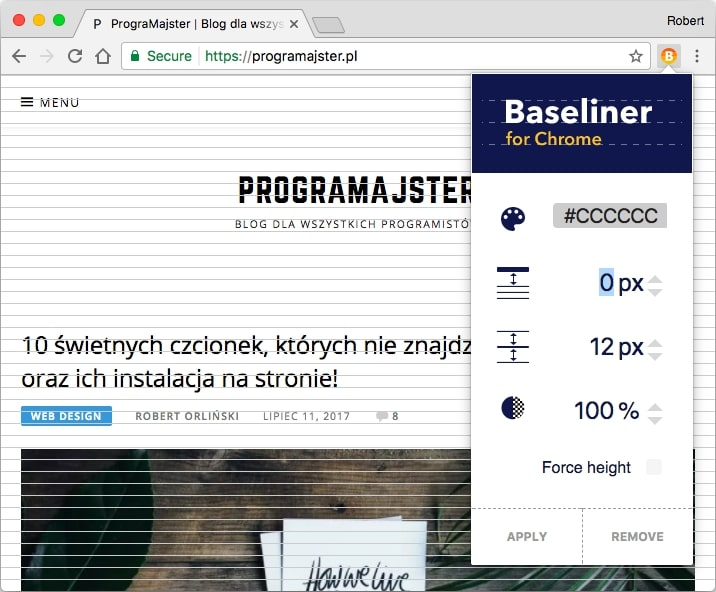
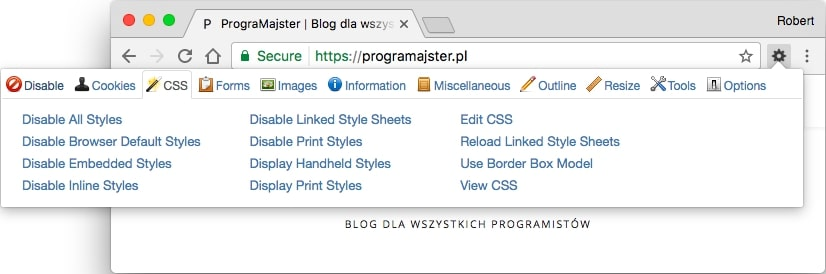
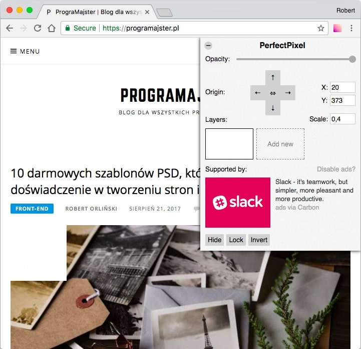

Google Chrome jest obecnie najpopularniejszą przeglądarką na świecie (wg różnych źródeł posiada ponad połowę rynku). Co za tym idzie, to właśnie na nią powstaje najwięcej dodatków, które potrafią znacznie rozbudować jej funkcjonalności oraz sprawić, że będzie nam się lepiej korzystało z Internetu.

Właśnie. Przy korzystaniu z Internetu warto się zatrzymać, bo w końcu jako web developerzy i web designerzy nie tylko go używamy ale też tworzymy i właśnie w tym mogą nam pomóc dodatki wymienione w tym oto artykule!

Przedstawiam 10 ciekawych rozszerzeń, które mogą pomóc Ci w tworzeniu stron internetowych oraz sprawić, że Twoja praca stanie się przyjemniejsza. Zapraszam!

## Numer 1: Wappalyzer

Link do pluginu: [Wappalyzer](https://chrome.google.com/webstore/detail/wappalyzer/gppongmhjkpfnbhagpmjfkannfbllamg)

Listę otwiera świetny dodatek, który pokazuje technologie używane w przeglądanej przez nas witrynie.

Wystarczy zainstalować nasze rozszerzenie, wejść na stronę, którą chcemy prześwietlić oraz kliknąć na ikonkę dodatku, tak jak na powyższym zrzucie. Naszym oczom ukaże się lista zawierająca wszystko to, co zostało użyte w witrynie. Od systemu CMS, przez biblioteki, aż po typ serwera, na którym jest nasz serwis.

## Numer 2: Lorem Ipsum Generator

Link do pluginu: [Lorem Ipsum Generator](https://chrome.google.com/webstore/detail/lorem-ipsum-generator-def/mcdcbjjoakogbcopinefncmkcamnfkdb?hl=en%20)

Kolejne, tym razem znacznie prostsze rozszerzenie pozwala na szybkie kopiowanie przykładowego tekstu, tzw. dummy contentu. Posiada trochę opcji, takich jak np. ilość akapitów, linii oraz automatyczne zaznaczanie.

## Numer 3: Emmet Re:view

Link do pluginu: [Emmet Re:view](https://chrome.google.com/webstore/detail/emmet-review/epejoicbhllgiimigokgjdoijnpaphdp?hl=pl)

Bardzo ciekawy dodatek stworzony do testowania responsywności stron internetowych.

Po jego uruchomieniu witryna znika i pokazuje się kilka okienek z poszczególnymi rozdzielczościami lub rozmiarami konkretnych urządzeń (możemy to wybrać za pomocą opcji na górze).

## Numer 4: CollorZilla

Link do pluginu: [CollorZilla](https://chrome.google.com/webstore/detail/colorzilla/bhlhnicpbhignbdhedgjhgdocnmhomnp?hl=en-GB)

Kolejny prosty dodatek, który tym razem służy do pobierania kolorów ze strony oraz wybierania nowych z palety barw. Dodatkowo pozwala na automatyczną analizę strony pod kątem znajdujących się na niej kolorów.

## Numer 5: WhatFont

Link do pluginu: [WhatFont](https://chrome.google.com/webstore/detail/whatfont/jabopobgcpjmedljpbcaablpmlmfcogm?hl=en-GB)

Ciekawy dodatek, który sprawdza fonty na stronie internetowej. Wystarczy najechać kursorem na jakikolwiek tekst, a obok pokaże się ciemny tooltip z nazwą fontu.

## Numer 6: Clear Cache

Link do pluginu: [Clear Cache](https://chrome.google.com/webstore/detail/clear-cache/cppjkneekbjaeellbfkmgnhonkkjfpdn)

Maksymalnie proste rozszerzenie, które pozwala na błyskawiczne wyczyszczenie pamięci cache przeglądarki. Wystarczy kliknąć w ikonkę naszego dodatku.

## Numer 7: Full Page Screen Capture

Link do pluginu: [Full Page Screen Capture](https://chrome.google.com/webstore/detail/full-page-screen-capture/fdpohaocaechififmbbbbbknoalclacl?hl=en-GB)

Kolejny dodatek tworzy nam zrzuty całych witryn. Wystarczy w niego kliknąć, a reszta zajdzie automatycznie - rozszerzenie stworzy nam trochę screenów, po czym połączy je w jeden plik.

Swoją drogą Google niedawno [wprowadził tę funkcję natywnie](https://developers.google.com/web/updates/2017/04/devtools-release-notes), ale jest tak ukryta, że często łatwiej będzie korzystać z tego dodatku :)

## Numer 8: Baseliner

Link do pluginu: [Baseliner](https://chrome.google.com/webstore/detail/baseliner/agoopbiflnjadjfbhimhlmcbgmdgldld?hl=en-GB)

Coś dla osób kochających pixel perfect. Dodatek Baseliner tworzy poziome linie, które mogą pomóc w tworzeniu układu naszej witryny. Dodatkowo można je edytować, za pomocą opcji widocznych na załączonym zrzucie.

## Numer 9: Web Developer

Link do pluginu: [Web Developer](https://chrome.google.com/webstore/detail/web-developer/bfbameneiokkgbdmiekhjnmfkcnldhhm)

Kolejny dodatek, który na pewno można określić jako najbardziej rozbudowany, ale [jednocześnie mający duże problemy z bezpieczeństwem](https://www.forbes.com/sites/leemathews/2017/08/03/over-a-million-coders-targeted-by-chrome-extension-hack/#14379c419c9d) (w ostatnim czasie).

Oczywiście mowa tu o Web Developer. Daje on nam możliwość pracy przy różnych elementach stron internetowych, wyłączania poszczególnych zasobów i wiele, wiele więcej.

## Numer 10: PerfectPixel (dodany 23.08.2017)

Link do pluginu: [PerfectPixel](https://chrome.google.com/webstore/detail/perfectpixel-by-welldonec/dkaagdgjmgdmbnecmcefdhjekcoceebi?hl=en)

Ostatnim rozszerzeniem jest zaproponowane przez [Olgę](http://sowaprogramuje.pl/) PerfectPixel. Pozwala nam bardzo prosto sprawdzać wygląd grafik na naszej stronie w sposób znany z programów graficznych.

## Podsumowanie

Jak widać narzędzia programistyczne, wbudowane w przeglądarkę nie stanowią dla nas ograniczenia. Jeśli nie są one dla Ciebie wystarczające lub dostatecznie wygodne, to mogą zostać rozszerzone o nowe dodatki, których jak widać jest mnóstwo!
