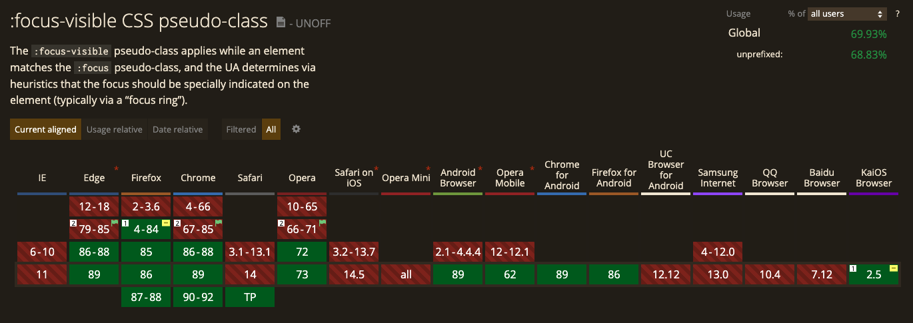

Dbanie o dostępność to zawsze dobry pomysł. Czasami tylko pojawia się z nią mały problem - ma tendencję do kłócenia się z wyglądem naszej witryny.

Tak jest, między innymi w przypadku pseudoklasy `:focus`, gdzie domyślnie, przeglądarki przypisują mu nie do końca ładną ramkę, która pojawia się od razu, po kliknięciu na jakikolwiek element interaktywny, jak i zaznaczenia go za pomocą tabulatora na klawiaturze.

Oczywiście, możemy ją wyłączyć, za pomocą prostego:

```css
el:focus {
  outline: none;
}
```

Tylko, że jest jeden problem takiego rozwiązania.

## Jest po prostu niedopuszczalne!

W takiej sytuacji, możliwość korzystania z naszej witryny przez ludzi posługujących się klawiaturą, jest po prostu niemożliwa.

A takich osób jest znacznie więcej, niż może się wydawać.

Dlatego nie możemy od tak wykluczyć części użytkowników, którzy chcą korzystać z naszego serwisu!

## W takim razie, co warto by było zrobić?

Mamy 2 opcje:

1. Zostawiamy nasz `focus`. W formie niezmienionej, lub stylujemy go tak, aby nie szpecił za mocno tworzonej strony internetowej, ale jednocześnie był dość dobrze widoczny.
2. Usuwamy go tylko dla użytkowników, którzy w danej chwili korzystają wyłącznie z myszki, touchpada lub ekranu dotykowego, a pokazujemy osobom korzystającym w danej chwili z klawiatury.

I o tej drugiej opcji dziś chciałbym z Tobą szerzej pomówić.

Bo otóż, mamy co najmniej 3 sposoby, aby usunąć `focus` tylko podczas klikania, a nie robić tego, przy obsłudze klawiaturą:

### Sposób pierwszy: `:focus-visible`

Istnieje, wymieniona w podtytule pseudoklasa `:focus-visible`, która idealnie rozwiązuje nasz problem.

Wystarczy, że dodamy do naszej strony taki oto kod CSS:

```css
el:focus {
  outline: none;
}

el:focus-visible {
  outline: 2px solid blue;
}
```

I focus zacznie być widoczny tylko po wywołaniu go za pomocą klawiatury.

Jedyna kwestia, która może nas powstrzymać od użycia tej pseudoklasy, to [wsparcie przeglądarek](https://caniuse.com/css-focus-visible), które wygląda coraz bardziej sensownie, ale cały czas pozostawia trochę do życzenia:

[]()

### Sposób drugi: focus-visible.json

Istnieje bardzo przyjemny polyfill ([link](https://github.com/WICG/focus-visible)), który możemy pobrać jako paczkę, o tak:

```bash
npm install --save focus-visible
```

...lub załadować, na przykład z CDNu:

```html
<script src="https://unpkg.com/focus-visible@latest/dist/focus-visible.min.js"></script>
```

Później wystarczy wyłączyć domyślnego focusa, w przypadku, w którym nasz polyfill się załaduje:

```css
.js-focus-visible :focus:not(.focus-visible) {
  outline: none;
}
```

I całość będzie działać! Przykład możesz zobaczyć (na bardzo wielu elementach) w [oficjalnym demo autora biblioteki.](https://wicg.github.io/focus-visible/demo/)

### Sposób trzeci: własny skrypt

I docieramy powoli do końca i jednocześnie do wg mnie, najlepszego rozwiązania z całej trójki.

Może nie będę tu wymyślać koła na nowo i posłużę się [bardzo dobrze działającym kodem](https://medium.com/hackernoon/removing-that-ugly-focus-ring-and-keeping-it-too-6c8727fefcd2), na który trafiłem, gdy kiedyś sam poszukiwałem rozwiązania opisywanego dziś problemu.

W pigułce, autor proponuje kod, składający się oczywiście z dwóch części, odrobiny CSSa (tu skróconego przeze mnie):

```css
*:focus {
  outline: none;
}

body.user-is-tabbing *:focus {
  outline: 2px solid #7aacfe;
}
```

...oraz oczywiście JavaScriptu:

```js
function handleFirstTab(e) {
  if (e.key === 'Tab') {
    document.body.classList.add('user-is-tabbing');
    window.removeEventListener('keydown', handleFirstTab);
  }
}

window.addEventListener('keydown', handleFirstTab);
```

Część CSSowa po prostu sprawia, że wszystkie elementy, zyskują widoczny focus, tylko wtedy, gdy element `body`, ma jednocześnie nadaną klasę `.user-is-tabbing`.

JavaScript z kolei, zarządza właśnie tą klasą, dodając ją, gdy użytkownik kliknie na klawiaturze klawisz o kodzie 9 (jak się pewnie domyślasz, jest to przycisk `tab`) i usuwając sam listener od razu po dodaniu klasy do naszego `body.`

W praktyce, strona sprawdza, przy każdym naciśnięciu klawisza na klawiaturze, czy jest to tabulator, jeśli tak, to dodaje klasę do `body`. Gdy już ją doda, po prostu przestaje sprawdzać, aby nie marnować zasobów komputera.

Oczywiście, jeśli zależy Ci na tym, aby dało się usunąć wygląd focusu, po powrocie do używania myszki, to możesz zmodyfikować powyższy skrypt, w taki sposób:

```js
function handleFirstTab(e) {
  if (e.key === 'Tab') {
    document.body.classList.add('user-is-tabbing');

    window.removeEventListener('keydown', handleFirstTab);
    window.addEventListener('mousedown', handleMouseDownOnce);
  }
}

function handleMouseDownOnce() {
  document.body.classList.remove('user-is-tabbing');

  window.removeEventListener('mousedown', handleMouseDownOnce);
  window.addEventListener('keydown', handleFirstTab);
}

window.addEventListener('keydown', handleFirstTab);
```

W tym przypadku przeglądarka, po naciśnięciu tabulatora, dodatkowo zaczyna sprawdzać, czy nie został wykonany klik myszką; jeśli taka sytuacja nastąpi, to klasa zostanie zabrana z `body`, a nasłuchiwanie klawiatury powróci do łask.

I tak w kółko.

Przy okazji, możesz spróbować zmienić powyższy skrypt, w taki sposób, że `outline` będzie domyślnie widoczny, kliknięcie myszką go usunie, a nawigowanie klawiaturą przywróci lub po prostu zostawi (gdy nie użyjemy w ogóle myszki). Ot, takie małe zadanie domowe :)

A dlaczego tak? Istnieje zawsze cień szansy, że ktoś wchodząc na naszą stronę, będzie chciał nawigować po niej klawiaturą, przy jednocześnie wyłączonym JavaScript\'cie. W takiej sytuacji, przyda mu się _focus_, włączony domyślnie, a nie taki, który pokazuje się dopiero po naciśnięciu tabulatora, przy jednoczesnym działaniu JSa.

## To co? Dotarliśmy do końca?

Chyba tak. Właśnie w ten sposób, prezentują się te 3 sposoby! Mam nadzieję, że dzięki temu artykułowi, łatwiej będzie Ci zająć się akurat tą kwestią, związaną z dostępnością.

I dzięki temu będziesz tworzyć jeszcze przyjemniejszy i przyjaźniejszy Internet. A to jest akurat dość miła sprawa.

A i przy okazji - jeśli wiesz, że coś warto byłoby dodać, nie krępuj się i daj znać o tym w komentarzu!
