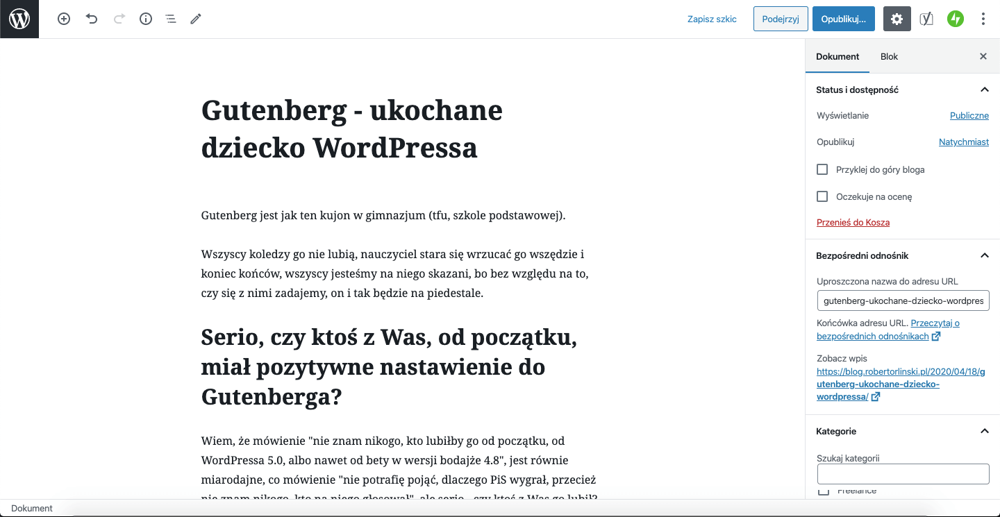
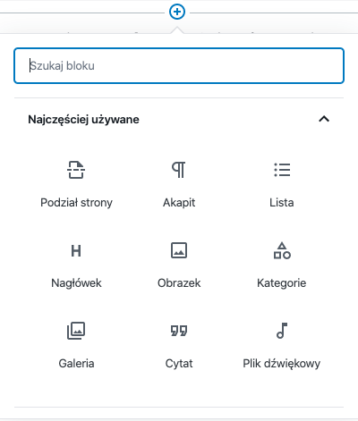

Gutenberg jest jak ten kujon w gimnazjum (tfu, szkole podstawowej).

Wszyscy koledzy go nie lubią, nauczyciel stara się wrzucać go wszędzie i koniec końców, wszyscy jesteśmy na niego skazani, bo bez względu na to, czy się z nimi zadajemy, on i tak będzie na piedestale.

## Serio, czy ktoś z Was, od początku, miał pozytywne nastawienie do Gutenberga?

Wiem, że mówienie nie znam nikogo, kto lubiłby go od początku, od WordPressa 5.0, albo nawet od bety w wersji bodajże 4.8, jest równie miarodajne, co mówienie nie potrafię pojąć, dlaczego PiS wygrał, przecież nie znam nikogo, kto na niego głosował, ale serio - czy ktoś z Was go lubił?

I to jest poważne pytanie, bo może tylko ja i moje otoczenie, mamy takie wrażenie i wobec tego, jesteśmy jakąś zamkniętą bańką, która żyje w oderwaniu od rzeczywistości.

Więc tak, jeśli Twoje zdanie, jest zupełnie inne, to zawsze zapraszam poniżej, do odezwania się w komentarzach.

Chociaż, jeśli jednak nie jestem tak baaardzo odosobniony, to mam wrażenie, że sam Gutenberg, dopiero w tej chwili zaczyna gościć, jako główny gracz na polu edycji treści, bo zaczęliśmy zdawać sobie sprawę, że zwyczajnie nie mamy wyboru - wyłączając go, przy okazji kolejnych serwisów, narażamy się tylko na coraz większy i bardziej nieubłagany, dług technologiczny - kiedyś, WordPress przestanie wspierać tak dobrze nam znany, klasyczny edytor.

I tak jak z tym dzieckiem - jeśli go nie poprosimy o pomoc, a będziemy zabiegać o nią, ze strony dzieciaków, które lubimy mocniej, narazimy się tylko na gorsze oceny.

I wobec tego, spróbujmy się choć trochę z nim zakolegować.

## Chociaż w sumie, przed tym, warto byłoby powiedzieć, czym dokładnie jest właśnie Gutenberg

Chodzi mi o nowy (wprawdzie ma już jakieś 1.5 roku, ale w skali tego, jakim staruchem jest już sam WordPress, to ten okres jest na tyle małym, że możemy Gutenberga określić jeszcze w ten sposób) edytor, który został wprowadzony już na stałe, razem z WordPressem 5.0 (trochę wcześniej, mogliśmy go doinstalować w postaci osobnej wtyczki).

W zamierzeniu, miał być (chyba można tak powiedzieć) wbudowanym edytorem wizualnym i powstał, jako coś pomiędzy właśnie czymś takim, a klasycznym edytorem, który był głównym sposobem, za pomocą którego mogliśmy edytować treści w WordPress, do wersji 4.9.

Pozwala nam, budować zawartość strony, wpisów i wszelkich typów postów właśnie w WordPressie, z przygotowanych lub zakodowanych przez nas bloków, takich jak:

- nagłówek;
- paragraf;
- cytat;
- obrazek;
- galeria;
- widgety;
- i wiele, wiele innych...

I tak oto, powstaje nasz content!

Okej, wiemy czym jest Gutenberg i to, że jesteśmy na niego najprawdopodobniej skazani. To co możemy zrobić z tą wiedzą?

## Na przykład, nauczyć się go!

W końcu, edytor ten, potrafi być naprawdę fajnym narzędziem, o czym regularnie się przekonuję, pracując w oparciu, właśnie o niego, na przestrzeni ostatnich miesięcy.

A do tego, warto wspomnieć, że korzysta z dobrodziejstw Reacta i Reduxa, którymi my również możemy się posługiwać, przy pracy z konkretnymi komponentami.

I biorąc to wszystko pod uwagę, nauka Gutenberga, jest koniec końców bardzo przyjemnym zadaniem!

## Dlatego, niech ten artykuł będzie zaproszeniem, do czegoś w rodzaju nowej serii

W końcu czemu nie.

W najbliższym czasie, powstanie zapewne trochę artykułów, w których przejdziemy przez tworzenie własnych bloków Gutenberga i wg tej wiedzy, zrealizujemy coś fajnego.

To tak, do następnego artykułu! Takiego, w którym napiszemy troszkę kodu i sprawimy, że nasz edytor, będzie mógł zrobić, po prostu więcej.
