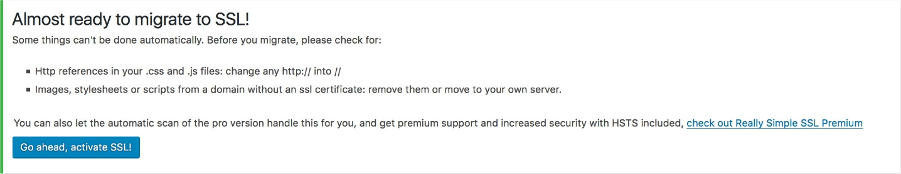
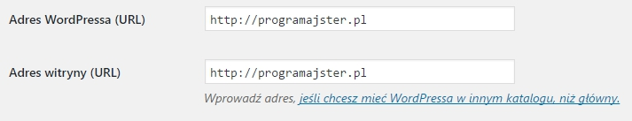
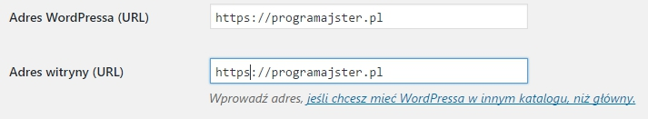
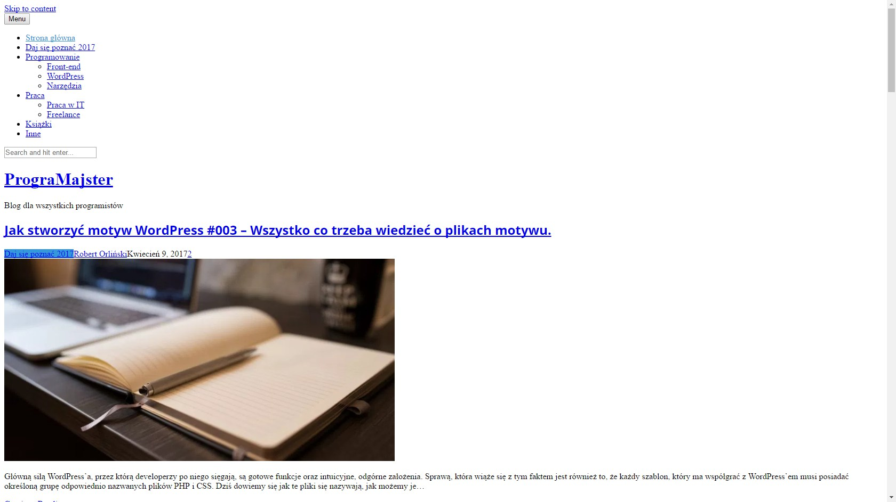

Ostatnio mogliście zauważyć, że adres tego bloga uległ zmianie. Przed dwukropkiem pojawiła się literka s, co świadczy o zabezpieczeniu protokołu HTTP przez certyfikat SSL. Właśnie o tym, a dokładnie o protokole SSL, który za tym stoi chcę dziś opowiedzieć!

Jeśli sprzedajesz na stronie internetowej, prowadzisz forum, serwis społecznościowy lub po prostu chcesz zabezpieczyć informacje przechodzące przez Twoją witrynę, to ten artykuł jest właśnie dla Ciebie.

Dowiesz się czym jest certyfikat SSL, w jakim celu się go stosuje, jak dodać go do swojej witryny postawionej na WordPressie oraz co zrobić w razie problemu z tzw. mixed content.

## Czym jest certyfikat SSL?

SSL to z angielskiego Secure Socket Layer. Jest niezwykle popularnym sposobem zabezpieczania danych płynących między użytkownikiem, a serwerem, za sprawą swojej niezawodności, jak i prostoty działania oraz instalacji.

Dane przesyłane za pomocą protokołu HTTPS są szyfrowane oraz integralne (nie da się ich zmienić podczas transferu, lub jeśli taka zmiana zaistnieje, zostanie wykryta automatycznie).

## Dlaczego zawsze warto posiadać certyfikat SSL?

Oczywiście największą zaletą jest bezpieczeństwo, z którą to związane jest mnóstwo innych plusów. Jakich? Już wymieniam:

1. Pozytywny wpływ na pozycjonowanie strony.
2. Ochrona przed phishingiem (podszywaniem się pod naszą witrynę).
3. Wspomniana niezawodność oraz integralność danych.
4. Większe zaufanie ze strony użytkowników i tym samym większy ruch oraz sprzedaż (w przypadku sklepów internetowych).
5. Certyfikat SSL bardzo często jest dołączany za darmo do pakietu hostingowego.

## Jak dodać go do strony na WordPressie?

Przede wszystkim potrzebujemy certyfikat zainstalowany na naszym hostingu. Często wygląda to w ten sposób, że przy kupnie pakietu otrzymujemy go za darmo i zostaje on zainstalowany na naszym serwerze. Niestety może się tak zdarzyć, że w naszym pakiecie go nie będzie, a wtedy musimy go dokupić i zainstalować samemu lub poprosić o to firmę hostingową.

Sposoby są 2. Jeden prostszy i znacznie lepszy, za pomocą wtyczki, drugi z kolei trochę bardziej problematyczny z racji, że po jego zastosowaniu może wystąpić problem tak zwanego mixed content, ale oczywiście nie wymagający instalacji żadnych dodatków. ### Sposób 1:

W panelu WordPressa wchodzimy w sekcję z wtyczkami i dodajemy nową. Wyszukujemy pluginu o nazwie [Really simple SSL](https://pl.wordpress.org/plugins/really-simple-ssl/). Włączamy dodatek, po czym przechodzimy do strony z wszystkimi wtyczkami. Tam widzimy taką oto ramkę:



Klikamy w przycisk Go ahead, activate SSL!. Zostajemy przeniesieni do panelu logowania (jest to spowodowane tym, że wcześniej byliśmy zalogowani przez protokół HTTP). Logujemy się tak jak zawsze i od tej chwili możemy cieszyć się pomyślnie podłączonym certyfikatem!

### Sposób 2:

Znów musimy znaleźć się w kokpicie WordPressa, ale tym razem nasza droga wygląda trochę inaczej.

Przechodzimy do ustawień ogólnych i wyszukujemy sekcję dotyczącą adresu naszej witryny. Dokładnie chodzi nam o te pola:



Oczywiście zamiast robertorlinski.pl znajdzie się tam coś innego :)

Cała sztuka polega na tym, aby do tych dwóch adresów dopisać literkę s w taki oto sposób:



Zapisujemy ustawienia przyciskiem na dole, po czym certyfikat zaczyna działać.

## Na mojej stronie nie ładują się pliki CSS, skrypty lub zdjęcia. Co zrobić?

Jeśli wchodzisz na swoją witrynę i widzisz coś w tym stylu:



...to znak, że na Twojej stronie występuje tzw. mixed content.

### Czym jest mixed content i dlaczego się pojawia?

Jest to sytuacja kiedy przeglądarka nie ładuje części zasobów znajdujących się na stronie internetowej, ponieważ uważa je za niebezpieczne. Występuje gdy style CSS, skrypty lub zdjęcia pobierane są z innych stron nie posiadających certyfikatu SSL.

Co ciekawe praktycznie nigdy nie pojawia się w przypadku instalacji protokołu HTTPS za pomocą pierwszej metody, dlatego zalecam dołączać SSL za pomocą wtyczki, która automatycznie zmienia liki do zasobów w taki sposób, że nie są uważane za niebezpieczne.

### W jaki sposób temu zaradzić?

Sposobów jest kilka, niestety większość z nich wymaga ingerencji w kod strony:

#### Sposób 1:

Jedyny, w którym możemy obejść się bez zmiany kodu naszej witryny. Niestety nie zawsze działa.

Pobieramy wtyczkę [SSL Insecure Content Fixer](https://pl.wordpress.org/plugins/ssl-insecure-content-fixer/), instalujemy i od tego momentu strona powinna zacząć działać normalnie.

Jeśli jednak tak się nie stanie przechodzimy do wszystkich wtyczek, odnajdujemy wcześniej zainstalowany dodatek i pod nim widzimy napis Settings. Klikamy i przechodzimy do ustawień wtyczki. Tak zaznaczamy ostatni checkbox z podpisem Capture all. Jeśli to również nie zadziała przechodzimy do następnego sposobu.

#### Sposób 2:

Tu już niestety musimy zajrzeć do plików witryny. Zmieniamy linki z takich:

```bash
http://przykładowastrona.pl/style.css
```

...na takie:

```bash
//przykładowastrona.pl/style.css
```

#### Sposób 3:

Ostania opcja wymaga od nas stosunkowo dużego nakładu pracy. Chodzi o to, aby przenieść niebezpieczne zasoby na nasz serwer i podłączyć je lokalnie do witryny. Ten sposób musi zadziałać, ale znacznie łatwiej jest podłączyć certyfikat od nowa pierwszą metodą i się nie męczyć :)

## Podsumowanie.

Certyfikat SSL to na prawdę świetna sprawa, która przy stosunkowo niewielkim nakładzie prac podczas instalacji daje dobre efekty. Wystarczy użyć jednej wtyczki, aby móc cieszyć się znacznie większym bezpieczeństwem witryny oraz wyższą pozycją w wyszukiwarkach.

Jeśli masz jakiekolwiek pytania, rady lub o czymś zapomniałem, to zapraszam Cię do zostawienia komentarza lub napisania do mnie, a jeśli znasz kogoś dla kogo ten wpis mógłby okazać się pomocny, to będzie mi niezmiernie miło, gdy mu go podeślesz :)
