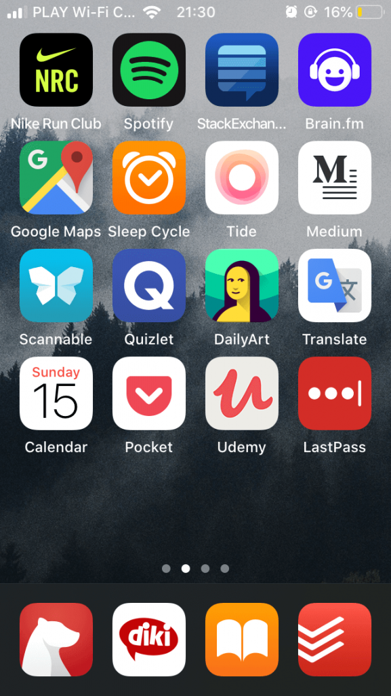
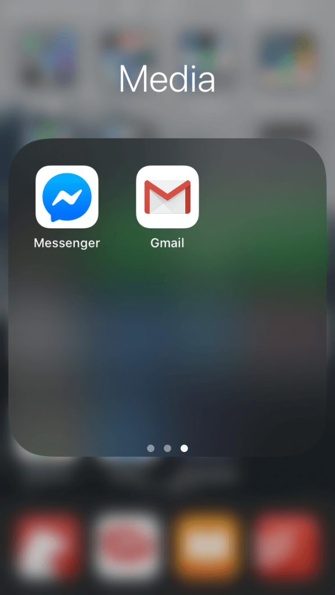
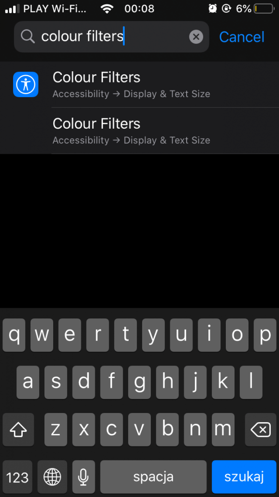
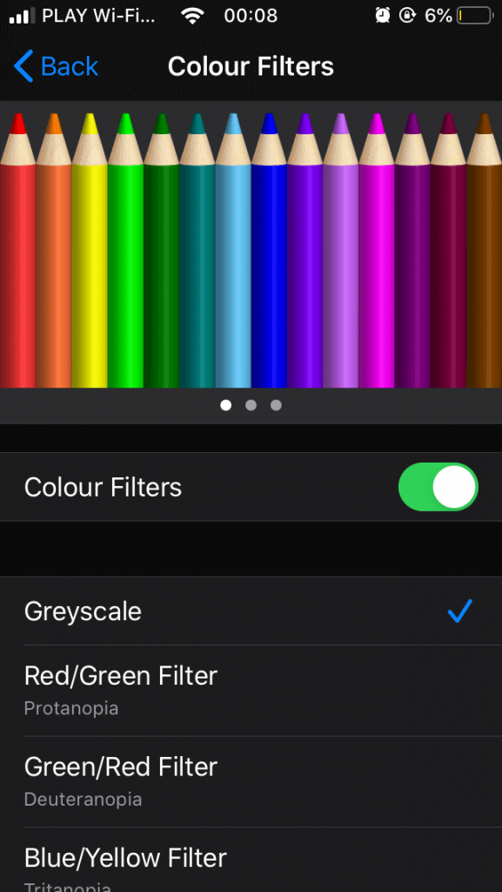

Każdy z nas, spędza pewną część swojego dnia, właśnie z telefonem w ręku. Czytamy, słuchamy, oglądamy, sprawdzamy, piszemy, dowiadujemy się, i wiele, wiele innych.

I jest to świetne, aktualnie chyba nie ma drugiego urządzenia, które pozwalałoby na więcej. Tylko za tym faktem idzie sobie jeden niepozorny problem.

## Telefon wyzwala dopaminę tak samo, jak narkotyk (tylko w mniejszych ilościach)

Co dzieje się, gdy usłyszysz dźwięk powiadomienia? Przez ułamek sekundy, po prostu się cieszysz. Twój ośrodek nagrody zostaje pobudzony, a Ty podświadomie czujesz, że pod tą notyfikacją kryje się coś dobrego; pomimo tego, że zupełnie nie musi tak być.

Oczywiście mija to równie szybko, jak przyszło. Wystarczy, że dowiesz się o co chodzi, i od razu, a nawet przed tym, cała euforia znika.

I ten prosty mechanizm, działa na nas jak narkotyk. Telefony, pod tym kątem nie różnią się niczym od kokainy, alkoholu, czy cukru.

Uzależniają w sumie tak samo.

## W takim razie, co możemy z tym faktem zrobić?

I tu dochodzimy do sedna. Gdybym miał powiedzieć, w jednym zdaniu, co można zrobić, aby spędzać mniej czasu z naszymi smartfonami w rękach, to brzmiałoby ono w ten sposób:

> Musimy sprawić, aby nasze telefony były, po pierwsze brzydsze, a po drugie, trudniejsze w obsłudze.

Nie jest wiedzą tajemną, że producenci oprogramowania (sam, jako programista, dokładam swoją cegiełkę do tego procederu), chcą trzymać nas jak najdłużej przy sobie.

Dlatego główkują się niemiłosiernie (głównie przy pomocy osób od UXu), aby zrobić swoje aplikacje ładniejszymi, przyjemniejszymi i sprawiającymi nam jak najwięcej przyjemności.

Dlatego, w opozycji, zadbajmy o to, aby przestały być takie miłe. Oto, co możesz zrobić:

### Krok 1: Usuń wszystkie aplikacje, które Cię rozpraszają

Nic odkrywczego, ale serio - bardzo często, nie potrzebujesz tego Facebooka na telefonie; nie potrzebujesz Twittera; nie potrzebujesz Instagrama; nie potrzebujesz żadnych social mediów, z których nie korzystasz, aby dodawać i tworzyć treści, a tylko je konsumujesz.

Jeśli masz na przykład Slacka na telefonie, to świetnym wyborem, będzie go odinstalować - nie dość, że nie będziesz poświęcać na niego czasu, to jeszcze lepiej odseparujesz się od pracy, w czasie z nią niezwiązanym.

I tak też jest z każdą aplikacją, z której jedyne co wynosisz, to oderwanie od ważniejszych spraw.

### Krok 2: Schowaj wszystkie, które lepiej byłoby mieć, ale i tak ograniczać czas spędzany na nich

Jak wygląda mój główny ekran w telefonie?

Dokładnie w ten sposób:

Jak widać, nie ma tu nic, na co można by tracić czas. Ale nie jest tak, że nie ma tego na telefonie! Na przykład, Messenger, siedzi u mnie na drugim ekranie, na trzeciej stronie losowego folderu:

Dzięki temu, mam do niego po prostu trudniejszy dostęp, a przez to, że nie jest pod nosem, wchodzę tam po prostu rzadziej. Tobie też polecam rozmieszczać aplikacje w ten sposób.

### Krok 3: Wyłącz (praktycznie) wszystkie powiadomienia

Krok, który odmienia życia. Serio.

Sam, powiadomienia mam włączone tylko dla:

- nadchodzących połączeń;
- kalendarza;
- przypomnień w aplikacji do zadań.

I nic więcej! Zero wiadomości, zero maili, zero SMSów, zero tzw. badge'y (kropeczek z liczbą powiadomień, na ikonach aplikacji), nic.

I co najważniejsze - takie działanie nie oznacza, że nie masz kontaktu ze światem. Wręcz przeciwnie; masz go jak najbardziej, ale dokładnie w takiej ilości i czasie, jak sam lub sama tego chcesz.

Przestajesz działać reaktywne, a zaczynasz proaktywnie, na to, co chce od Ciebie świat.

### Krok 4: Pomieszaj aplikacje i ustaw bardzo prostą tapetę

Nie będę udawać, że akurat ten krok, zmieni bardzo wiele, bo nie, ale jak najbardziej jest w stanie pomóc.

Jak tak poprzestawiasz sobie aplikacje, to potrzebujesz naprawdę sporo czasu, aby się do nich przyzwyczaić, a dzięki temu nie będziesz włączać ich automatycznie (co zaczyna się dziać zawsze, po pewnym czasie).

I jeszcze dodatkiem jest kwestia tapety - ustaw sobie najlepiej jeden kolor lub coś bardzo prostego. Dzięki temu to urządzenie, nie będzie po prostu tak atrakcyjne!

### Krok 5: Włącz filtr kolorów

Gdy już wszystko inne zawiedzie, to na ukojenie frustracji pozostaje ten jeden sposób. Dla największych freaków produktywności, lub najbardziej wkurzonych na siebie, przez to, ile czasu marnują (tak, zgłaszam się jako ten drugi).

W naszym telefonie, musimy znaleźć filtry kolorów. W przypadku iPhone’a wchodzimy w tym celu w ułatwienia dostępności lub po prostu wyszukujemy ustawienie związanego z filtrami kolorów:

I włączamy filtr monochromatyczny:

Tak, nie przewidziało Ci się - chodzi o to, aby ekran naszego telefonu, stał się po prostu czarno-biały. Nie widać tego oczywiście powyżej, bo to zrzut ekranu, ale jeśli powielisz moje kroki, to gwarantuję - zadziała.

Z takim ustawieniem, jestem w stanie Ci zagwarantować, że większość chęci do sprawdzania smartfona, po prostu minie.

A w przypadku Instagrama - na pewno miną wszystkie ?

## To co, odzyskasz trochę swojego czasu?

Jeśli tylko czujesz, że tracisz za dużo z dnia, na sprawdzanie telefonu, to niech wymienione 5 kroków, służy Ci tak, jak to tylko możliwe!

A jeśli chcesz coś dodać - sposób lub odrobinę swojego wrażenia po przeczytaniu wpisu lub zastosowaniu tych kroków, to oczywiście podziel się w komentarz
