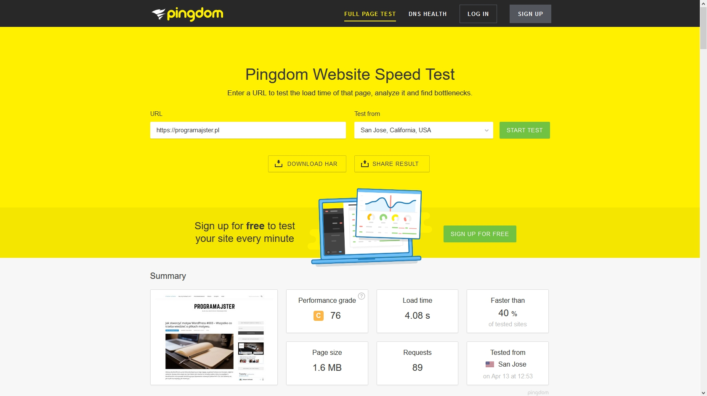
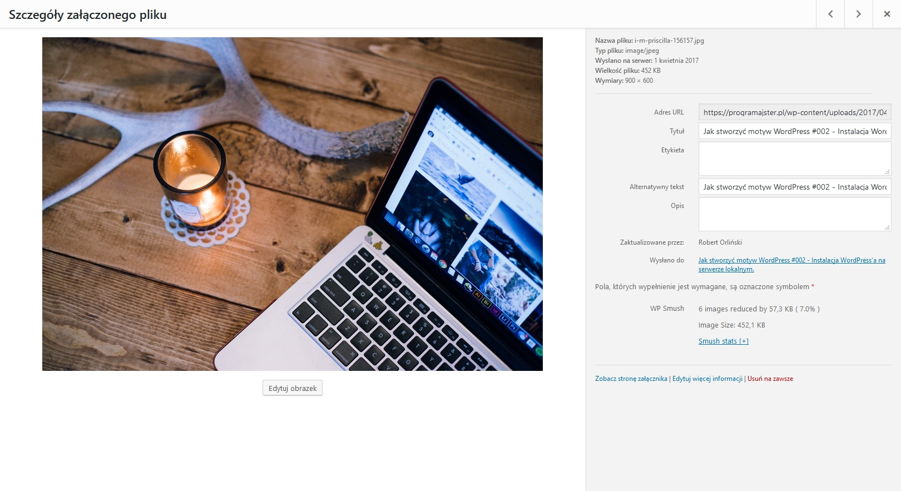

Posiadając stronę internetową zawsze chcemy dla niej jak najlepiej (brzmi to trochę jakby ta witryna była naszym podopiecznym i w sumie trochę tak jest) ;) Jednym z elementarnych czynników wpływających na jej jakość jest szybkość ładowania, o której chcę Wam trochę opowiedzieć.

W dzisiejszym wpisie dowiemy się jak testować wydajność strony, co na nią wpływa i oczywiście w jaki sposób (bez ingerencji w kod) sprawić, aby ładowała się znacznie szybciej!

## Jak testować szybkość strony internetowej?

Szybko ładująca się witryna ma mnóstwo plusów. Siłą rzeczy znacznie lepiej się z niej korzysta, minimalizujemy ryzyko, że ktoś z niej wyjdzie przed przeczytaniem treści (wg. badań użytkownikowi wystarczają 2 sekundy, aby zdecydować o tym czy zostać na danej stronie) oraz sam Google znacznie lepiej pozycjonuje zoptymalizowane strony.

Między innymi o tym ostatnim będziemy mówić w tej części za sprawą świetnego narzędzia o nazwie [Google PageSpeed Insights](https://developers.google.com/speed/pagespeed/insights/). Testuje naszą stronę, pokazuje wynik punktowy z podziałem na urządzenia mobilne i komputery oraz co najważniejsze wypisuje czynniki, które spowalniają ową witrynę, przez co dokładnie wiemy co poprawić. Wystarczy wejść na tę [stronę](https://developers.google.com/speed/pagespeed/insights/), wpisać adres witryny, którą chcemy sprawdzić oraz kliknąć przycisk Analizuj. Strona się skanuje i po chwili widzimy wyniki:

Drugą świetną stroną, służącą do sprawdzania wydajności strony internetowej jest [Pingdom](https://tools.pingdom.com/), który różni się od PageSpeed Insights tym, że niestety jest po angielsku, ale za to dokładniej rozpisuje wszystkie czynniki wpływające na szybkość witryny. Wystarczy wejść pod ten [link](https://tools.pingdom.com/), wpisać nasz adres i kliknąć Start test (lokalizacji tak naprawdę nie musimy wprowadzać, bo w praktyce nie wpływa to na przebieg testu). Wygląda to w ten sposób:

Poza tym istnieje jeszcze [GTmetrix](https://gtmetrix.com/), ale działa praktycznie tak samo jak Pingdom, z tym że pokazuje trochę mniej informacji, więc może nie będę się rozpisywać i przejdę do właściwej treści :)

## Sposób 1: Optymalizacja zdjęć

Może jeszcze przed jakimikolwiek działaniami powiem o bardzo ważnej rzeczy, a mianowicie o kopii zapasowej. Bardzo dobrze jest ją zrobić gdyby zdarzyło się tak, że jakaś wtyczka spowoduje problemy. Jeśli nie posiadasz dodatku do tworzenia backupów, to zapraszam Cię do tego [wpisu](./10-niezbednych-wtyczek-do-wordpressa). No dobrze, teraz do rzeczy!

Zmniejszyć rozmiar zdjęć można przez wybranie najmniejszego, a zarazem bezstratnego rozmiaru grafiki oraz optymalizację samego zdjęcia. Może opisałem to troszkę skomplikowanie, ale bez obaw, już tłumaczę o co chodzi.

**Po pierwsze** musimy zadbać o odpowiedni rozmiar naszego zdjęcia. Co rozumiem przez najmniejszy, ale zarazem bezstratny rozmiar? Może posłużę się przykładem: W motywie WordPress, którego używam szerokość sekcji na stronie głównej, zawierającej posty oraz samego artykułu, gdy już w niego wejdziemy wynosi 900 pikseli. W takiej sytuacji nie potrzebne mi jest zdjęcie, którego rozdzielczość to na przykład `5000x3500 pikseli`, a wystarczy jedynie `900x630 pikseli`.

W takim razie jak takie ogromne zdjęcie zmniejszyć? Ja korzystam z dwóch rozwiązań. W przypadku stron statycznych można skorzystać ze strony [Squoosh](https://squoosh.app/), a jeśli chodzi o witryny na WordPressie robię to w ten sposób: Wchodzimy w panel administracyjny strony, potem w bibliotekę mediów i wybieramy zdjęcie. Ukazuje się nam takie okno:

Klikamy na `Edytuj obrazek` po czym z prawej stron w sekcji Przeskaluj obrazek wpisujemy zamierzone wartości (gdy wpiszemy jedną z nich, to druga dopasuje się wg. proporcji oryginalnego zdjęcia). Klikamy Skaluj.

**Po drugie** ważna jest optymalizacja grafiki. Ponownie robię to na dwa sposoby, za pomocą tej [witryny](http://optimizilla.com/) w przypadku stron statycznych lub dzięki wtyczce [WP Smush](https://pl.wordpress.org/plugins/wp-smushit/) dla stron na WordPressie. W przypadku zdjęć, które już znajdują się na serwerze dodatek pozwala na zmniejszenie ich rozmiarów za pomocą jednego kliknięcia. Z kolei wszystkie nowe grafiki są optymalizowane automatycznie.

## Sposób 2: Usunięcie niepotrzebnych wtyczek

Dodatki nieraz potrafią znacznie spowolnić działanie witryny, dlatego też trzeba zadbać o to aby mieć tylko te, które są niezbędnie potrzebne. Trzeba również wiedzieć, że samo wyłączenie wtyczki niestety nic nie daje ponieważ WordPress i tak ładuje jej zasoby. Jeśli jakiejś nie używamy, zwyczajnie usuńmy zupełnie.

Z kolei jeśli posiadamy już pewną ilość wtyczek, to możemy rozejrzeć się za ich lżejszymi odpowiednikami, dzięki czemu lekko zwiększymy wydajność naszej witryny.

## Sposób 3: Wykorzystywanie pamięci cache.

Cache to pamięć podręczna przeglądarki, która archiwizuje strony internetowe, na których już byliśmy, przez co przy następnych odwiedzinach nie trzeba owej witryny pobierać ponownie z sieci.

W tej roli naprawdę świetnie sprawdza się wtyczka [W3 Total Cache](https://pl.wordpress.org/plugins/w3-total-cache/), posiadająca mnóstwo funkcji od cache\'owania strony głównej, aż po bazę danych.

Dodatkowo przy tym ogromie funkcji jest bardzo prosta w użytku. Wystarczy wejść w ustawienia wtyczki oraz zaznaczyć pierwszy checkbox z podpisem Toggle all caching types on or off (at once). Gdy to zaznaczymy, wtyczka dobierze optymalne ustawienia dla naszej witryny. Klikamy Save Settings & Purge Changes i wszystko zaczyna działać.

## Sposób 4: Minifikacja kodu

Kolejnym sposobem na zwiększenie osiągów naszej witryny jest minifikacja kodu HTML, CSS oraz JavaScript. W tej roli świetnie sprawdzi się wcześniej wymieniony dodatek, czyli [W3 Total Cache](https://pl.wordpress.org/plugins/w3-total-cache/). Checkbox, który zaznaczyliśmy w poprzednim akapicie również działa na minifikację, więc jeśli postępowałeś wg. tamtych wytycznych, to możesz przejść do następnego sposobu. Jeśli jednak nie, to zapraszam do dalszej lektury.

Nie tracąc Twojego czasu pokażę optymalne ustawienia wtyczki. Wchodzimy w General settings, zjeżdżamy w dół i konfigurujemy sekcję o minifikacji w ten oto sposób:

Po kliknięciu Save Settings & Purge Changes minifikacja zaczyna działać.

## Sposób 5: Przeniesienie skryptów i requestów JavaScript na dół strony.

Kolejnym i już ostatnim sposobem na przyspieszenie strony internetowej jest przeniesienie skryptów JS na dół strony, po to aby nie opóźniały ładowania innych zasobów, takich jak na przykład HTML. Bardzo prostym sposobem na taką optymalizację jest instalacja wtyczki [Scripts to Footer](https://pl.wordpress.org/plugins/scripts-to-footerphp/). Od razu po instalacji dodatek zaczyna działać, a my możemy się cieszyć kolejnym, zyskanym czasem!

## Podsumowanie

Jak widać bez ingerencji w kod witryny, za pomocą kilku wtyczek i chwili czasu można znacznie zwiększyć prędkość ładowania się strony i tym samym sprawić, że algorytmy Google\'a będą dla nas bardziej przyjazne oraz przede wszystkim użytkownicy będą milej spędzać czas na naszej stronie!
