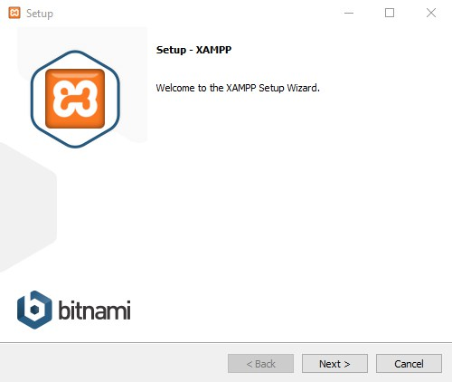
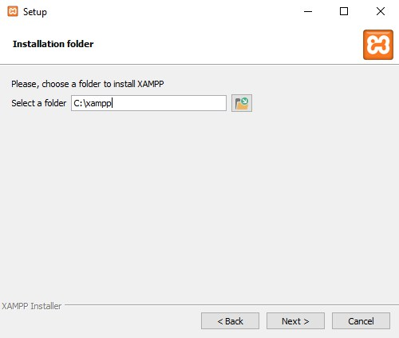
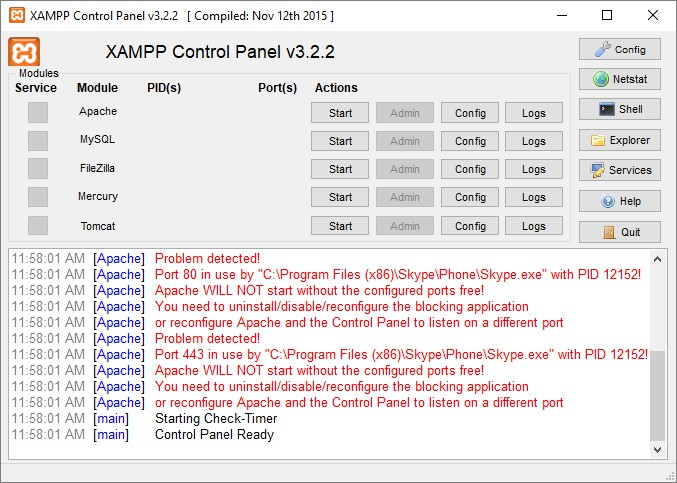
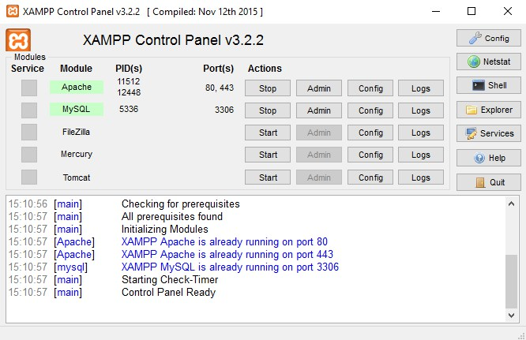
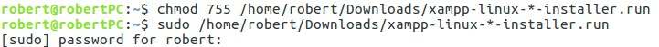
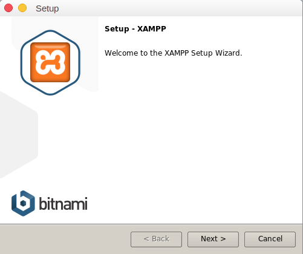
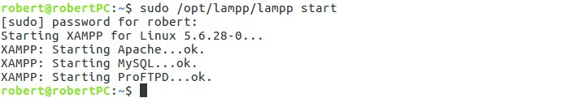

Podstawową i zarazem pierwszą czynnością, którą robimy przy działaniach z WordPressem jest zdobycie serwera, na którym będzie można go zainstalować.

Dobra wiadomość jest taka, że nie musimy wykupować hostingu, aby korzystać z tego CMSa, a jeszcze lepsza jest taka, że serwer lokalny jest znacznie lepszy przy tworzeniu strony internetowej lub omawianego motywu WordPress od wykupionego hostingu.

Dlaczego? Ponieważ serwer lokalny jest jak sama nazwa wskazuje lokalnie na naszym komputerze, przez co gdy za jego pomocą chcemy np. uruchomić stronę internetową, to przekopiowujemy pliki do określonego folderu na naszym sprzęcie, a nie wysyłamy za pomocą łącza internetowego.

## W takim razie czego użyjemy?

W Internecie jest dostępne sporo tego typu narzędzi, ale za najlepsze można uznać programy Xampp oraz Wamp. I dzisiaj pokażę jak zainstalować ten pierwszy na systemach Windows oraz Linux.

## Poradnik dla Windows:

Pierwsze co musimy zrobić, to oczywiście pobrać program z tej strony. Tam wybieramy opcję dla Windowsa i ściągamy (po pobraniu dobrze jest wstrzymać działanie programu antywirusowego, ponieważ może powodować problemy). Uruchamiamy instalator i widzimy takie okienko:

Pierwsze co musimy zrobić, to oczywiście pobrać program ze [strony Xamppa](https://www.apachefriends.org/pl/index.html). Tam wybieramy opcję dla Windowsa i ściągamy (po pobraniu dobrze jest wstrzymać działanie programu antywirusowego, ponieważ może powodować problemy). Uruchamiamy instalator i widzimy takie okienko:



Klikamy next, next i ukazuje się takie okno:



w którym to wybieramy lokalizację całego localhosta. Ja polecam zostawić domyślną ponieważ w następnym wpisie będę instalować WordPressa na przykładzie właśnie tej ścieżki. Ponownie klikamy next do momentu pokazania się tego okna:


w którym zostawiamy zaznaczonego checkboxa i klikamy finish.

Pojawia się okno programu, w którym klikamy start, przy modułach Apache i MySQL. W tym miejscu warto zaznaczyć, że może się tak zdarzyć, że port, na którym działa jeden z modułów może być zajęty, tak jak w tym przypadku przez Skype\'a:



Gdy tak się stanie, należy zamknąć program, który powoduje problem (Xampp pokazuje jego ścieżkę) i ponownie uruchomić serwer lokalny. Gdy ten będzie już działać, możemy uruchomić aplikację, która wcześniej powodowała problemy.

Pomyślnie uruchomiony serwer lokalny ma wyglądać w ten sposób:



Od tego momentu mamy działającego Xamppa i możemy rozpoczynać właściwe działania związane z instalacją WordPressa.

## Poradnik dla Linux:

Tu sprawa jest troszkę bardziej skomplikowana, ponieważ trzeba wchodzić w terminal. Podobnie jak w przypadku systemu Microsoftu ściągamy program z tej strony, tym razem wybierając opcję dla Linuxa. Po pobraniu uruchamiamy terminal i wpisujemy dwie komendy. Pierwsza z nich wygląda tak:

```bash
chmod -755 /sciezka-do-pliku/xampp-linux-*-installer.run
```

Za jej pomocą zmieniamy uprawnienia do instalatora. Za pomocą drugiej uruchamiamy instalację. Wygląda ona tak:

```bash
sudo /sciezka-do-pliku/xampp-linux-*-installer.run
```

U mnie wygląda to w ten sposób:



Po wpisaniu widzimy takie okno:



Wszędzie klikamy "next", a na końcu naciskamy "finish".

Xamppa uruchamiamy ponownie wchodząc w terminal i wpisując:

```bash
sudo /opt/lampp/lampp start
```

Po czym widzimy coś takiego:



I to tyle! Od teraz możemy cieszyć się działającym localhostem! Tak jak już wspominałem, w następnym wpisie z tej serii zajmiemy się już właściwą instalacją WordPressa.
