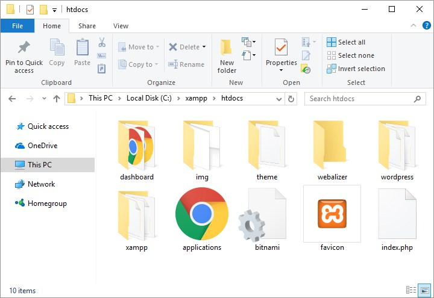
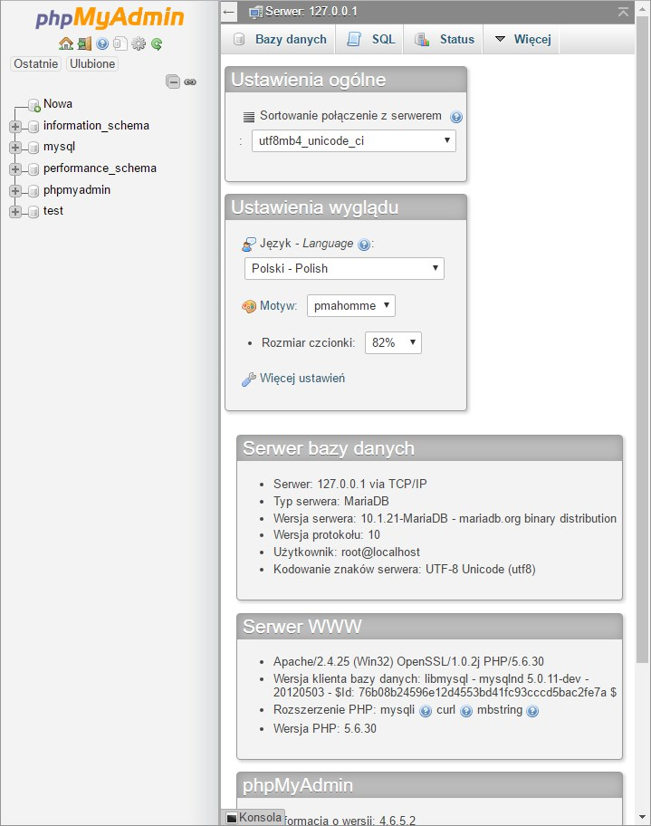
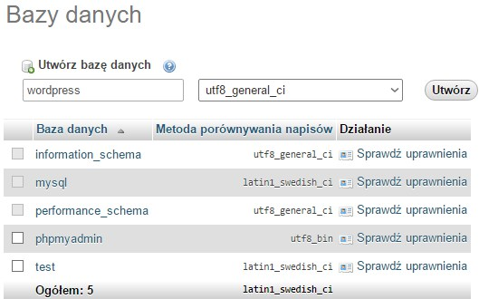
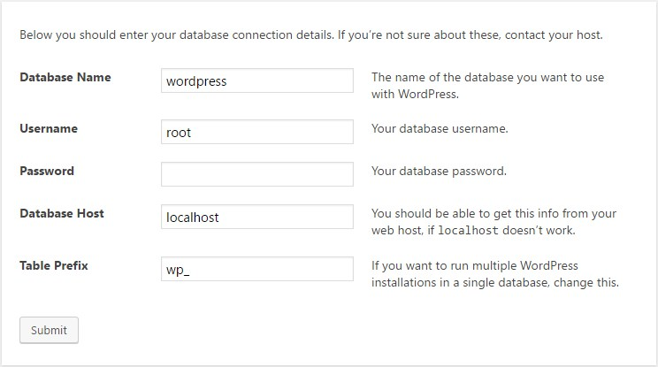
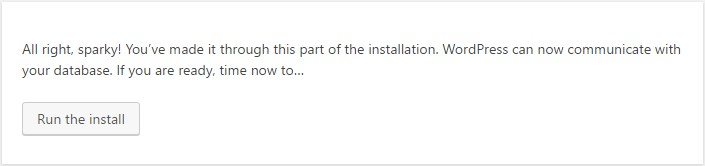
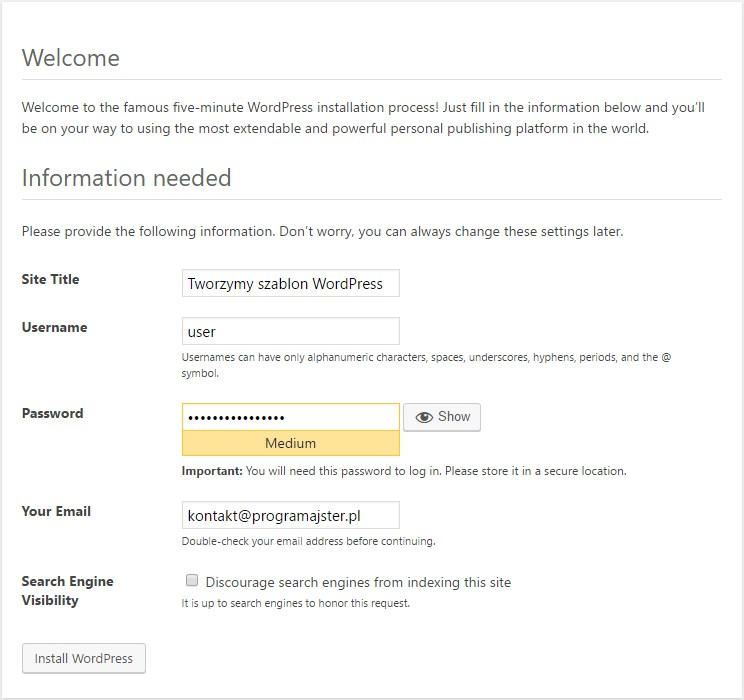

W poprzednim wpisie z tej serii opowiedziałem o tym jak zainstalować pierwszą z rzeczy potrzebnych nam do rozpoczęcia prac nad motywem, czyli serwer lokalny. Z kolei w tym artykule przybliżę Wam instalację samego WordPressa.

## Pobieranie i umieszczenie WordPressa w folderze

Pierwszą czynnością, którą trzeba wykonać jest ściągnięcie CMSa z tej strony. W tym celu klikamy "Download WordPress" i oczekujemy na pobranie. Po wszystkim rozpakowujemy całość oraz przenosimy do folderu "htdocs" w katalogu Xamppa. Na Windows ta ścieżka domyślnie wygląda w ten sposób:

```bash
C:\xampp\htdocs
```

A na Linux tak:

```bash
/opt/lampp/htdocs
```

Po wszystkich działaniach ten folder powinien wyglądać w ten sposób (przykład Windows):



W tym przypadku jest to domyślna zawartość katalogu świeżo po instalacji Xamppa z oczywiście dodatkowym folderem "wordpress".

## Utworzenie bazy danych

W tym celu musimy włączyć Xamppa, wejść w przeglądarkę i wpisać:

```bash
localhost/phpmyadmin
```

Wyskakuje taka oto strona:



Z menu na górze wybieramy "Bazy danych" i widzimy stronę z wszystkimi bazami jakie posiadamy.

Z jej poziomu klikamy na "Utwórz bazę danych". W polu "Nazwa bazy danych" wpisujemy "wordpress", po czym wybieramy "utf8-global-ci", jako metodę porównywania napisów. Całość ma wyglądać w ten sposób:



Po wszystkim naciskamy "Utwórz" i w ten sposób posiadamy już bazę danych, którą możemy podpiąć pod naszego WordPressa!

## Podłączenie bazy danych

Aby rozpocząć proces instalacji przechodzimy pod ten adres:

```bash
localhost/wordpress
```

Tam wita nas możliwość wyboru języka. Ja podczas tej instalacji, jak i całego kursu będę używać wersji angielskiej ponieważ zdaję sobie sprawę jak ważne w nauce języka obcego jest otoczenie się nim wszędzie gdzie się da.

W końcu taki los programistów, że musimy znać angielski, czy nam się to podoba czy nie. Ostatnio nawet popularną odpowiedzią na pytanie "Jaki język programowania na początek?" jest "Angielski". Ale dobrze, za bardzo odszedłem od tematu. Działamy!

Wybieramy język, po czym pokazuje się strona powitalna z informacjami o instalacji. Klikamy "Let's go!".

Dostajemy się na stronę, na której wpisujemy takie rzeczy jak nazwa bazy danych, nazwa użytkownika, hasło, host bazy danych oraz prefiks tabeli. Zanim wyjaśnię czym jest każda z nich, to pokażę jak wygląda to u mnie:



- Database Name - wcześniej ustawiona nazwa bazy danych. W naszym przypadku jest to "wordpress".
- Username - nazwa użytkownika naszej bazy. Domyślnie po instalacji Xamppa jest to "root".
- Password - hasło do bazy danych, domyślnie, go nie ma.
- Database host - w przypadku serwera lokalnego jest to "localhost". Jeśli instalujesz WordPressa na prawdziwym hostingu, to jest możliwość, że będzie to coś innego. Wtedy najłatwiej będzie Ci się skontaktować z pomocą techniczną.
- Table Prefix - prefiks tabeli, domyślnie "wp\_". Przy instalacji WordPressa po raz kolejny należy wpisać inny od domyślnego.

Jeśli wszystko się powiodło, przechodzimy do ekranu, który informuje nas o pomyślnym podłączeniu bazy danych. Teraz możemy przejść do tego na co wszyscy czekamy, czyli właściwej instalacji.

## Instalacja WordPressa

W tym momencie na ekranach widzimy taką stronę:



Klikamy "Run the install" i zostajemy przeniesieni do strony z instalacją, gdzie wpisujemy podstawowe dane o naszej witrynie. Nazwę strony, login i hasło, za pomocą których będziemy się logować oraz nasz e-mail.

Dodatkowo możemy zaznaczyć czy strona ma być indeksowana przez wyszukiwarki. W tym przypadku jest to serwer lokalny więc nie ma to znaczenia, ale gdy instalujemy WordPressa na prawdziwym hostingu, to należy zaznaczyć tę opcję. U mnie całość prezentuje się tak:



Klikamy "Install WordPress" i po dłuższej chwili zostajemy przeniesieni do podstrony logowania, gdzie wpisujemy wcześniej ustawioną nazwę użytkownika i hasło. Po udanej procedurze zostajemy przekierowani do panelu zarządzania stroną i w ten sposób wiemy już, że cała instalacja się powiodła!

Mam nadzieję, że mogłem Ci pomóc tym wpisem :)
