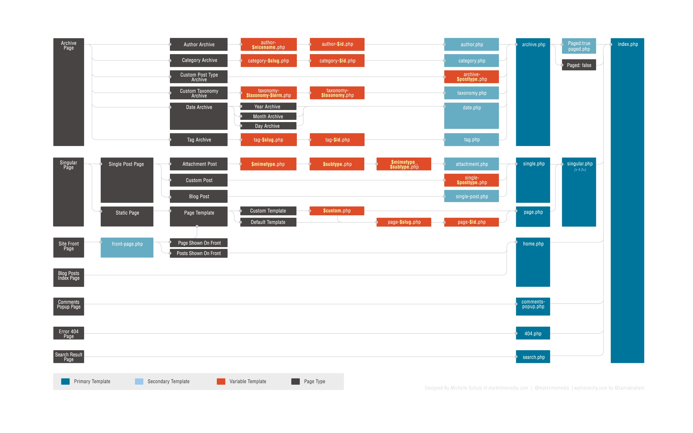

Główną siłą WordPressa, przez którą developerzy po niego sięgają, są gotowe funkcje oraz intuicyjne, odgórne założenia. Sprawą, która wiąże się z tym faktem jest również to, że każdy szablon, który ma współgrać z WordPressem musi posiadać określoną grupę odpowiednio nazwanych plików PHP i CSS.

Dziś dowiemy się jak te pliki się nazywają, jak możemy je łączyć oraz w jaki sposób sam WordPress je wczytuje.

## Pliki motywu

Tak naprawdę aby motyw mógł pełnoprawnie działać, potrzebne są 2 pliki:

- **style.css** - najważniejszy i w praktyce jedyny plik, bez którego motyw się nie załaduje. Zawiera style witryny oraz specjalny komentarz na początku z informacją o nazwie motywu, autorze, wersji i nie tylko (te informacje widzimy podczas wybierania motywu w panelu WordPressa.
- **index.php** - podstawowy plik HTML odpowiedzialny za wyświetlanie strony głównej bloga, będący szablonem dla wszystkich innych stron na blogu oraz ładujący pozostałe elementy.

Poza tym w większości motywów możemy natknąć się na takie pliki jak:

- **header.php** - plik odpowiedzialny za wszystko co znajduje się między znacznikami `<head>;` i `</head>;` oraz na górze każdej podstrony w witrynie (np. nawigacja), innymi słowy nagłówek strony.
- **sidebar.php** - kod wyświetlający boczną sekcję strony, na której zwykle znajdują się takie rzeczy jak widgety, reklamy i oferty specjalne.
- **comments.php** - jak sama nazwa wskazuje jest to sekcja komentarzy na blogu lub stronie internetowej.
- **footer.php** - plik odpowiedzialny za wyświetlenie stopki strony internetowej.

To wszystko składa się na podstawowy, w pełni działający motyw. Oczywiście poza tym występuje znacznie więcej plików, a mianowicie:

- **single.php** - plik pojedynczego wpisu, takiego jak ten, który właśnie czytasz. Często też można się spotkać z plikami, takimi jak np. single-example.php. Jest to to samo co sigle.php, tylko, że dla postów z nazwą example, to tak odnośnie hierarchii, o której będzie w trzecim podtytule tego wpisu.
- **functions.php** - jedyny plik zawierający wyłącznie kod PHP, a dokładnie funkcje motywu zdefiniowane przez użytkownika.
- **page.php** - plik odpowiedzialny za wyświetlanie indywidualnej strony.
- **search.php** - strona wyników wyszukiwania.
- **archive.php** - archiwum wpisów.
- **attachment.php** - witryna służąca do wyświetlania złączników oraz zdjęć (chociaż bezpośrednio do tych ostatnich przeznaczony jest plik image.php).
- **home.php** - strona domowa.
- **category.php** - strona określonej kategorii.
- **tag.php** - strona jednego z wcześniej utworzonych tagów.
- **author.php** - witryna określonego autora.
- **rtl.php** - dość ciekawa strona, która pojawia się gdy strona jest w języku czytanym od prawej do lewej (można ją dodać za pomocą wtyczki [RTLer](https://wordpress.org/plugins/rtler/)).
- **404.php** - i ostatnia, strona błędu, którą widzimy, gdy dana witryna nie istnieje.

Wyszło tego więcej niż początkowo przypuszczałem, ale cóż, chciałem wyczerpać temat, aby pokazać Wam praktycznie wszystkie możliwe pliki, które interpretuje WordPress :)

No dobrze. Możemy mieć tyle plików i teraz jak z nich stworzyć działającą witrynę? Z pomocą przychodzi nam pewna funkcja WordPressa.

## Funkcja get\_\*, czyli jak połączyć kilka plików w jedną witrynę

Trochę dziwna sprawa, że z jednej strony mamy index.php, w którym znajduje się cała strona główna, a z drugiej takie pliki jak np. `footer.php`, zajmujący się wyświetlaniem stopki, nieprawdaż? Jest tak ponieważ `index.php` zwykle w dużej części składa się z innych plików, takich jak wspomniany `footer.php`, `header.php`, czy też `sidebar.php`.

W takim razie jak je połączyć? Bardzo prosto, za pomocą funkcji wymienionej w podtytule, na przykład:

```php
<?php get_header(); ?>
<?php get_footer(); ?>
<?php get_search_form(); ?>
```

Chcąc stworzyć bardzo prosty motyw składający się z nagłówka, postów, sidebara oraz stopki, możemy użyć takiego, przykładowego kodu:

```php
<?php get_header(); ?>

<main>
  // WP Loop (pętla WordPressa, służąca do pokazywania najnowszych postów).
</main>
<aside>
  <?php get_sidebar(); ?>
</aside>

<?php get_footer(); ?>
```

Wiemy już jakie pliki składają się na motyw oraz jak je łączyć, w tym momencie możemy poznać hierarchię WordPressa, aby wiedzieć, które z nich rzeczywiście potrzebujemy.

## Hierarchia plików w WordPressie.

Gdy wchodzimy na jakąkolwiek stronę, WordPress zaczyna sprawdzać pliki w określonej kolejności. Nie ma co tu dużo pisać więc może od razu wytłumaczę to na przykładzie.

Aby wyświetlić wszystkie wpisy o kategorii motyw, WordPress musi przebyć taką drogę:

1. Na początku szukany jest plik o nazwie category-motyw.php.
2. Gdy WordPress go nie znajdzie, szuka category.php.
3. Analogicznie gdy tego nie będzie, CMS postara się znaleźć archive.php.
4. Gdy całość zawiedzie, WordPress pobierze kod z index.php.

Swoją drogą twórcy bardzo dobrze przedstawiają cały proces na tej grafice:

[]()

To chyba już wszystko co musimy wiedzieć o plikach w WordPressie, może dodam jeszcze, że szczególnie ważne jest zrozumienie drugiego i trzeciego akapitu, bo to właśnie w nich zawarte są kluczowe informacje o działaniu tegoż CMSa.
