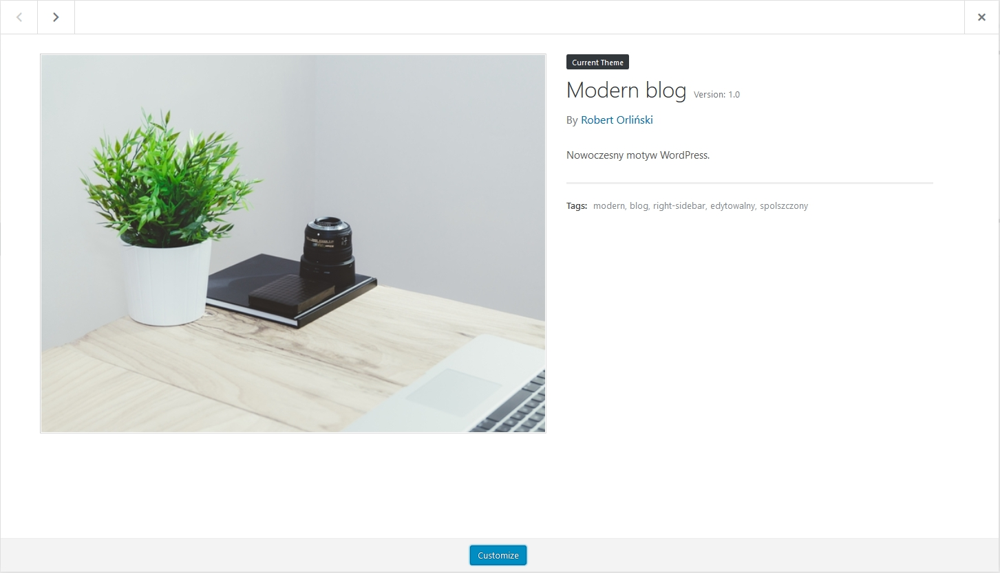
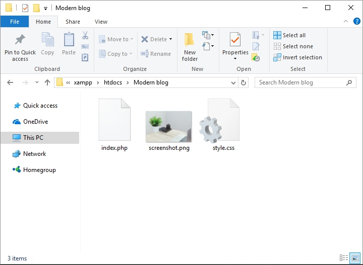
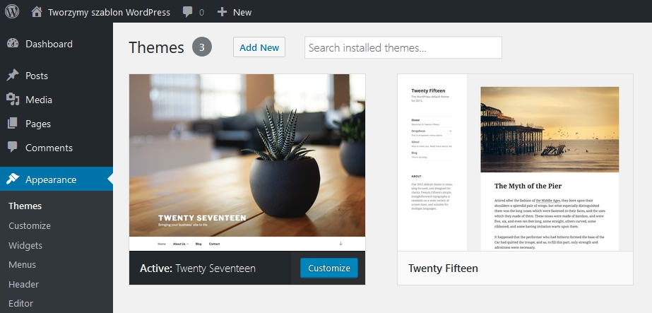
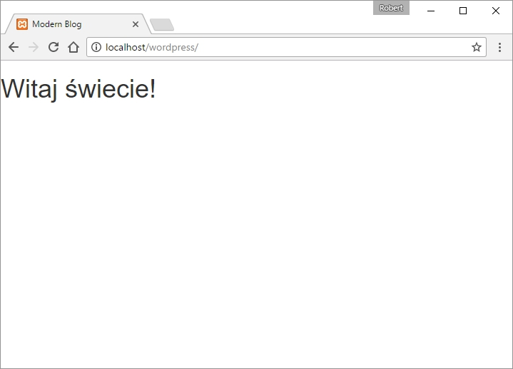

Po ostatnich trzech wpisach jesteśmy gotowi, aby w końcu zajrzeć w kod naszego motywu, a dokładnie zacząć go tworzyć. Wreszcie uruchomimy szablon i zobaczymy, że wiedza podana w ostatnich artykułach rzeczywiście działa.

Dziś dowiemy się jak skonfigurować szablon, aby po przesłaniu do WordPressa, w panelu motywów wyglądał w taki oto sposób:



...oraz wyświetlimy pierwszą zawartość wczytaną z pliku `index.php`!

## Dane motywu - komentarz w pliku `style.css`

Jak widać na poprzednim zdjęciu nasz motyw posiada sporo danych, takich jak jego nazwa, adres, autor, opis oraz wiele innych. W takim razie gdzie się je umieszcza? W pliku wymienionym w podtytule - `style.css.`

Na jego początku znajduje się komentarz o takiej, przykładowej dla mojego motywu treści:

```css
/*
Theme Name: Modern blog
Theme URI: https://github.com/robert-orlinski/modern-blog.git
Author: Robert Orliński
Author URI: https://robertorlinski.pl
Description: Nowoczesny motyw WordPress.
Version: 1.0
License: GNU General Public License v2 or later
License URI: http://www.gnu.org/licenses/gpl-2.0.html
Tags: modern, blog, right-sidebar, edytowalny, spolszczony,
Text Domain: modernblog
*/
```

To wszystkie dane, jakie można zawrzeć w opisie motywu. Ważne jest to, aby nie zmieniać tego co jest przed każdym z myślników, ponieważ wtedy WordPress nie będzie w stanie tego zinterpretować.

Mamy już opis. W takim razie pora dowiedzieć się jak w bardzo prosty sposób dodać zdjęcie naszego motywu.

## Zdjęcie motywu - plik screenshot.png

Ta część jest niezwykle prosta. Wybieramy jakąkolwiek grafikę w formacie png (jeśli jedyna, jaką posiadamy, ma inne rozszerzenie, to możemy skorzystać np. z tej [strony](http://jpg2png.com/pl/)) oraz zmieniamy jej nazwę na `screenshot.png`. Przenosimy do folderu z motywem i zostaje ona automatycznie pobrana.

Aby zobrazować obecny postęp prac, pokażę folder motywu w moim przypadku:



## Pierwszy kod HTML oraz uruchomienie motywu

Przed włączeniem szablonu dobrze byłoby dodać do niego jakąś zawartość, aby mieć pewność, że działa. Oczywiście jaki byłby ze mnie programista gdybym nie wpisał do pliku `index.php` tych oto słów:

```html
<h1>Witaj świecie!</h1>
```

W tym momencie możemy przejść do wgrania motywu. Wszystkie posiadane przez nas pliki przenosimy do folderu skompresowanego oraz wgrywamy na serwer przechodząc w `Appearance`, później w `Themes` i klikając na górze `Add New`:



W tym momencie naciskamy przycisk `Upload Theme` i wgrywamy nasz motyw klikając na `Install Now`. Gdy proces przebiegnie pomyślnie, włączamy szablon, klikając `Activate` i całość powinna zacząć działać. Aby się o tym przekonać wyjdźmy z panelu WordPressa klikając na wcześniej utworzoną nazwę strony w lewym-górnym rogu witryny. Całość oczywiście powinna wyglądać w ten sposób:



## Podsumowanie

Tym sposobem posiadamy już zalążki szablonu wgranego i uruchomionego na naszej stronie. Może w tym momencie nie przypomina motywu, ale to się zmieni już w kolejnych wpisach :)

Wszystkie pliki, oczywiście można pobrać z mojego [GitHuba](https://github.com/robert-orlinski/modern-blog)!
