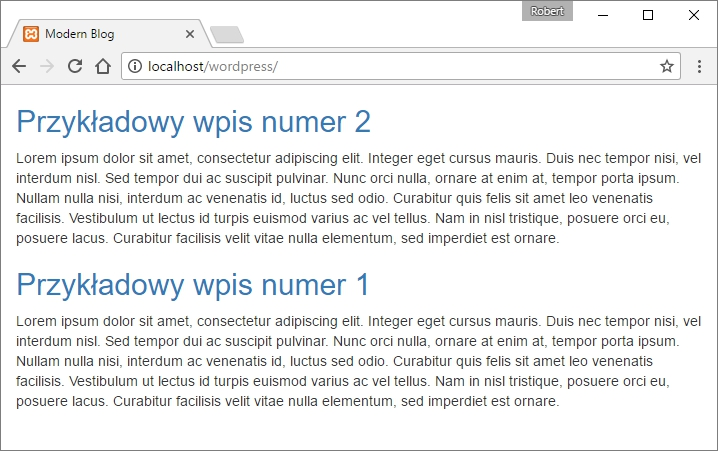

W domyśle WordPress od zawsze był platformą blogową. Stało się to powszechne do tego stopnia, że firmy posiadające statyczne strony internetowe podpinają je pod ten system tylko po to, aby dodawać aktualności oraz artykuły. A co jest najważniejszą częścią każdego bloga? Oczywiście wpisy, o których powiemy sobie właśnie w tym artykule!

Dowiemy się czym jest tak zwana The Loop, odpowiedzialna za wyświetlanie najnowszych treści, opiszemy jej ogólną budowę, widoczną w każdym motywie WordPress, poznamy wszystkie funkcje, wyświetlające treść związaną z wpisami na blogu oraz dodamy je do wcześniej utworzonej The Loop.

## Czym jest The Loop?

Jak sama nazwa wskazuje jest to powszechnie znana z innych języków programowania pętla (loop), która wyświetla nowo dodane wpisy. Cały kod w niej zawarty powtarza się dla każdego wpisu, zmienna jest jedynie treść pobierana za pomocą funkcji WordPressa.

## Podstawowa wersja pętli WordPressa

Cały kod, zawarty w szkielecie tej pętli jest stosunkowo prosty i krótki. Jedyna wiedza, potrzebna do jego dokładnego zrozumienia to zasada działania konstrukcji warunkowej `if` oraz pętli `while` Całość przedstawia się w ten sposób:

```php
<?php
  if ( have_posts() ) :
    while ( have_posts() ) :the_post();
      // Zawartość wpisu.
    endwhile;
    else :
      echo <p>Na tej stronie nie ma żadnych wpisów.</p>;
  endif;
?>
```

Postaram się w jak najprostszy sposób przedstawić całość po kolei. Zaczynajmy!

```php
<?php
  if ( have_posts() ) :
```

Pierwsza linia oczywiście mówi o tym, że w danym miejscu rozpoczyna się kod PHP, druga z kolei rozpoczyna konstrukcję warunkową `if`. W nawiasie znajduje się funkcja WordPressa `have_posts()`, która sprawdza czy na stronie dodano jakiekolwiek wpisy.

```php
    while ( have_posts() ) :the_post();
```

Tu widać naszego głównego bohatera, czyli omawianą pętlę. Całość mówi o tym, że pętla ma wykonywać się dla każdego wpisu (`have_posts()`) oraz po kolei, umożliwiając pobranie poszczególnych informacji z artykułu (`the_post()`).

Wszystko co znajduje się po tej linii zostanie powtórzone dla każdego z wpisów.

```php
    endwhile;
```

Zakończenie pętli. Cały kod znajdujący się później nie będzie powtarzany dla postów.

```php
    else :
      echo <p>Na tej stronie nie ma żadnych wpisów.</p>;
```

Informacja co ma się stać, gdy warunek podany przy konstrukcji IF się nie spełni, czyli gdy nie dodamy żadnych postów na stronie. W tym przypadku skrypt wypisze zwykły ciąg tekstowy (_echo_) z informacją o braku wpisów.

```php
  endif;
?>
```

Ta część kodu odpowiada za zakończenie konstrukcji warunkowej IF (`endif`) oraz całego skryptu PHP (`?>`).

Jak widać całość nie jest długa. Jeśli chcesz zobaczyć, że to rzeczywiście działa, możesz dodać w miejscu:

```php
      // Zawartość wpisu.
```

...jakikolwiek kod wypisujący tekst na ekranie, na przykład:

```php
      echo <h2>Wpis</h2>;
```

Po czym dodać kilka postów w panelu WordPressa (W menu z boku: Posts -> Add new). Jeśli tekst Wpis pokaże się taką ilość razy, ile dodaliśmy postów, to oznacza, że nasza pętla działa poprawnie!

## 10 funkcji WordPressa związanych z The Loop

Wiemy już w jaki sposób WordPress wyświetla posty na blogu oraz jaki kod za to odpowiada. Teraz przyszedł czas na dokładne poznanie wszystkich funkcji, które wypełniają tę pętlę i tworzą wpis. Chodzi o takie elementy jak tytuł, data dodania, autor i wiele innych.

### 1. `the_title()`

Jak sama nazwa wskazuje jest to funkcja wyświetlająca tytuł. Jako jej argument można przyjąć 3 różne parametry:

1. $before - ciąg tekstowy przed tytułem.
2. $after - string po tytule.
3. $echo - jeśli w to miejsce wpiszemy false, tytuł nie zostanie wypisany.

Przykład użycia:

```php
<?php the_title( '<p>', '</p>' ); ?>
```

### 2. `the_permalink()`

Odnośnik do konkretnego wpisu. Posiada jeden parametr:

1. $post - pozwala wybrać czy link ma prowadzić do określonego identyfikatora postu, czy też obiektu.

Przykład użycia:

```php
<?php the_permalink(); ?>
```

### 3. `the_content()`

Zawartość całego wpisu. Może przyjmować 2 parametry:

1. $more_link_text - tekst pojawiający się gdy wpis jest długi.
2. $strip_teaser - za pomocą wartości `true` lub `false` określa czy pokazany tekst artykułu ma być skrócony.

Przykład użycia:

```php
<?php the_content( 'Czytaj dalej' ); ?>
```

### 4. `the_category()`

Domyślnie lista nieuporządkowana wypisująca kategorie, do których zalicza się dany wpis. Parametry, które może przyjmować to:

1. $separator - znak oddzielający poszczególne kategorie.
2. $parents - sposób, w jaki pokazywany jest rodzic danej kategorii.
3. $post_id - identyfikator wpisu do pobierania kategorii.

Przykład użycia:

```php
<?php the_category( ' | ' ); ?>
```

### 5. `the_author()`

Funkcja służąca do pokazywania nazwy danego autora (w ustawieniach WordPressa mamy możliwość wyboru pomiędzy wyświetlaniem nazwy użytkownika a na przykład imienia i nazwiska). Jako jedyna funkcja nie posiada dedykowanych parametrów. Z tego też powodu przykład będzie niezbyt odkrywczy 😌

Przykład użycia:

```php
<?php the_author(); ?>
```

### 6. `the_date()`

Jak sama nazwa wskazuje, ten kod odpowiada za wyświetlanie daty wstawienia danego postu. Posiada najwięcej możliwych parametrów, bo aż 4:

1. $format - format zapisu daty. Domyślnie zostaje pobrany z ustawień WordPressa.
2. $before - tekst przed datą.
3. $after - string po dacie.
4. $echo - decyduje czy wyświetlić datę (`true`), czy nie (`false`).

Przykład użycia:

```php
<?php the_date('Y-m-d', '<p>', '</p>'); ?>
```

### 7. `the_tags()`

Wyświetla tagi przypisane dla konkretnego wpisu. Jej parametry to:

1. $before - tekst przed tagami.
2. $sep - tekst pomiędzy (separator).
3. $after - tekst po wszystkich tagach.

Przykład użycia:

```php
<?php the_tags( 'Tagi: ', ' | '); ?>
```

### 8. `the_excerpt()`

Ten kod zajmuje się bezpośrednim wyświetlaniem małej części wpisu. Podobnie jak `the_author()`, nie posiada parametrów.

Przykład użycia:

```php
<?php the_excerpt(); ?>
```

### 9. `the_post_thumbnail()`

Dość ciekawa funkcja, zajmująca się wyświetleniem miniaturki artykułu (wcześniej trzeba dodać funkcję miniatur do naszego motywu). Przyjmuje takie oto parametry:

1. $size - wielkość miniaturki.
2. $attr - dodatkowe atrybuty.

Przykład użycia:

```php
<?php the_post_thumbnail( 'post-thumbnail' ); ?>
```

### 10. `comments_link()`

Bezpośredni odnośnik do sekcji komentarzy w naszym wpisie. Podobnie jak niektóre z poprzednich funkcji, tak i ta nie ma parametrów.

Przykład użycia:

```php
<?php comments_link(); ?>
```

W ten sposób przedstawiają się funkcje, którymi można zapełnić pętlę zawierająca wszystkie wpisy na blogu.

## Podsumowanie

W poprzedniej części z tej serii udało nam się wypisać na ekranie Witaj świecie!. Dzisiaj z kolei dobrze byłoby zmienić te zdanie na jakieś wpisy z bloga. W tym celu utworzyłem 2 przykładowe wpisy i dodałem taki oto kod:

```php
<?php
	if (have_posts()) :
    while (have_posts()) : the_post(); ?>
    	<h2>
    		<a href=<?php the_permalink(); ?>>
          <?php the_title(); ?>
        </a>
    	</h2>

    	<?php the_content();

    endwhile;

  else :
    echo <p>Na tej stronie nie ma żadnych wpisów.</p>;

  endif;
?>
```

Dzięki temu strona wygląda w ten sposób:



Oczywiście na razie nie prezentuje się to zbyt dobrze (dlatego na razie wstrzymałem się z dodawaniem innych funkcji), ale to wkrótce się zmieni.

To na razie tyle! Dowiedzieliśmy się dzisiaj wszystkiego co jest potrzebne, aby dodać wpis na naszego bloga!

Cały kod oczywiście znajduje się na moim [GitHubie](https://github.com/robert-orlinski/modern-blog) c:
