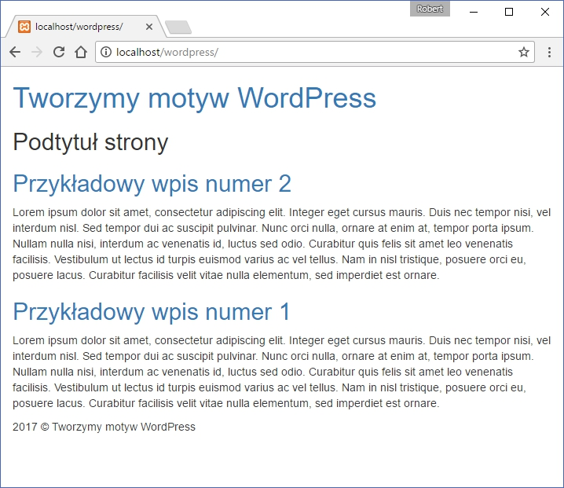

W poprzednim [wpisie](./jak-stworzyc-motyw-wordpress-006) z tej serii zdefiniowaliśmy funkcje odpowiedzialne za dołączanie stylów CSS oraz skryptów JS do naszego motywu. Dziś z kolei zajmiemy się utworzeniem oraz podstawową konfiguracją dwóch plików, w których możemy je dołączyć. Są to `header.php` oraz `footer.php`, czyli nagłówek oraz stopka naszego motywu.

Poznamy funkcje służące do dodawania tych plików do `index.php` oraz opiszemy sobie podstawową konfigurację każdego z nich.

## Konfiguracja pliku `index.php`

Wszystkie nowe pliki, składające się na motyw muszą być w jakiś sposób połączone z naszym głównym plikiem. W tym celu służy bardzo prosta i wspominana przeze mnie funkcja `get`. W tym przypadku potrzebujemy dwóch tego typu funkcji. Dla nagłówka:

```php
<?php get_header(); ?>
```

...oraz dla stopki naszego motywu:

```php
<?php get_footer(); ?>
```

W połączeniu z kodem pętli WordPressa, utworzonym w poprzednich częściach tego cyklu, omawiane funkcje wyglądają w ten sposób:

```php
<?php
    get_header();
        if (have_posts()) :
            while (have_posts()) : the_post(); ?>

                <h2>
                    <a href=<?php the_permalink(); ?>>
                        <?php the_title(); ?>
                    </a>
                </h2>

            <?php the_content(); ?>

            <?php endwhile;

            else :
                echo <p>Na tej stronie nie ma żadnych wpisów.</p>;
        endif;

    get_footer();

?>
```

## Nagłówek motywu

Może zacznę od pokazania jak wygląda on w moim przypadku, po czym wytłumaczę wszystkie funkcje w nim zawarte. Całość prezentuje się tak:

```php
<!DOCTYPE html>
<html <?php language_attributes(); ?>>
  <head>
      <meta charset=<?php bloginfo( 'charset' ); ?> />
      <meta name=viewport content=width=device-width, initial-scale=1>
      <title><?php wp_title(); ?></title>
      <?php wp_head(); ?>
  </head>
  <body>
      <header>
          <h1>
              <a href=<?php echo home_url(); ?>>
                  <?php bloginfo('name'); ?>
              </a>
          </h1>
          <h2>
              <?php bloginfo('description'); ?>
          </h2>
      </header>
  </body>
</html>
```

Widzimy tu podstawowy kod nagłówka naszego motywu, w którym znajduje się 7 funkcji zdefiniowanych w WordPressie: - `language_attributes()` - funkcja odpowiedzialna za dodanie atrybutu `lang`, odpowiedniego dla języka naszej strony.

- `bloginfo('charset')` - w ten sposób ustawiamy odpowiedni sposób kodowania znaków.
- `wp_title()` - funkcja ta odpowiada za ustawienie tytułu konkretnej witryny.
- `wp_head()` - dzięki temu elementowi motywy oraz wcześniej zdefiniowane funkcje w pliku `functions.php` wiedzą gdzie umieścić swoje zasoby, takie jak chociażby style CSS.
- `echo home_url()` - jest do dynamicznie generowany odnośnik do strony głównej naszego serwisu.
- `bloginfo('name')` - funkcja ta pobiera tytuł naszej witryny, uprzednio zdefiniowany w ustawieniach (Settings -> General ->Site title).
- `bloginfo('description')` - podtytuł naszej witryny, który podobnie jak tytuł zostaje zdefiniowany w ustawieniach.

To wszystko składa się na podstawowy nagłówek, który poza zapisami w sekcji `head`, wyświetla tytuł oraz podtytuł naszej witryny na początku strony. Oczywiście wymienione tu zostały najczęściej używane funkcje składające się na nagłówek naszego motywu. Nie wszystkie z nich są wymagane :)

## Stopka motywu

Może zacznę tak samo jak w przypadku nagłówka, czyli od pokazania kodu całego pliku:

```php
    <footer>
        <?php echo date('Y'); ?> &copy; <?php bloginfo('name'); ?>
    </footer>

    <?php wp_footer(); ?>

  </body>
</html>
```

Jak widać nie jest on już tak długi jak nagłówek, a w praktyce posiada tylko jedną niezbędną funkcję, czyli: - `wp_footer()` - kod ten definiuje miejsce, w którym mają się znaleźć wszystkie skrypty załadowane z parametrem `&in_footer` ustawionym na `true`, o którym to mówiłem już w poprzednim [wpisie](./jak-stworzyc-motyw-wordpress-006).

Dodatkowo użyliśmy tu dwie funkcje, czyli: - `echo date('Y')` - funkcja odpowiedzialna za wyświetlanie aktualnej daty. W tym przypadku użyty został parametr `Y`, w celu wyświetlenia roku.

- `bloginfo('name')` - o tej funkcji dowiedzieliśmy się już przy okazji nagłówka. W skrócie wyświetla ona nazwę naszej strony.

Tym prostym sposobem dodaliśmy stopkę do naszego motywu! :)

## Podsumowanie

Tak prezentują się kolejne 2 pliki z naszego motywu, czyli `header.php` oraz `footer.php`. Z kolei cała nasza strona, po ich dodaniu prezentuje się w ten sposób:



Może jeszcze nie wygląda ona najlepiej, ale zachowuje pełnię swoich funkcjonalności, które widać szczególnie gdy wejdziemy w któryś z naszych wpisów! Jeśli chcesz pobrać gotowe pliki mojego motywu, to zapraszam Cię na [GitHuba](https://github.com/robert-orlinski/modern-blog).
