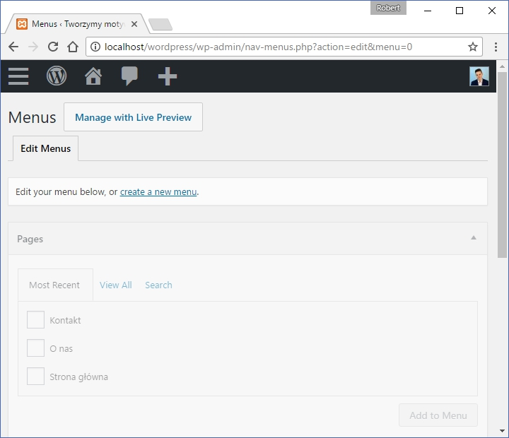
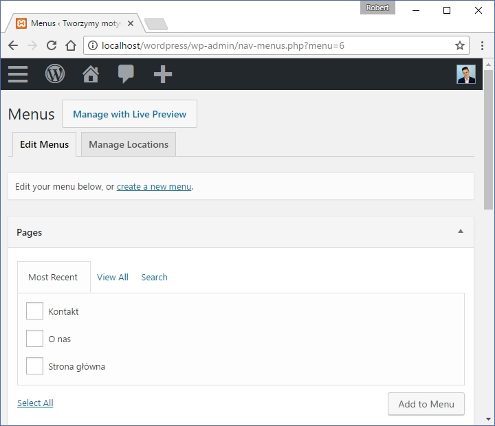
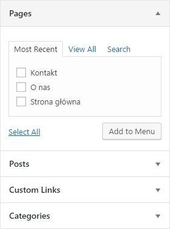
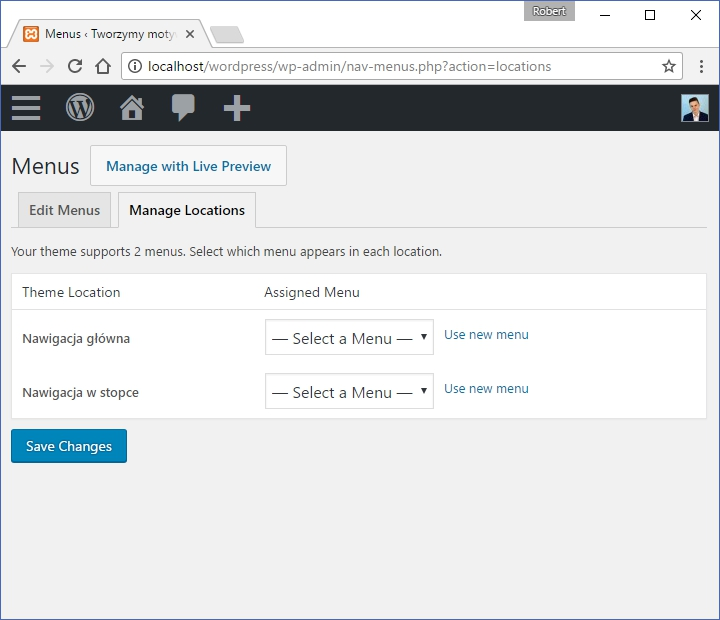
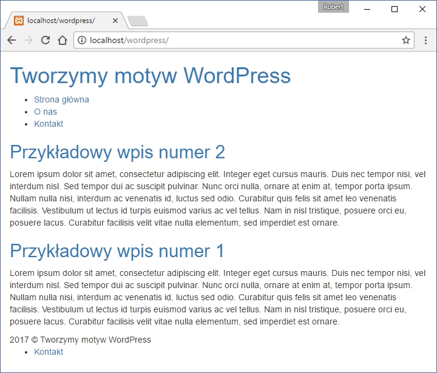

W ostatnim [wpisie](./jak-stworzyc-motyw-wordpress-007) dołączyliśmy nagłówek oraz stopkę do naszego motywu. Tym razem dobrze będzie dodać do nich element, który możemy zobaczyć na praktycznie wszystkich stronach internetowych. Oczywiście jest to nawigacja.

Poznamy dziś 2 działania, które składają się na to, że w naszym motywie znajdzie się dynamicznie generowane menu. Na początku dodamy go do nagłówka oraz stopki, po czym całość zaktywujemy w pliku `functions.php` w sposób, który pozwoli nam na prostą edycję z poziomu WordPressa. Zaczynajmy! :)

## Dołączanie nawigacji do nagłówka

Zacznijmy od dodania głównego menu na samej górze strony internetowej. W tym celu użyjemy takiego kodu:

```php
<?php
  wp_nav_menu( array(
    'theme_location' => 'primary'
  ));
?>
```

Oznacza on, że w tym miejscu znajdzie się nawigacja, którą wywołamy w WordPressie za pomocą lokalizacji (`theme_location`) o nazwie `primary`. Po wykonaniu utworzonego kodu do naszego motywu zostanie dodana lista nieuporządkowana (`ul`), do której będziemy mogli dodawać elementy z poziomu panelu WordPressa.

Oczywiście poza lokalizacją naszego menu, możemy dodać mnóstwo innych parametrów. Może wymienię niektóre z nich:

- `menu_class` - ten parametr definiuje klasę CSS, którą ma posiadać nasza nawigacja. Analogicznie występuje parametr `menu_id`, który określa ID.
- `depth` - dosłownie tłumacząc są to zagłębienia. Oczywiście chodzi tu o ilość podmenu.
- `container` - opakowanie naszej nawigacji. Na przykład możemy ustawić znacznik `<div>`, aby nasze menu znalazło się właśnie w `divie`.
- `link_before` oraz `link_after` - tekst, który ma znaleźć się przed lub po elemencie nawigacji. Najczęściej parametry te używa się do dodawania atrybutów HTML.
- `walker` - parametr ten pozwala nam zdefiniować nową funkcję, w której będą zawarte informacje o działaniu całej funkcji.

Oczywiście to tylko kilka parametrów, które możemy użyć. Pełną listę możecie znaleźć na przykład na tej [stronie](https://developer.wordpress.org/reference/functions/wp_nav_menu/).

## Dołączenie nawigacji do stopki

W tym przypadku nie ma co się rozpisywać, całość wygląda praktycznie tak samo:

```php
<?php
  wp_nav_menu( array(
    'theme_location' => 'secondary'
  ));
?>
```

Dobrze. Wiemy już gdzie mają znaleźć się nasze nawigacje, więc teraz czas aktywować każdą z nich!

## Nawigacja w motywie WordPress - aktywacja

Aby powiadomić WordPressa o powstaniu naszej nawigacji wchodzimy w plik `functions.php` i tam umieszczamy taki kod:

```php
<?php
  register_nav_menus(array(
    'primary' => 'Nawigacja główna',
    'secondary' => 'Nawigacja w stopce'
  ));
?>
```

Może wytłumaczę po kolei co oznacza każda z linii:

- `register_nav_menus` - w ten sposób nazywamy funkcję, która ma za zadanie zarejestrować naszą nawigację w WordPressie.
- `(array())` - parametry naszej funkcji. W tym przypadku istnieje tylko jeden: `$locations`.
- `'primary' => Nawigacja główna` - ten kod oznacza, że menu, które w nagłówku nazwaliśmy jako `primary`, w panelu WordPressa zostanie pokazane jako Nawigacja główna (oczywiście możemy nazwać to inaczej). Dokładnie tak samo działa kolejna linia.

W tym momencie możemy zakończyć prace z kodem i przejść do kokpitu WordPressa, o którym tak często wspominałem!

## Konfiguracja nawigacji w panelu WordPressa

Przed ustawieniem menu dobrze będzie stworzyć kilka podstron po to abyśmy mogli wyraźnie zobaczyć różnice pomiędzy każdą z nawigacji :)

Wchodzimy na naszą stronę i klikamy nazwę witryny w lewym-górnym rogu. Przechodzimy do Pages po czym klikamy `Add New`. Ja dodam stronę główną, Kontakt i O nas.

Gdy uda nam się to zrobić przechodzimy do sedna sprawy, czyli konfiguracji naszego menu. Z nawigacji WordPressa wybieramy `Appearance -> Menus` i zostajemy przeniesieni do takiej witryny:



Klikamy w link create a new menu po czym w polu `Menu Name` wpisujemy nazwę naszej nawigacji (w moim przypadku będzie to "Menu główne"), po czym klikamy przycisk Create Menu. Po utworzeniu nowej nawigacji ukazuje się nam taka strona:



Może zanim przystąpimy do zarządzania pierwszą nawigacją, to stwórzmy kolejną, tym razem dla stopki naszego motywu. Klikamy na link `create a new menu`, i postępujemy tak jak poprzednio. W moim przypadku nowe menu zostanie nazwane, jako Menu w stopce.

Teraz musimy dodać poszczególne podstrony do każdej z nawigacji. Wybieramy Menu główne na górze strony i klikamy `Select`. Dodajemy podstrony do naszego menu, używając zakładki z lewej strony:



Wybieramy te, które chcemy umieścić w nawigacji, po czym klikamy `Add to Menu` (ja umieściłem wszystkie podstrony). Całość zapisujemy klikając w przycisk Save Menu, po czym analogicznie wybieramy nasze drugie menu, które znajdzie się w stopce witryny. Później dodajemy do niego podstrony (tam umieściłem tylko stronę Kontakt).

W tym momencie stworzyliśmy 2 nowe nawigacje, czas przypisać je do odpowiednich miejsc na naszej stronie. Przechodzimy w zakładkę `Menage Locations`, po czym widzimy taką stronę:



Klikamy Select a Menu, po czym dla wcześniej utworzonej (w kodzie motywu) Nawigacji głównej przypisujemy Menu główne. Oczywiście tak samo postępujemy w przypadku działań przy stopce naszej strony.

W ten oto sposób wiemy już w jaki sposób zarządzać naszym menu z poziomu panelu WordPressa. W moim przypadku całość wygląda w ten sposób:



Jak widać udało nam się dodać nawigację w nagłówku i stopce oraz co najważniejsze każda z nich ma takie elementy, jakie przypisaliśmy w panelu WordPressa!

## Podsumowanie

To już wszystko co musimy wiedzieć, aby móc tworzyć nawigacje, które współgrają z naszym CMSem! Standardowo cały kod mojego motywu znajduje się na [GitHubie](https://github.com/robert-orlinski/modern-blog).
