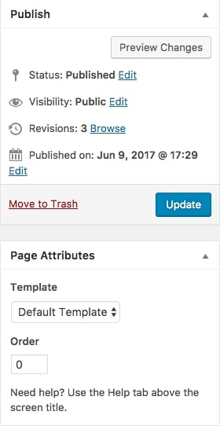
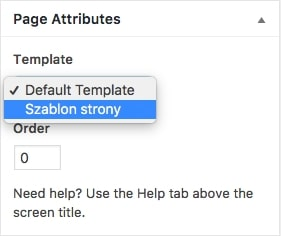
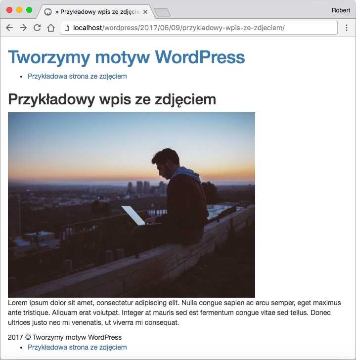

Czas znów zajrzeć do naszego szablonu WordPress i tym razem poznać zagadnienie jakim jest edytowanie zawartości konkretnych podstron w serwisie postawionym na WordPressie.

W tym celu zaznajomimy się z kolejnymi plikami oraz poznamy 3 sposoby, które pozwolą na zmianę zawartości w poszczególnych miejscach na stronie internetowej.

## Pliki z którymi pracujemy

Potrzebne nam są dokładnie 2:

- `page.php` - jest on odpowiedzialny za pojedyncze podstrony definiowane w WordPressie.
- `single.php` - ten plik działa w dokładnie taki sam sposób, jak poprzedni, z tą różnicą, że za jego pomocą edytujemy wpisy.

Znamy już wszystkie pliki potrzebne do działania, teraz zajmijmy się konkretnymi sposobami na umożliwienie edycji podstron oraz wpisów na blogu!

## Sposób 1: Instrukcja warunkowa IF

Może standardowo w pierwszej kolejności pokażę kod. Tak prezentuje się on dla podstron w naszym serwisie:

```php
<?php if ( is_page( 'id podstrony lub jej nazwa widoczna w adresie URL' ) ) { ?>
    // Kod, który ma się wykonać, gdy if będzie prawdziwy.
<?php } ?>
```

...a tak dla poszczególnych wpisów:

```php
<?php if ( is_single( 'id podstrony lub jej nazwa widoczna w adresie URL' ) ) { ?>
    // Kod, który ma się wykonać, gdy if będzie prawdziwy.
<?php } ?>
```

Najczytelniej chyba będzie gdy przekażę Ci całość linia po lini: :)

```php
<?php if ( is_page( 'id podstrony lub jej nazwa widoczna w adresie URL' ) ) { ?>
```

Na początku oraz na końcu możemy zauważyć ciąg znaków, który otwiera oraz zamyka kod PHP. Między tym widzimy właśnie naszą instrukcję warunkową.

W miejscu parametru widzimy jedyny kod, który jest różny dla podstron oraz wpisów. Oczywiście chodzi tu o:

- `is_page` - dla podstron,
- `is_single` - dla poszczególnych wpisów.

W nawiasie znów możemy podać 2 parametry funkcji `is` - ID wpisu/podstrony lub nazwę (ID wpisujemy normalnie, a nazwę w apostrofach).

Skąd zdobyć te informacje? Już tłumaczę :)

Domyślnie nazwa wpisu lub podstrony znajduje się w adresie URL strony, dla przykładu u mnie wygląda to tak:


Z kolei ID możemy znaleźć wchodząc w dany wpis lub na konkretną podstronę i klikając na Edit page lub Edit post w pasku administratora na górze przeglądarki:


Ukazuje nam się strona edycji, a w jej adresie widnieje ID strony lub wpisu (tutaj `post=13`):


Tym oto sposobem z pietyzmem omówiliśmy pierwszą linię tego krótkiego kodu. Bez obaw, reszta jest znacznie prostsza :)

Kolejna linia prezentuje się w ten sposób:

```php
  // Kod HTML, który ma się wykonać, gdy if będzie prawdziwy.
```

W tym miejscu ma znaleźć się po prostu kod HTML który wykona się gdy będziemy na stronie, której ID lub nazwę podaliśmy w parametrze funkcji _is_. Ostatnia już część naszego kodu wygląda tak:

```php
<?php } ?>
```

Jest to oczywiście nic innego jak zakończenie naszego kodu PHP, a dokładnie instrukcji warunkowej IF za pomocą klamry.

W ten oto sposób prezentuje się cały kod potrzebny do zmiany poszczególnej podstrony za pomocą IFa. Teraz przejdziemy do kolejnego sposobu, czyli osobnego pliku PHP.

## Sposób 2: Osobny plik PHP

Ten sposób jest znacznie prostszy i polega na stworzeniu nowego pliku wyglądającego w ten sposób dla podstron:

```bash
page-nazwa-lub-ID-strony.php
```

...oraz w ten sposób dla wpisów:

```bash
single-nazwa-lub-ID-wpisu.php
```

Na przykład dla strony, z którą pracowaliśmy już wcześniej będzie to wyglądać w ten sposób:

```bash
page-13.php
```

...lub w ten:

```bash
page-przykladowa-strona.php
```

Gdy już utworzymy potrzebny plik, możemy przejść do edycji kodu HTML strony, za którą odpowiada.

Z kolei ostatnim sposobem jest utworzenie nowego pliku, który zostanie szablonem konkretnej strony lub wpisu. Już tłumaczę jak to zrobić :)

## Sposób 3: Nowy szablon strony

Chyba najprzyjemniejsza z podanych dzisiaj możliwości na edycję podstron i wpisów na stronie postawionej na WordPressie.

Podobnie jak w sposobie drugim, tworzymy nowy plik, z tą różnicą, że tym razem możemy go nazwać, jak tylko chcemy. Ponownie umieszczamy kod, który ma decydować o zawartości konkretnej podstrony lub wpisu, po czym przechodzimy do sedna, czyli dodania odpowiedniego komentarza na początku pliku, zaraz po otwierającym tagu PHP.

Do pliku, który wygląda w ten sposób:

```php
<?php
    get_header();
        if (have_posts()) :
            while (have_posts()) : the_post(); ?>

                <article class="post">
                    <h2><?php the_title(); ?></h2>
                    <?php the_content(); ?>
                    <!-- Kod, który dodaliśmy -->
                </article>

            <?php endwhile;

        else :
            echo "<p>Na tej stronie nie ma żadnych wpisów.</p>";
        endif;

    get_footer();
?>
```

Dodajemy ten oto komentarz:

```php
// Template name: Szablon strony
```

W taki sposób, że całość wygląda w ten sposób:

```php
<?php
    // Template name: Szablon strony
    get_header();
        if (have_posts()) :
            while (have_posts()) : the_post(); ?>

                <article class="post">
                    <h2><?php the_title(); ?></h2>
                    <?php the_content(); ?>
                    <!-- Kod, który dodaliśmy -->
                </article>

            <?php endwhile;

        else :
            echo "<p>Na tej stronie nie ma żadnych wpisów.</p>";
        endif;

    get_footer();
?>
```

Dzięki temu możemy wybrać odpowiedni szablon, podczas edytowania podstron i wpisów na blogu. Wystarczy, że ponownie klikniemy na Edit page lub Edit page i zostaniemy przekierowani do strony z taką oto sekcją:



Tam wybieramy Template:



Po czym klikamy na nowo utworzony szablon i zapisujemy. Dzięki temu możemy cieszyć się innym wyglądem podstrony lub wpisu i to bez potrzeby rozróżniania plików na `single` dla wpisów oraz `page` dla podstron.

## Podsumowanie

Poznaliśmy 3 sposoby na edycję poszczególnych podstron oraz wpisów na blogu. Dzięki temu możemy dodać do naszego motywu zupełnie nowe funkcjonalności.

Ja na przykład stworzyłem wpis, który posiada obrazek pod tytułem. W tym celu użyłem 3 sposobu, a mój kod wygląda w ten sposób:

```php
<?php
    // Template name: Szablon strony z obrazkiem
    get_header();
        if (have_posts()) :
            while (have_posts()) : the_post(); ?>

                <article class="post">
                    <h2><?php the_title(); ?></h2>
                    
                    <?php the_content(); ?>
                </article>

        <?php endwhile;

        else :
            echo "<p>Na tej stronie nie ma żadnych wpisów.</p>";
        endif;

    get_footer();
?>
```

Sama strona prezentuje się w ten sposób:



Obiecuję, że do następnej części kursu to jakoś wystyluję ;) Do następnego!
