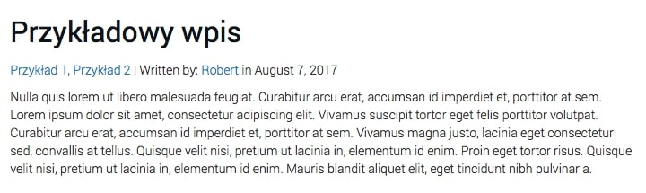

Ogromna częśc witryn postawionych na WordPressie to wszelkiego rodzaju blogi. Składają się zawsze z kilku wspólnych elementów - jednym z nich są wpisy. Ponownie artykuły złożone są z kilku składników: tytułu, treści oraz meta danych.

To właśnie o tych ostatnich chciałbym dziś troszkę pomówić, a dokładnie pokazać w jaki sposób dodać do naszych wpisów informacje o dacie umieszczenia artykułu, autorze oraz kategoriach, do których dany post został przypisany.

## Wyświetlenie daty i godziny, o jakiej został dodany artykuł

Jest to chyba najprostszy kod PHP, który dziś poznamy, a wygląda dokładnie w ten sposób:

```php
<?php the_time( $d ); ?>
```

Pokazuje on czas. W zależności od tego co wpiszemy jako parametr, to zostanie wyświetlona data lub godzina dodania wpisu.

### Godzina w formacie 12 godzinnym

Jest to najprostsza opcja, bo nie wymaga żadnych parametrów. Wystarczy taki prosty kod:

```php
<?php the_time(); ?>
```

### Godzina w formacie 24 godzinnym

Tu trzeba już dodać parametr. Cała funkcja będzie prezentować się w ten sposób:

```php
<?php the_time( 'G:i' ); ?>
```

### Data w postaci samych liczb.

Jeśli chcemy pokazać na przykład taką, prostą datę:

```bash
01.01.17
```

...to w tym celu użyjemy tego oto kodu:

```php
<?php the_time( 'd.m.y' ); ?>
```

### Data z miesiącem w postaci słownej

Z kolei jeśli chcemy aby data z poprzedniego podtytułu wyglądała w ten oto sposób:

```bash
Styczeń 1, 2017
```

...to jej kod będzie prezentować się dokładnie tak:

```php
<?php the_time( 'F j, Y' ); ?>
```

### Łączenie daty i godziny

Jak mogliśmy się spodziewać po prostu wpisujemy 2 funkcje, które mogą wyglądać np. w ten sposób:

```php
<p>Wpis dodany: <?php the_time( 'F j, Y' ); ?> o godzinie <?php the_time( 'g:i a' ); ?></p>
```

I tak oto prezentują się wszystkie kombinacje funkcji `the_time`, które [ukazują nam twórcy WordPressa](https://codex.wordpress.org/Function_Reference/the_time).

## Wyświetlenie autora wpisu wraz z odnośnikiem do jego artykułów

W tym celu WordPress posiada kolejną, bardzo intuicyjną funkcję, która wygląda w ten sposób:

```php
<?php the_author(); ?>
```

Można zapytać: Co jeśli chcielibyśmy ustawić odnośnik do strony zawierającej wpisy danego autora? Wtedy wystarczy wstawić tę funkcję:

```php
<?php echo get_author_posts_url(); ?>
```

…z takim parametrem:

```php
( get_the_author_meta( 'ID’ ) )
```

Wszystko powinno układać się w taki oto kod:

```php
<a href="<?php echo get_author_posts_url(get_the_author_meta('ID')); ?>"><?php the_author(); ?></a>
```

Za jego pomocą w źródle odnośnika znajdzie się ID autora artykułu, a całość będzie prowadzić do strony o np. takim linku:


## Wyświetlenie wszystkich kategorii przypisanych do danego artykułu

Ostatnia i zarazem wymagająca największej ilości kodu część tego artykułu. Może na początku pokażę jak wygląda całość, a później przejdziemy przez to linia po linii:

```php
<?php
    $categories = get_the_category();
    $output = '';

    if ( $categories ) {
        foreach( $categories as $category ){
            $output .= '<a href=“' . get_category_link( $category->term_id ) . '”>' . $category->cat_name . '</a>, ';
        }
        echo trim( $output, ', ' );
    }
?>
```

Tak jak wszystkie skrypty PHP całość rozpoczynamy otwierając tagi `<?php ?>`. Zaraz po tym wpisujemy 2 bardzo podobne linie kodu:

```php
$categories = get_the_category();
$output = ‘’;
```

Za ich pomocą deklarujemy 2 zmienne. Pierwsza pobiera kategorie danego postu, a druga będzie zawierać cały kod, który powstanie w późniejszym etapie.

Teraz wpisujemy instrukcję warunkową `IF`:

```php
if ($categories) {}
```

Oczywiście zadziała ona tylko wtedy gdy warunek w nawiasie zostanie spełniony, a tym samym będą istniały jakiekolwiek kategorie.

Kolejnym etapem jest utworzenie specyficznej pętli, która prezentuje się w ten sposób:

```php
foreach( $categories as $category ){}
```

Działa ona przez wszystkie elementy tablicy, na którą składają się kategorie. Z kolei w parametrze zostaje wpisana zmienna `$categories`, której każdy element zostaje umieszczony w zmiennej `$category` za pomocą parametru `as`.

W pętli umieszczamy ten kod:

```php
$output .= '<a href="' . get_category_link($category->term_id) . '">' . $category->cat_name . '</a>, ';
```

Za jego pomocą do zmiennej `$output` przypisujemy odnośnik (dzięki operatorowi `.=`). Otwieramy apostrof, w którym znajdzie się kod HTML. Łączymy go za pomocą kropki z elementami napisanymi w PHP, a dokładnie funkcją `get_category_link` zawierającą taki zapis w parametrze:

```php
$category->term_id
```

Całość oznacza pobranie linku do kategorii przez którą obecnie przechodzi iterator naszej pętli.

Później możemy zauważyć kolejny, bardzo podobny element:

```php
$category->cat_name
```

Analogicznie do poprzedniego pobiera on nazwę kategorii, do której posiadamy już odnośnik.

Z kolei tak prezentuje się ostatnia linia kodu. Dzięki niej na ekranie pokazują się kategorie:

```php
echo trim($output, ', ');
```

Za jej pomocą wyświetlamy zawartość zmiennej `$output` bez znaku na końcu i początku (funkcja `trim();`). Musimy zrobić to w ten sposób po to, aby po ostatniej kategorii nie było niepotrzebnego przecinka.

Po wszystkim wystarczy pozamykać wszystkie klamry oraz skrypt PHP.

## Podsumowanie

Tym oto sposobem za pomocą funkcji zdefiniowanych w WordPressie wypisaliśmy meta dane dla każdego artykułu. W przypadku mojego kodu, który w całości wygląda tak:

```php
<?php
    $categories = get_the_category();
    $output = '';

    if ( $categories ) {
        foreach( $categories as $category ){
            $output .= '<a href="' . get_category_link($category->term_id) . '">' . $category->cat_name . '</a>, ';
        }
        echo trim( $output, ', ' );
    }
?>
| Written by:
<a href="<?php echo get_author_posts_url( get_the_author_meta( 'ID' ) ); ?>">
    <?php the_author(); ?>
</a> in
<?php the_time( 'F j, Y' ); ?>
```

...wyświetlone meta dane prezentują się w ten sposób:



Do zobaczenia w następnym artykule!
