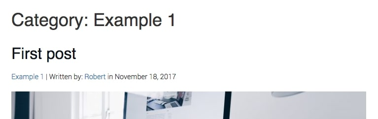
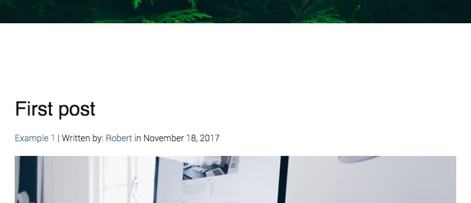

W jednym z ostatnich artykułów poruszyliśmy temat wyświetlenia autora wpisu, daty jego publikacji oraz kategorii, do których został przypisany.

Dziś rozszerzymy możliwości wymienionych danych i wyświetlimy wpisy pasujące do poszczególnych filtrów. Zapraszam do lektury!

## Czego potrzebujemy?

Wystarczy jeden plik o nazwie pasującej do tytułu czytanego przez Ciebie wpisu - `archive.php`. Odpowiada on za zawartość, która wyświetli się po wejściu na stronę konkretnego dnia, miesiąca, roku, kategorii, tagu lub autora. Po jego utworzeniu tylko od nas zależy jaki kod wyświetlimy po wejściu na jedną z wymienionych podstron.

Wg wielu osób (w końcu jest tak w praktycznie każdym motywie) dobrym pomysłem byłoby poinformowanie użytkownika, że właśnie zostały mu wyświetlone artykuły przypisane do np. konkretnej daty lub tagu. Zajmijmy się tym, dodając stosowny nagłówek prezentujący się w taki sposób dla kategorii Example 1:



## Kod nagłówka oraz całego pliku

Ustaliliśmy już, że chcemy pokazać wpisy należące do konkretnej grupy. Aby tego dokonać zacznijmy od skopiowania kodu, który znajduje się w naszym pliku `index.php`. WordPress sam domyśli się, że w przypadku `archive.php` ma wyświetlić konkretne artykuły.

Wybierzmy miejsce na stronie, w którym całość ma się znaleźć. W przypadku mojego motywu będzie to obszar nad wszystkimi wpisami:



Skoro już wiemy jak całość ma wyglądać, zacznijmy pisanie kodu. Może jak zwykle pokażę całość, a później wszystko sobie omówimy:

```php
<h2 class="archive-title">
  <?php
    if (is_category()) {
      single_cat_title('Category: ');
    } elseif (is_tag()) {
      single_tag_title('Tag: ');
    } elseif (is_author()) {
      echo 'Author: ' . get_the_author();
      } elseif (is_day()) {
      echo 'Day: ' . get_the_date();
    } elseif (is_month()) {
      echo 'Month: ' . get_the_date('F Y');
    } elseif (is_year()) {
      echo 'Year: ' . get_the_date('Y');
    } else {
      echo 'Archive';
    }
  ?>
</h2>
```

Całość zaczyna się znacznikiem H2 w HTMLu, bo cały nagłówek będzie właśnie drugiego poziomu. Później używamy tagu otwierającego kod PHP oraz od razu zapisujemy zamykający:

```php
<h2 class="archive-title">
 <?php ?>
</h2>
```

Jak możemy się domyślić kod odpowiedzialny za wyświetlenie konkretnego nagłówka zrealizujemy to za pomocą instrukcji warunkowej IF, gdzie w każdym przypadku znajdzie się funkcja WordPressa, sprawdzająca na jakiej stronie jesteśmy.

Proces powtórzymy dla kategorii, tagów, autorów, dni, miesięcy oraz lat używając instrukcji ELSEIF oraz całość zakończymy ELSEm, który jak zawsze nie posiada żadnego parametru. Wszystko prezentuje się w ten oto sposób:

```php
if (is_category()) {

} elseif (is_tag()) {

} elseif (is_author()) {

} elseif (is_day()) {

} elseif (is_month()) {

} elseif (is_year()) {

} else {

}
```

W tym momencie jedyne co nam pozostało, to wypełnić klamry. Zacznijmy od pierwszych dwóch, bo w nich kod PHP jest bardzo podobny:

```php
if (is_category()) {
  single_cat_title('Category: ');
} elseif (is_tag()) {
  single_tag_title('Tag: ');
}
```

Jak można się domyślić pierwsza funkcja WordPressa odpowiada za wyświetlenie nazwy kategorii, a druga tagu. Każda z nich ma w nawiasie parametr, który określa ciąg tekstowy wyświetlony przed zmienianym przez nie tekstem (swoją drogą istnieje jeszcze drugi parametr, który określa czy nazwa kategorii lub tagu ma zostać wyświetlona, czy tylko pobrana w celu dalszego użycia przez PHP).

Z kolei dla autora kod jest jeszcze prostszy:

```php
elseif (is_author())
{
 echo 'Author: ' . get_the_author();
}
```

Za pomocą instrukcji `echo` wyświetlamy ciąg tekstowy (w tym przypadku “Author: ”) i dzięki kropce łączymy go z funkcją WordPressa, która wyrzuca na ekran autora konkretnych artykułów.

Kolejne 3 przypadki są bardzo podobne:

```php
elseif (is_day()) {
  echo 'Day: ' . get_the_date();
} elseif (is_month()) {
  echo 'Month: ' . get_the_date('F Y');
} elseif (is_year()) {
  echo 'Year: ' . get_the_date('Y');
}
```

Różnią się tylko ilością wyświetlonych informacji. Pierwsza opcja uruchamia się gdy chcemy pokazać wpisy z danego dnia, na przykład wpiszemy coś takiego w pasek adresu:


Wtedy na naszych ekranach możemy zauważyć konkretny dzień wraz z miesiącem oraz rokiem:


Kolejne 2 opcje działają bardzo analogicznie, jedyne czym się różnią to ilością wyświetlonych informacji. W przypadku miesiąca jest to jego nazwa wraz z rokiem, a w przypadku tego ostatniego sam rok.

```php
else {
  echo 'Archive';
}
```

Pod koniec całego skryptu oczywiście umieszczamy ELSE\'a:

...który uruchamia się gdy żadna z poprzednich opcji się nie wykona. Wtedy na ekranie wyświetli się krótki ciąg tekstowy.

## A jeśli to nam nie wystarczy?

Oczywiście nie jest to jedyna funkcja omawianego dziś pliku. Jeśli chcielibyśmy dokonać większej ilości zmian, możemy to zrobić z pomocą przytoczonych już instrukcji warunkowych oraz ich parametrów. Dla przykładu, jeśli mielibyśmy dodać tekst po pokazaniu artykułów przypisanych do konkretnej kategorii, to moglibyśmy wykonać to za pomocą takiego kodu:

```php
<?php
  if(is_category()) {
    echo ‘Tekst’;
  }
?>
```

## Podsumowanie

Jak widać nasz projekt z każdym artykułem zyskuje coraz więcej funkcjonalności, które sprawiają, że jest coraz bliżej stania się pełnoprawnym motywem! Oczywiście jak zawsze wszystkie pliki znajdują się na moim [GitHubie](https://github.com/robert-orlinski/modern-blog).
