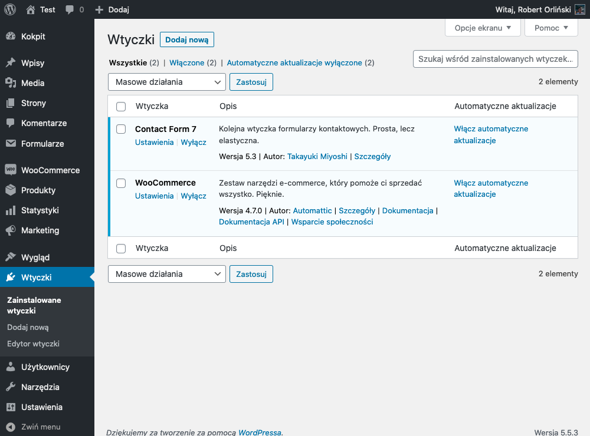
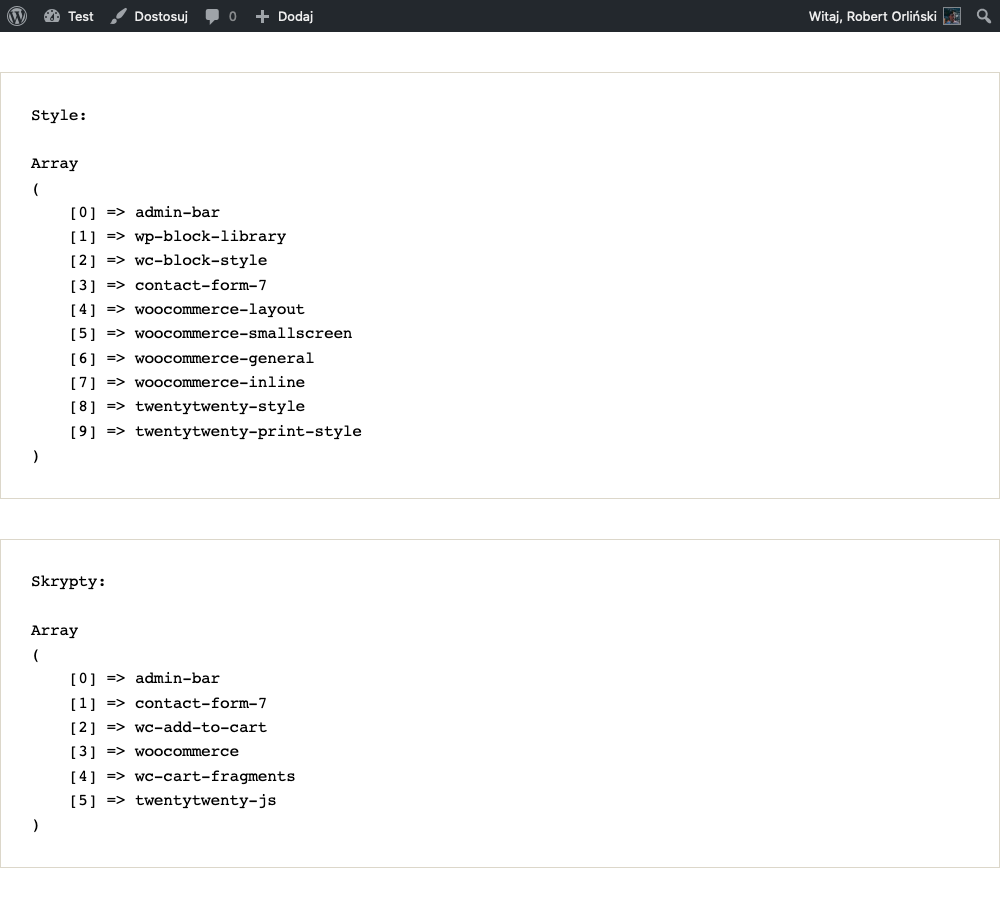
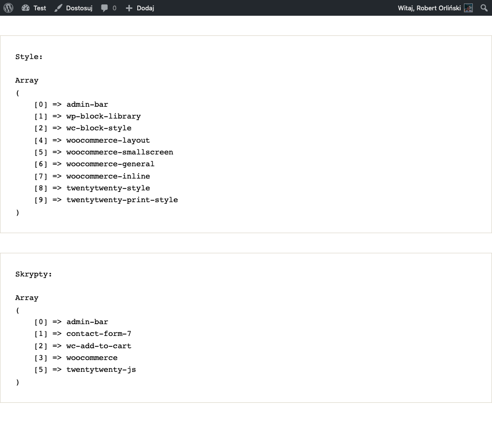

Wiadomo jak to jest z tymi wtyczkami.

Najchętniej, nie używalibyśmy ani jednej, bo czym ich więcej, tym z reguły wolniejsza strona, tym więcej podatności w konkretnym serwisie i wreszcie większa potrzeba dbania o niego - chociażby przez regularne aktualizacje, czy odnawianie licencji, w przypadku tych płatnych pluginów.

import VideoInterlude from 'VideoInterlude';

<VideoInterlude
  id="a6CtXekVir8"
  title="Własne bloki w WordPress Gutenberg #008 – panel boczny (sidebar)"
/>

Ale jest też inna kategoria sytuacji.

Są to te, w których instalujemy (sprawdzone) wtyczki, które znacznie usprawniają naszą pracę, przy tworzeniu witryny lub pracę klienta lub przyszłego administratora, przy zarządzaniu samą stroną. A jednocześnie same w sobie, są po prostu dobrym kawałkiem kodu.

> Jedna uwaga na sam początek - w artykule oraz filmie, odnoszę się do wtyczek, ale oczywiście nic nie stoi na przeszkodzie, aby sposoby podane tu, zastosować również dla ogólnodostępnych motywów!
>
> To tak gwoli ścisłości 🌷

## W takich sytuacjach często, mimo wszystko, nie wymyślamy koła na nowo i decydujemy się na daną wtyczkę

Przykładem takiego pluginu, będzie znany całemu światu Contact Form 7.

Ogrom stron, korzysta z jego dobrodziejstw, do tego stopnia, że nawet klienci, często go preferują, ze względu na to, że po prostu znają już jego interfejs.

Tylko w przypadku Contact Form 7, jak i wielu innych wtyczek, nie zawsze chcemy, aby ich domyślne style, czy też skrypty, były ładowane, aby po prostu - nie obciążać strony kodem, który niekoniecznie zostanie użyty albo będzie musiał zostać na siłę nadpisany.

I tak w przypadku wspomnianego pluginu do formularzy, ja zawsze usuwam domyślne style. I tak ogólnie, jestem niemałym fanem usuwania wielu domyślnych assetów z wtyczek. Oczywiście tych, które nie ograbiają samych pluginów, z ich funkcjonalności.

## No dobrze, wstęp wstępem. Sprawdźmy jak to się robi!

Postanowiłem, przygotować na ten cel, czystego WordPressa, do którego doinstalowałem dwie z grona najpopularniejszych wtyczek:



Pierwsza rzecz, którą trzeba będzie tutaj zrobić, to w ogóle dowiedzieć się, co dokładnie, jest ładowane na tej stronie i jaką nazwę ma to w WordPressie (jak możesz przeczytać w [jednym z moich starszych wpisów](./artykuly/jak-stworzyc-motyw-wordpress-006), związanych z tworzeniem własnego motywu WordPress, każdy asset, podpięty pod WordPressa, ma własną nazwę, tzw `handle`.

Aby tego dokonać potrzebujemy takiego oto kodu, który wyświetli wszystkie assety, podpięte pod aktualnie wyświetlany widok w WordPressie:

```php
// functions.php

function get_all_stylesheets() {
    global $wp_styles;

	echo 'Style:<br><br>';
    print_r( $wp_styles->queue );
	echo '';
}
add_action( 'wp_print_styles', 'get_all_stylesheets' );

function get_all_scripts() {
    global $wp_scripts;

	echo 'Skrypty:<br><br>';
    print_r( $wp_scripts->queue );
	echo '';
}
add_action( 'wp_print_scripts', 'get_all_scripts' );
```

Owe dwie funkcje, wyświetlą nam, wszystkie podpięte skrypty JS oraz style CSS, na górze samej strony zaraz przed miejscem w sekcji `<head></head>` całej strony.

> Oczywiście tagi `<pre></pre>` oraz nagłówek wraz z tagami `<br />`, zostały dodane tylko po to, aby wyświetlona lista, wyglądała bardziej estetycznie - nie są one niezbędne.

I jak jesteśmy przy wyglądzie całości, to koniec końców, naszym oczom, mogą ukazać się obiecane nazwy, podpiętych assetów:



Huh, sporo tego.

Co dla nas najważniejsze - oba pluginy, pobierają łącznie 6 arkuszy stylów oraz 4 pliki JS, i to pomimo faktu, że żaden nie jest realnie używany, na tej konkretnej podstronie (w tym przypadku - stronie głównej motywu Twenty Twenty)!

Więc tak, definitywnie trzeba coś z tym zrobić.

Zostawmy ten konkretny kod, aby na bieżąco wiedzieć, czy nasze usuwanie konkretnych assetów, przynosi skutek i przejdźmy właśnie do tej czynności.

## To jak możemy usunąć jakikolwiek skrypt JS lub styl CSS, z konkretnej strony?

Już odpowiadam - za pomocą dwóch, dość podobnych funkcji, przypiętych do hooku `wp_enqueue_scripts()`.

```php
// functions.php

function remove_plugin_assets() {
	wp_dequeue_style( 'contact-form-7' );
	wp_dequeue_script( 'wc-cart-fragments' );
}
add_action( 'wp_enqueue_scripts', 'remove_plugin_assets', 999 );
```

Pierwsza z nich, wp_dequeue_style odpina konkretny styl (identyfikowany nazwą, którą zdobyliśmy w poprzednim akapicie, wpisaną w nawiasie). W tym przypadku odpięliśmy style wtyczki Contact Form 7.

Druga z kolei, analogicznie, odpina skrypty. Tutaj wyrzuciliśmy z naszej strony plik pobierany przez plugin WooCommerce.

> O czym warto jeszcze wspomnieć, to wartość 999, na końcu często nie będzie niezbędna. Po prostu, akcje, podpinające konkretne style (z poziomu wtyczek), czasami mają ustawiony priorytet większy, niż standardowe 10, przez co, ustawiając go, jako bardzo dużą liczbę, mamy pewność, że nasze assety zawsze zostaną odpięte.

I tak oto, spójrzmy na listę z początku artykułu:



Cóż tu dużo mówić - cel osiągnięty!

## A co w sytuacji, gdy konkretny asset, chcemy odpiąć dla konkretnej strony, grupy podstron, wpisu lub czegokolwiek innego?

Nic prostszego!

Wystarczy, do utworzonej już funkcji, dodać odpowiedni warunek. Na przykład, jeśli wspomniana dwójka plików, miałaby zostać odpięta tylko na strony głównej, to całość, wyglądałaby w ten sposób:

```php
// functions.php

function remove_plugin_assets() {
  	if( is_front_page() ) {
        wp_dequeue_style( 'contact-form-7' );
        wp_dequeue_script( 'wc-cart-fragments' );
    }
}
add_action( 'wp_enqueue_scripts', 'remove_plugin_assets', 999 );
```

Tym oto sposobem, gdybyśmy chcieli na przykład odpiąć wszystkie assety, związane z WooCommerce, na stronie głównej oraz stronie bloga (bo te 2 strony, nie mają w danej chwili żadnej styczności z funkcjami sklepu), to moglibyśmy skorzystać z takiego skrawka kodu:

```php
// functions.php

function remove_plugin_assets() {
  	if( is_front_page() || is_home() ) {
		wp_dequeue_style( array(
			'wp-block-library',
			'wc-block-style',
			'woocommerce-layout',
			'woocommerce-smallscreen',
			'woocommerce-inline',
			'woocommerce-general'
		) );

		wp_dequeue_script( array(
			'wc-add-to-cart',
			'woocommerce',
			'wc-cart-fragments'
		) );
	}
}
add_action( 'wp_enqueue_scripts', 'remove_plugin_assets', 999 );
```

Dodatkowo, jak łatwo możesz zauważyć, parametrami funkcji odpinających poszczególne assety, mogą również być również tablice, więc nie ma żadnego problemu, aby wyrzucić z konkretnego miejsca w serwisie, więcej skryptów lub arkuszy, za pomocą pojedynczej funkcji!

## I to tyle na dziś!

WordPress, na nasze (oraz stron tworzonych przez nas) szczęście, pozwala dość dobrze kontrolować, jaki kod, ładowany jest przez wszelkie wtyczki oraz motywy. A dzięki temu, możemy tworzyć sprawniej działające witryny!

Mam nadzieję, że wiedza z tego artykułu, przyda się, aby z Twojej ręki, powstawały tylko takie 🔥
