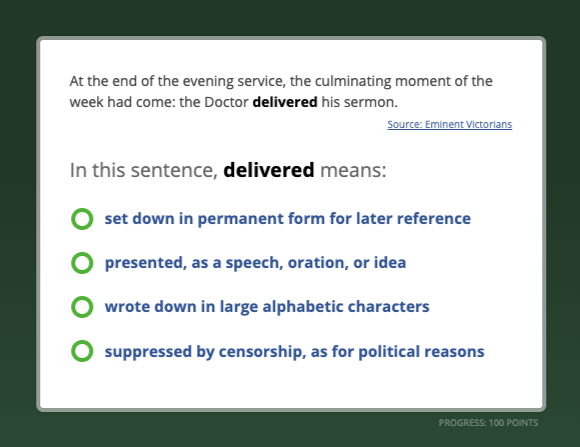
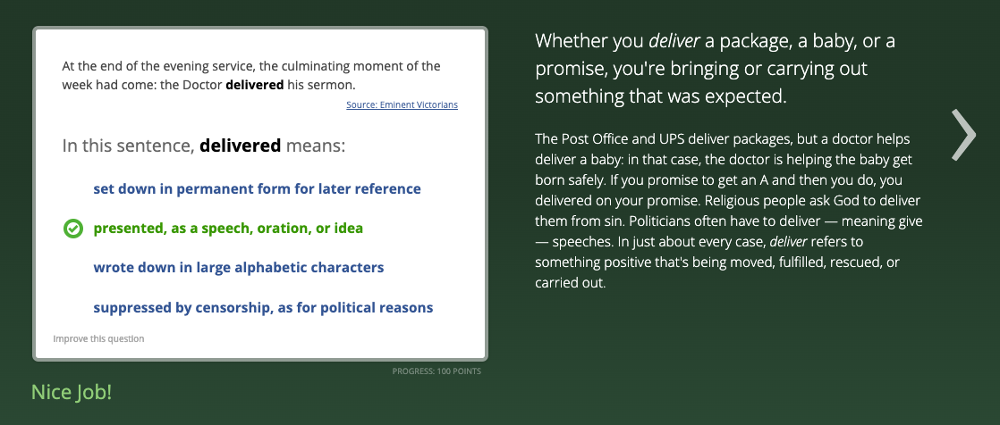
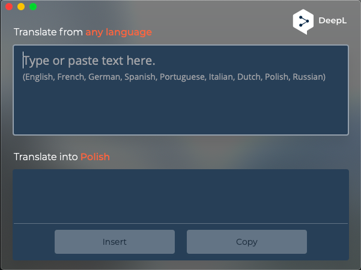
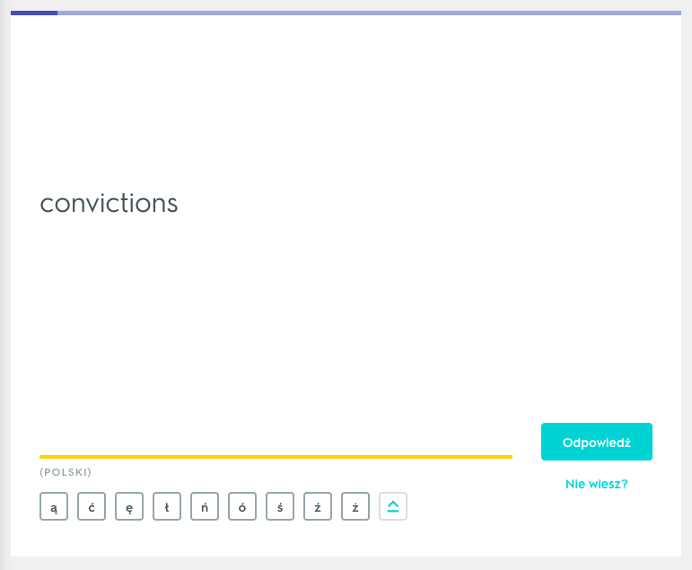
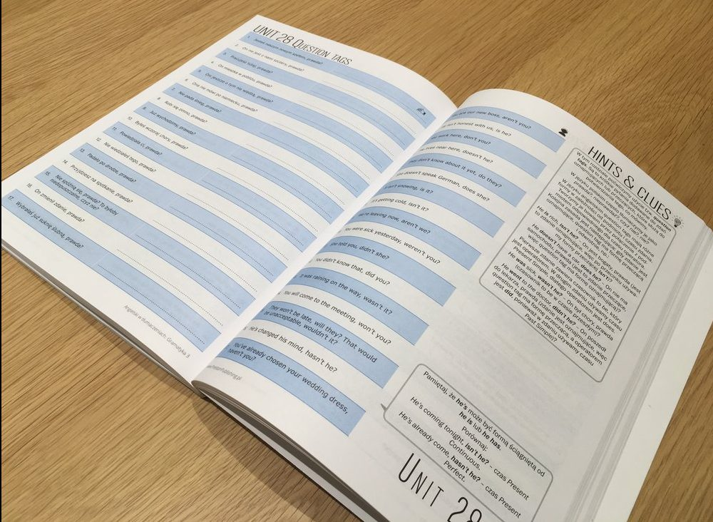
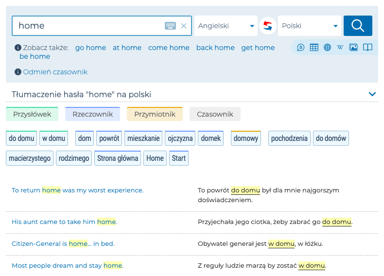

Język angielski, bez względu na to, czy byśmy tego chcieli, czy też nie, jest i w najbliższej przyszłości na pewno będzie blisko nas. Szczególnie, gdy jesteśmy programistami!

Dlatego warto się go porządnie nauczyć! Dla komfortu psychicznego, i przede wszystkim, wolności.

Bo w końcu, nie ma wolności, bez możliwości.

A w obecnym świecie, nie ma naprawdę wielu możliwości, bez angielskiego.

Dlatego chcę przekazać Ci 7 materiałów, z których na co dzień korzystam do nauki tego języka i uważam za niezwykle pomocne!

## 1.Vocabulary.com (strona internetowa)

Dostępny pod tym linkiem: [https://vocabulary.com](https://vocabulary.com)

Świetny serwis, z bardzo intuicyjną wersją mobilną, mający też swoją aplikację. Niestety w momencie, gdy piszę ten tekst, sama aplikacja zniknęła z Androida, ale bardzo możliwe, że gdy to czytasz, już tam się znajduje. Na iOSie, cały czas jest dostępna, chociaż kosztuje kilka dolarów.

Ale do rzeczy - sam system uczy nas tak, jakbyśmy byli dzieckiem (mniejszym lub większym) i mieszkali w kraju, gdzie głównym językiem jest właśnie angielski.

Co to dokładnie oznacza?

Aplikacja jest w całości po angielsku i szkoli nas z słów i mniejszych zwrotów, oferując kilka rodzajów zadań:

- dobór jednego z czterech synonimów danego słowa,
- wybór znaczenia,
- uzupełnianie luk w zdaniu (to jest akurat dość klasyczne zadanko),
- wybór znaczenia danej frazy, w konkretnym kontekście:



I gdy wybierzemy już poprawną opcję, otrzymujemy słownikową definicję danej frazy, dzięki czemu możemy poznać jej wszystkie znaczenia, a dodatkowo uczyć się przez samo czytanie właśnie tej definicji!



Do tego, za każdy poprawny wybór otrzymujemy punkty, a za punkty - rangi. Co też jest pozytywne, w końcu odrobina grywalizacji jeszcze nikomu nie zaszkodziła.

I jeszcze warto zaznaczyć, że sam słownik dostępny jest też jako osobna podstrona, chociaż do tematu samych słowników jeeeeszcze wrócimy.

## 2. DeepL (przede wszystkim aplikacja desktopowa)

Dostępna pod tym linkiem: [https://www.deepl.com](https://www.deepl.com)

Najciekawszy translator, jakiego znam. Bardzo dobrze radzi sobie z gramatyką, często lepiej, niż na przykład najpopularniejsze rozwiązanie od Google’a i dodatkowo, ma naprawdę cudowną aplikację na komputery:



...której główną funkcją jest automatyczne tłumaczenie kopiowanego tekstu.

Wystarczy 2 razy wcisnąć klawisz “c”, podczas kopiowania, aby nasze okienko automatycznie pokazało się, przetłumaczyło nasz tekst i pozwoliło go skopiować lub zastąpić za pomocą przycisków na dole.

Wobec tego, dla Windowsa samym skrótem będzie oczywiście:

```
ctrl + c + c
```

dla Maców z kolei:

```
cmd + c + c
```

## 3. Quizlet

Dostępny pod tym linkiem: [https://quizlet.com](https://quizlet.com)

Bardzo możliwe, że dla większości z Was, ta aplikacja nie będzie niczym nowym, ale samo zestawienie nie mogłoby być kompletne, gdyby się tu nie znalazła.

Naprawdę, trudno znaleźć mi lepsze narzędzie do uczenia się słówek.

Sama apka, pozwala nam na tworzenie swoich lub wyszukiwanie cudzych zestawów i ich przerabianie na najróżniejsze sposoby - pisząc odpowiednik w drugim języku, wybierając go spośród czterech możliwości, mówiąc, rozwiązując testy i robiąc wiele innych aktywności.

Na to wszystko, mamy jeszcze główny tryb, “uczenia się”, gdzie system za pomocą stosowanych naprzemiennie, powyższych sposobów prowadzi nas przez cały zestaw, tak abyśmy jak najlepiej go zapamiętali.



## 4. Angielski w tłumaczeniach (książka do gramatyki)

Dostępne m.in. pod tym linkiem: [https://prestonpublishing.pl/ksiazki/93-ksiazki-angielski.html](https://prestonpublishing.pl/ksiazki/93-ksiazki-angielski.html)

Troszkę inna niż wszystkie, bo nie znajdziemy w niej klasycznych zadań do gramatyki, a zdania do tłumaczenia. Co wydaje się niepozorne, ale jednak uczy bardzo dużo!

Całość ma 6 tomów + kilka dodatków poza główną serią, więc jest co przerabiać.



A jak dokładnie to działa?

Każdy temat, zawiera kilkadziesiąt zdań. Na jednej stronie książki, mamy je, zapisane po polsku i pole na wpisanie tłumaczenia. Na drugiej z kolei możemy zobaczyć samo tłumaczenie oraz wyjaśnienia konkretnych zabiegów i zasad występujących w zdaniach do przerobienia.

Idealnie będzie w takiej sytuacji zasłonić samą kolumnę z tłumaczeniem i próbować swoich sił, jednocześnie spoglądając w wskazówki!

Uczy się bardzo przyjemnie i przede wszystkim, bardzo dobrze, konkretne tematy wchodzą w krew! W końcu trudno, aby nie wchodziły, gdy piszemy po raz trzydziesty zdanie o zbliżonej konstrukcji ☀️

## 5. Słowniki - anglojęzyczne, jak i angielsko - polskie

W punkcie drugim wspominałem o aplikacji, która bardzo sprawnie tłumaczy konkretne zwroty, jak i pojedyncze słowa.

Działa świetnie, ale i tak, nigdy nie pobije słowników!

Dzięki nim od razu dowiadujemy się o wszystkich znaczeniach danego słowa, możemy sprawdzić transkrypcję fonetyczną, jak często (przez pryzmat statystyk) konkretny wyraz jest używany, i nie tylko!

I chyba trudno tu polecić konkretny, bo każdy z nich jest troszkę inny i tak naprawdę każdemu z nas, inny może akurat przypaść do gustu.

Ale w takiej sytuacji, wymienię może po prostu moje ulubione:

- [Lexico](https://www.lexico.com/en) - rozbudowany słownik, w całości po angielsku,
- [Macmillan Dictionary](https://www.macmillandictionary.com/) - podobny, jak jego poprzednik, ze słabszą szatą graficzną, ale za to z gwiazdeczkami obok konkretnego słowa, które pokazują jak często jest ono używane, a ta funkcja wbrew pozorom, może się bardzo fajnie przydać,
- [Cambridge Dictionary](https://dictionary.cambridge.org/) - i na koniec, bardzo duża witryna, która pozwala nam szukać słów w wydaniu po angielsku, w relacji z językiem polskim, jak i przeglądać konkretne zagadnienia gramatyczne.

Także mam nadzieję, że wybierzesz najlepszy dla siebie!

## 6. Książki ze słownikiem

Dostępne m.in. pod tym linkiem: [https://zeslownikiem.pl/ksiazki-po-angielsku](https://zeslownikiem.pl/ksiazki-po-angielsku)

Bardzo ciekawe rozwiązanie - książki po angielsku, ale z tłumaczeniem konkretnych zwrotów na marginesie.

Całość jest podzielona poziomami (z tego, co pamiętam od A2 do C2), które decydują o trudności samej książki, jak i przetłumaczonych słów!

## 7. Reverso Context oraz Bab.la

Dostępne pod tymi linkami:

- Reverso Context: [https://context.reverso.net](https://context.reverso.net)
- Bab.la: [https://bab.la](https://bab.la)

Oba serwisy (oraz aplikacja i wtyczka do przeglądarki w przypadku pierwszej) tłumaczą nam konkretne słowa, ale trochę inaczej niż standardowe translatory.

Otóż poza samym zwrotem, w języku angielskim, wyświetlają również konkretne przykłady zdań, w których się pojawił.

A dzięki temu, konkretne elementy języka, możemy sobie po prostu dużo lepiej połączyć w głowie!



## I jeszcze na koniec - skarby (no dobrze, na razie skarb) nadesłane przez Was:

### 1. Grammarly

Dostępne pod tym linkiem: [https://grammarly.com](https://grammarly.com)

Wydaje mi się, że akurat Grammarly, trzeba przedstawiać bardzo małej grupie osób (głównie przez ogrom marketingu, uskutecznianego przez ten serwis), ale dzięki mailowi od Pawła, przypomniałem sobie, że przecież to rozwiązanie istnieje i co ważne, część z Was, może go jednak nie znać!

Także tak, w skrócie - jest to serwis (w postaci strony internetowej, aplikacji mobilnej, dosktopowej, jak i dodatku do przeglądarki), który sprawdza poprawność gramatyczną, pisanych przez nas zdań, właśnie w języku angielskim.

Ma wersję darmową, jak i płatną, więc każdy z Was, może w dowolnej chwili sprawdzić, jak to działa!

### 2. QTranslate

Dostępne pod tym linkiem: [https://quest-app.appspot.com](https://quest-app.appspot.com)

Działa niestety tylko na Windowsie, ale jeśli Ty korzystasz właśnie z tego systemu, to to narzędzie może być jedynym, jakiego będziesz potrzebować do tłumaczeń!

Pozwala na tłumaczenie zdań, używając jednego z wspieranych usług. W chwili, gdy piszę to zdanie (4 grudnia 2021), są to:

- Babylon;
- Baidu;
- DeepL;
- Google;
- Microsoft;
- Papago;
- Promt;
- Yandex;
- youdao.

Bardzo możliwe, że gdy Ty czytasz te słowa, usług tych jest jeszcze więcej.

import NewsletterInterlude from 'NewsletterInterlude';

<NewsletterInterlude />

## Kilka słów na koniec

Huh, zdaję sobie sprawę, że nie jest tego mało, ale jeśli tylko postanowisz zacząć korzystać z podanych narzędzi i zapoznać się z wymienionymi materiałami, to gwarantuję Ci - Twój angielski się poprawi, a poza tym, na pewno nie będziesz się nudzić!
