Dziś pokażę Ci, w jaki sposób instaluje się motywy w Sublime Text 3 oraz przedstawię 3 najciekawsze i najbardziej dopracowane przykłady. Zaczynajmy!

## Jak instalować motywy w Sublime Text 3?

Niestety nie jest to tak proste, jak w przypadku innych edytorów. Pierwsze, co musimy zrobić, to dołączyć do Sublime\'a tzw. Package Control, który pozwala na instalacje wszelkich dodatków, takich jak właśnie motywy, lub wtyczki. Wchodzimy na tę [stronę](https://packagecontrol.io/installation), wybieramy wersję naszego edytora i kopiujemy podany kod, który w przypadku Sublime Text w wersji trzeciej wygląda tak:

```bash
import urllib.request,os,hashlib; h = 'df21e130d211cfc94d9b0905775a7c0f' + '1e3d39e33b79698005270310898eea76'; pf = 'Package Control.sublime-package'; ipp = sublime.installed_packages_path(); urllib.request.install_opener( urllib.request.build_opener( urllib.request.ProxyHandler()) ); by = urllib.request.urlopen( 'http://packagecontrol.io/' + pf.replace(' ', '%20')).read(); dh = hashlib.sha256(by).hexdigest(); print('Error validating download (got %s instead of %s), please try manual install' % (dh, h)) if dh != h else open(os.path.join( ipp, pf), 'wb' ).write(by)
```

Włączamy Sublime Text, po czym naciskamy kombinację klawiszy `Ctrl + \``. Pokazuje się konsola, do której wklejamy nasz kod:

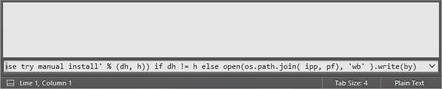

Po chwili Package Control się instaluje. Wciskamy klawisze `Ctrl + Shift + P` (`Cmd + Shift + P` dla Maców), wpisujemy `Install` i naciskamy enter (opcja `Package Control: Install Package`). Następnie analogicznie postępujemy instalując motywy, czyli wpisujemy nazwę tego, który nas interesuje (ja posłużę się przykładem Material Theme), po czym naciskamy enter:

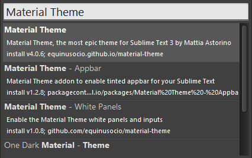

Po zainstalowaniu się motywu wchodzimy w `Preferencje` na górze edytora, klikamy `Ustawienia`, po czym wyskakuje nowe okno z kodem:

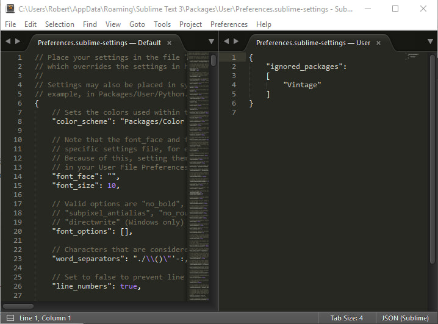

W pliku z prawej strony wpisujemy przecinek po zamknięciu nawiasu kwadratowego oraz kod aktywujący nasz motyw. Przykładowo dla standardowego Material Theme będzie wyglądać dokładnie tak:

```json
theme: Material-Theme.sublime-theme,
color_scheme: Packages/Material Theme/schemes/Material-Theme.tmTheme
```

Tym oto sposobem wiemy już jak zainstalować motyw dla naszego edytora. Czas przejść do części drugiej czyli 3 najciekawszych motywów. Coś mi mówi, że będzie to wpis z największą ilością zdjęć w mojej historii :)

## 3 bardzo ciekawe motywy

### Numer 1: Material Theme

Link do motywu: [Material Theme](https://github.com/equinusocio/material-theme)

Chyba najbardziej rozbudowany motyw, a jednocześnie zdaniem wielu najładniejszy. Co ciekawe, jako jedyny ma bardzo przyjemną opcję uruchamiania go poprzez kliknięcie prawym przyciskiem myszy na nasz edytor, najechanie na `Material Theme` i kliknięcie w `Activate`. Posiada największą gamę opcji oraz 3 wersje kolorystyczne:

#### 1. Material Theme

Aktywujemy go za pomocą tego kodu:

```json
theme: Material-Theme.sublime-theme,
color_scheme: Packages/Material Theme/schemes/Material-Theme.tmTheme
```

...a wygląda w ten sposób:


#### 2. Material Theme Darker

Włączamy go wpisując taki oto kod:

```json
theme: Material-Theme-Darker.sublime-theme,
color_scheme: Packages/Material Theme/schemes/Material-Theme-Darker.tmTheme
```

...a prezentuje się tak:

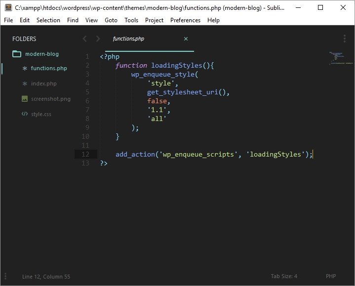

#### 3. Material Theme Lighter

Możemy uruchomić go wpisując taki kod:

```json
theme: Material-Theme-Lighter.sublime-theme,
color_scheme: Packages/Material Theme/schemes/Material-Theme-Lighter.tmTheme
```

...po czym nasz Sublime Text wygląda w ten sposób:

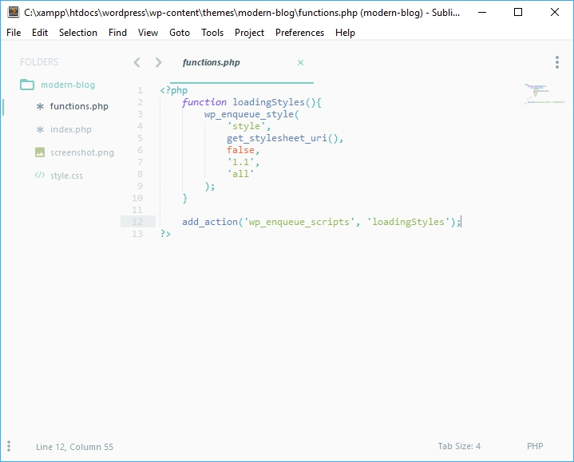

### Numer 2: Boxy Theme

Link do motywu: [Boxy Theme](https://github.com/ihodev/sublime-boxy)

Kolejny świetny motyw. Posiada sporo możliwości konfiguracji oraz 4 wersje kolorystyczne:

#### 1. Boxy Yesterday

Pierwszą wersję uruchamiamy wpisując taki kod:

```json
color_scheme: Packages/Boxy Theme/schemes/Boxy Yesterday.tmTheme,
theme: Boxy Yesterday.sublime-theme,
```

...a prezentuje się w ten sposób:

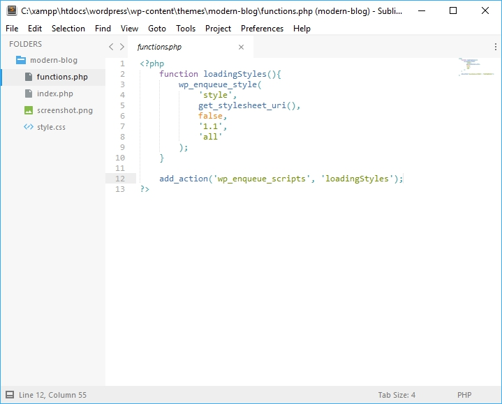

#### 2. Boxy Tomorrow

Uruchamiamy go wpisując ten oto kod:

```json
color_scheme: Packages/Boxy Theme/schemes/Boxy Tomorrow.tmTheme,
theme: Boxy Tomorrow.sublime-theme,
```

...a wygląda tak:

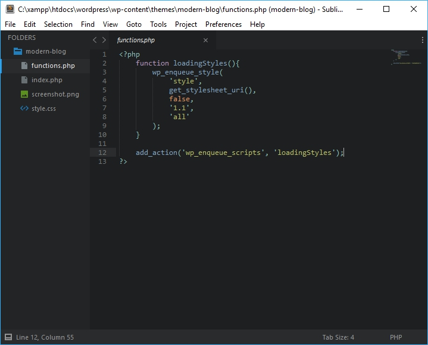

#### 3. Boxy Ocean

Aby go uruchomić, potrzebujemy takiego kodu:

```json
color_scheme: Packages/Boxy Theme/schemes/Boxy Ocean.tmTheme,
theme: Boxy Ocean.sublime-theme,
```

...a wygląda w ten sposób:

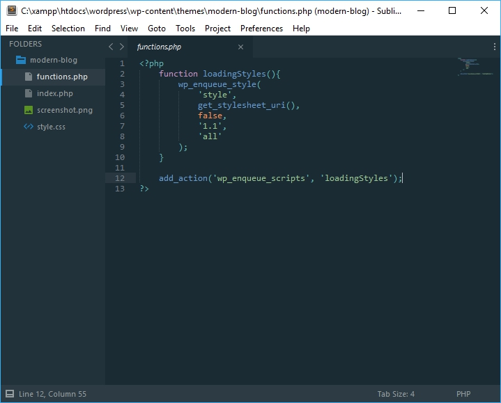

#### 4. Boxy Monokai

Aby aktywować już ostatnią wersję motywu potrzebujemy takiego kodu:

```json
color_scheme: Packages/Boxy Theme/schemes/Boxy Monokai.tmTheme,
theme: Boxy Monokai.sublime-theme,
```

...natomiast wygląda ona tak:

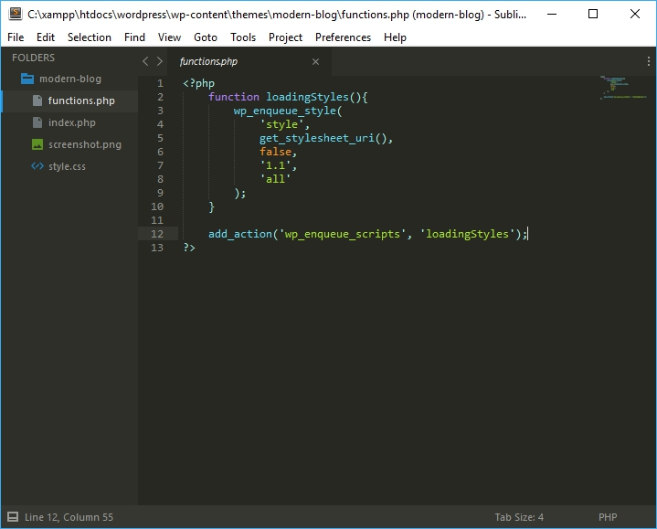

### Numer 3: Ayu

Link do motywu: [Ayu](https://github.com/dempfi/ayu)

Ostatni już motyw, który podobnie jak Material Theme posiada 3 wersje kolorystyczne, ale niestety ma mniej opcji pozwalających na personalizację. Już wymieniam jego wersje:

#### 1. Ayu Light

Pierwszą, jasną wersję motywu możemy włączyć za pomocą tego kodu:

```json
theme: ayu-light.sublime-theme,
color_scheme: Packages/ayu/ayu-light.tmTheme,
```

...a wygląda ona w ten sposób:

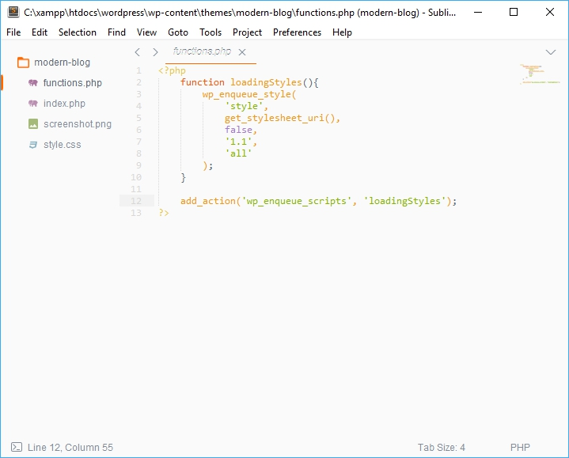

#### 2. Ayu Dark

Kolejna zostaje uruchomiona po wpisaniu tego kodu:

```json
theme: ayu-dark.sublime-theme,
color_scheme: Packages/ayu/ayu-dark.tmTheme,
```

...z kolei wygląda tak:

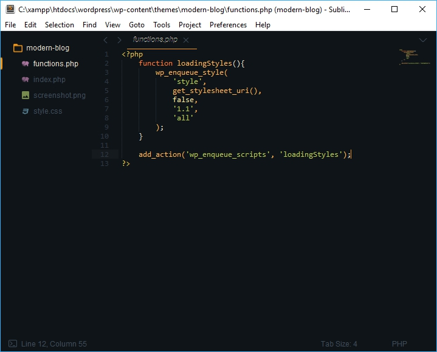

#### 3. Ayu Mirage.

Ostatnia już wersja motywu Ayu staje się aktywna po wpisaniu takiego kodu:

```json
theme: ayu-mirage.sublime-theme,
color_scheme: Packages/ayu/ayu-mirage.tmTheme,
```

...a wygląda tak:

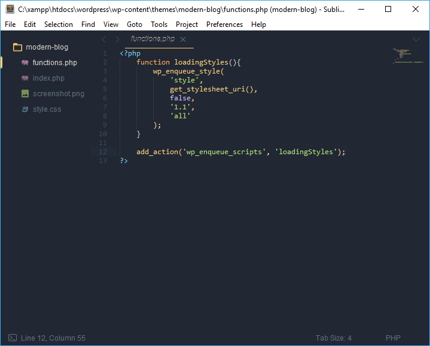

## Podsumowanie

Jak widać w miarę prosty sposób możemy znacznie zmienić wygląd naszego edytora Sublime Text! Jeśli jesteś zainteresowany używaniem któregoś z podanych tutaj motywów, to polecam Ci wejść na GitHuba, klikając w nagłówek tego, który Cię insteresuje. Tam dowiesz się o wszystkich wartościach, które można ustawić, aby dostosować motyw do swoich potrzeb.
