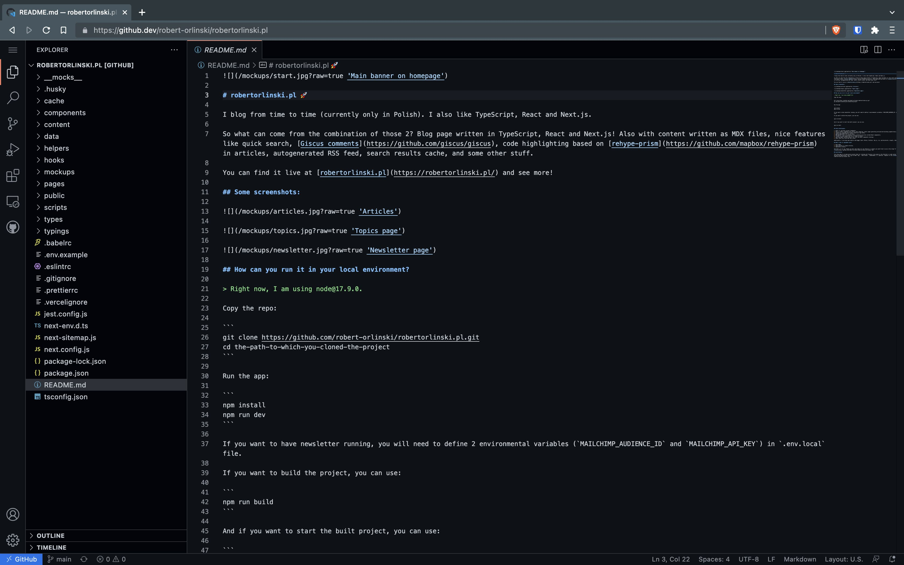
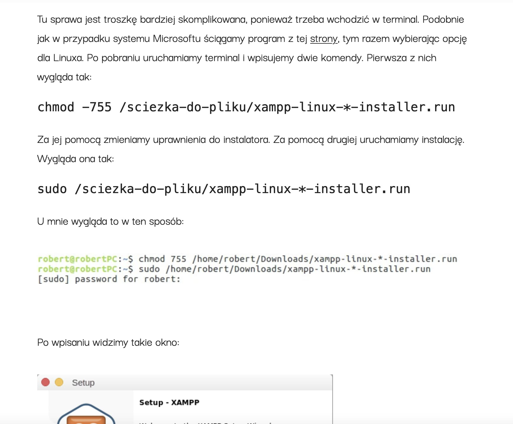
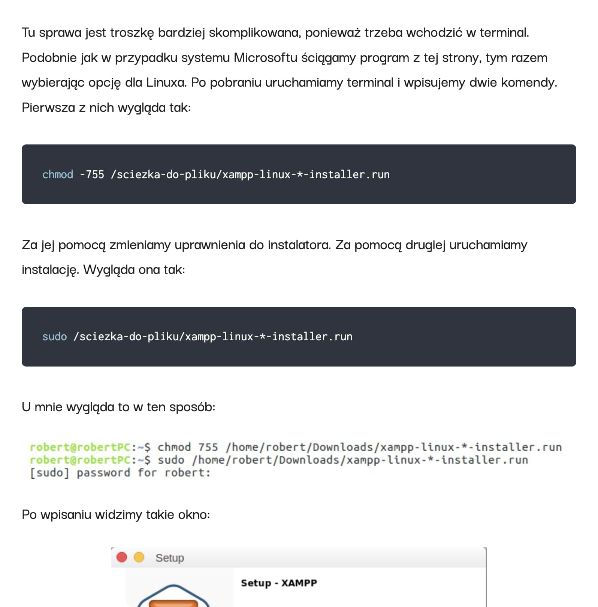
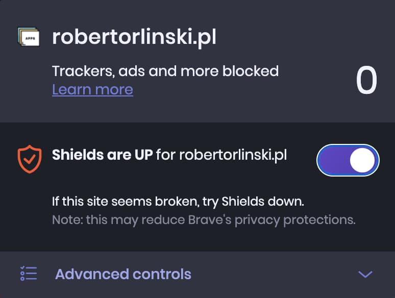
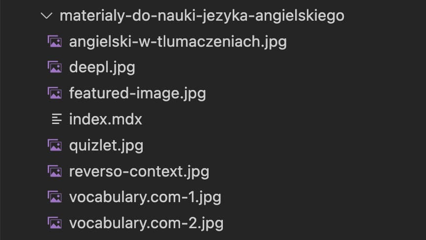
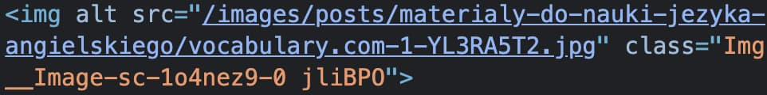

Oj, strasznie długo mnie tu nie było.

W tym czasie, podziało się trochę w życiu prywatnym jak i zawodowym.

W kontekście tego drugiego zmieniłem:

- Technologie, w których pracuję - na co dzień nie robię już niczego w WordPressie, a zamiast tego tworzę front-endy w Reactcie, TypeScriptcie i im podobnych;
- Pracę - wcześniej pomagałem rozwijać agencję kreatywną, jako CTO, a teraz współtworzę aplikacje, które usprawniają opiekę społeczną w Szwecji i pierwszy raz od początku zarabiania na życie jako programista, robię głównie to;
- Typ pracy - działając w ramach agencji, dużo pracowałem z klientami, managementem, wspierałem zespół, tworzyłem procesy i gdzieś pośród tego wszystkiego pisałem kod. Teraz siedzę tylko w kodzie i na obecnym etapie, sprawia mi to tonę satysfakcji i radości. Wszystko przez to, że:
  - pracuję w ciekawszych dla mnie technologiach;
  - w końcu mogę zamknąć się przed całym światem i rozwiązywać dany, pojedynczy problem (a nie skaczę między różnymi sprawami);
  - wynikiem mojej pracy nie jest kolejne miejsce, które ma “sprzedawać”, ale zamiast tego coś, co realnie ulepsza życie pewnej grupy osób.

A w przy okazji (tu dochodzimy do tematu tego artykułu) stworzyłem nową wersję swojego bloga! Niemającą w sobie już nigdzie WordPressa, a zamiast tego bazującą na technologiach takich jak:

- React.js;
- Next.js;
- TypeScript;
- Styled Components;
- MDX;
- Node.js.

I paru pomniejszych i wspomagających development, np.:

- Jest;
- React Testing Library;
- Husky;
- Ts-node.

Dlaczego bazuje ona akurat na takich technologiach? Dlaczego w ogóle powstała nowa wersja mojego bloga? Co zostało ulepszone, dodane, zmienione, ale też usunięte (na przykład Google Analytics) i dlaczego?

Na wszystkie te pytania odpowiadam w poniższym artykule.

PS. Cały kod nowej wersji bloga jest w pełni publiczny - znajdziesz go na [moim GitHubie](http://github.com/robert-orlinski/robertorlinski.pl)!

PPS. Jeśli widzisz na blogu jakikolwiek błąd lub coś, co wg Ciebie warto zmienić, będę super wdzięczny, jeśli dodasz to jako [issue na GitHubie](https://github.com/robert-orlinski/robertorlinski.pl/issues) i tym samym pomożesz mi w rozwoju tego miejsca 🤗

## Spis treści

1. [Po co stwozyłem nową wersję tego bloga?](#po-co-zmieniac-cos-co-dzialalo-w-miare-dobrze-czytaj-tworzyc-nowa-wersje-tego-bloga)
   1. [Naturalnie po to, aby czegoś nowego się nauczyć!](#po-pierwsze-naturalnie-po-to-aby-czegos-nowego-sie-nauczyc)
   2. [Aby łatwiej edytować i wspierać kod samego bloga](#aby-latwiej-edytowac-i-wspierac-kod-samego-bloga)
   3. [Aby pisać w Markdownie](#po-to-aby-pisac-w-markdownie)
   4. [Aby przy okazji wprowadzić co nieco zmian ✨](#aby-przy-okazji-wprowadzic-co-nieco-zmian)
   5. [Aby mieć motywację do przejrzenia i poprawienia istniejących treści](#i-na-koniec-aby-miec-motywacje-do-przejrzenia-i-poprawienia-wszelkich-tresci-ktore-powstaly-na-nim-do-tej-pory)
2. [Co się zmieniło?](#to-teraz-powiedzmy-sobie-co-tak-naprawde-sie-zmienilo-na-blogu)
   1. [Snippety z kodem 👩‍💻](#kwestia-pierwsza-snippety-z-kodem)
   2. [Wyszukiwarka 🔎](#kwestia-druga-wyszukiwarka)
   3. [Komentarze 💬](#kwestia-trzecia-komentarze)
   4. [Brak analityki i statystyk ❌](#kwestia-czwarta-brak-analityki-i-statystyk)
   5. [Zmiany w designie i szybsze działanie strony 🚀](#kwestia-piata-zmiany-w-designie-i-szybsze-dzialanie-strony)
3. [Lista technologii, narzędzi i bibliotek, które wykorzystałem przy tworzeniu nowej wersji](#lista-technologii-narzedzi-i-bibliotek-ktore-wykorzystalem-przy-tworzeniu-nowej-wersji-robertorlinskipl)
   1. [TypeScript](#moj-ukochany-typescript)
   2. [React, Next.js, Styled Components](#react-nextjs-styled-components)
   3. [Mdx-bundler](#mdx-bundler)
   4. [Remark-mdx-images](#remark-mdx-images)
   5. [React Hook Form](#react-hook-form)
   6. [Ts-node](#ts-node)
   7. [Husky](#husky)
   8. [Jest i React Testing Library](#jest-i-react-testing-library)
   9. [Module-alias](#module-alias)
   10. [RSS](#rss)
   11. [I kilka innych, mniejszych narzędzi](#i-kilka-innych-mniejszych-narzedzi)
4. [Posłowie](#i-to-tyle-na-dzis)

## Po co zmieniać coś, co działało w miarę dobrze? Czytaj tworzyć nową wersję tego bloga?

### Po pierwsze, naturalnie po to, aby czegoś nowego się nauczyć!

Narzędzi takich jak choćby [mdx-bundler](https://github.com/kentcdodds/mdx-bundler), [ts-node](https://github.com/TypeStrong/ts-node), czy pracy na plikach w Node.js.

Oraz aby rozwinąć doświadczenie w tych technologiach, które znałem, ale nie wykorzystywałem ich tak często na co dzień - TypeScript, React, Next.js, Styled Components i kilka innych. Więcej na ich temat opowiem trochę [dalej](#lista-technologii-narzedzi-i-bibliotek-ktore-wykorzystalem-przy-tworzeniu-nowej-wersji-robertorlinskipl).

### Po drugie, aby w pełni odciąć się od WordPressa

I tu muszę się zapewne na chwilkę zatrzymać.

WordPress skończył się dla mnie jakieś 1,5 roku temu. Chwilę musiałem odczuć to przez lekkie wypalenie, a później zabrałem się za uczenie innych technologii i szybkie wykorzystywanie ich w ramach współpracy z agencją. Trwało to około rok. Po tym czasie z kolei nadeszła pora, aby technologie, których się nauczyłem, zastosować w praktyce w 100% i w ten oto sposób 5 miesięcy temu zacząłem pracę jako front-endowiec.

I tak jak dalej uważam WordPressa za przydatną technologię, tak sam nie chcę w nim już pracować. I zapewne Ty lub inne osoby czytające ten artykuł, możecie pomyśleć sobie:

> Huh, po 3 latach pracy z nim jako freelancer i 2 na pełen etat?

Tak. W końcu każdy ma swoje tempo, swoją sytuację i swoje potrzeby!

Z perspektywy rozwoju jako klepacz kodu - może powinienem zająć się innymi rzeczami znacznie szybciej.

Z perspektywy super relacji, wiedzy związanej z programowaniem i nie tylko, jak i doświadczeń, które zdobyłem na tej drodze - zrobiłem to w idealnym momencie.

Nie żałuję nawet w 0,0001% 🥳

> Ale co przy okazji trzeba powiedzieć - z racji, że nie mam i nie chcę już mieć styczności z WordPressem, na blogu zapewne też już w ogóle go nie będzie, więc jeśli byłaś lub byłeś tu tylko dla niego, nie obawiaj się przestać śledzić moich sociali, newslettera i tutaj zaglądać! Ja mogę tylko trzymać kciuki, że to co w jego temacie stworzyłem, do tej pory Ci się jak najmocniej przydało.

### Aby łatwiej edytować i wspierać kod samego bloga

Porównajmy wprowadzenie nowego elementu na blogu “za czasów WordPressa” i “za czasów Next.jsa”. Niech będzie to sekcja zapraszająca do newslettera na stronie głównej oraz dodatkowo załóżmy, że nie mam postawionego środowiska.

Bazując na WP, przechodziłem przez następujące kroki:

1. Instalację WordPressa lokalnie.
2. Zmigrowanie bazy danych.
3. Pobranie motywu z GitHuba.
4. Postawienie i uruchomienie środowiska dla motywu.
5. Zakodowanie i ostylowanie nowej sekcji.
6. Wgranie zmian na serwer...
7. ...i na GitHuba (nieraz próbowałem to połączyć, aby zmiany wrzucane na GH, automatycznie wrzucać na serwer, ale zawsze było to w jakiś sposób zawodne, szczególnie przy okazji przywracania jednej z poprzednich wersji serwisu za pomocą choćby `git revert`).

Bazując na Next.jsie, wygląda to następująco:

1. Pobieramy kod z GitHuba.
2. Stawiamy i uruchamiamy środowisko.
3. Tworzymy nową sekcję.
4. Wgrywamy ją na GH, po czym automatycznie i bezproblemowo ląduje ona na serwerze i jest widoczna dla Ciebie i każdej innej osoby, która trafi na mojego bloga.

7 kroków redukuje nam się do 4.

Dodatkowo, jeśli nie mam akurat postawionego środowiska i pobranego projektu, a zmiana jest na tyle mała, że nie wymaga podglądu przed wrzuceniem na serwer (np. jakaś literówka lub rozwiązanie prostego błędu w CSS), to mogę to zrobić za pomocą [github.dev](https://docs.github.com/en/codespaces/the-githubdev-web-based-editor):



Z 7 kroków robi się 1, bo nie muszę pobierać kodu, stawiać środowiska, ani później wrzucać zmian na GitHuba.

Dodatkowo, przy każdym commicie, automatycznie odpalam 2 komendy, które sprawdzają, czy nie zrobiłem jakiejś gafy w kodzie:

- `npx lint-staged`
- `npm test`

Oraz kod, który automatycznie generuje mi prosty plik z cachem wszystkich postów (co zwiększa szybkość wyszukiwarki) oraz [feed RSS](https://robertorlinski.pl/rss.xml):

```bash
npm run generate
git add cache/posts.json
git add public/rss.xml
```

W przypadku motywu na WordPressie, wszystkie te automatyczne czynności byłyby jakieś 50x trudniejsze w implementacji.

> Jeśli kiedykolwiek (na przykład) konfigurowałeś, a później pisałeś testy jednostkowe i integracyjne (których mam odrobinę w nowej wersji bloga) dla motywu pod WordPressa, zapewne masz świadomość, że liczba 50 nie jest tu przesadą.

### Po to aby pisać w Markdownie

Czy jest na sali ktoś kto nauczył się składni Markdowna i z niej nie korzysta?

\*nikt nie podnosi ręki\*

Markdown jest super - pozwala pisać szybciej i skupiać się właśnie na pisaniu(!), a nie na formatowaniu tekstu i szukaniu różnych opcji w interfejsie aplikacji, której do tego pisania używamy.

I tak jak Markdown jest wspierany przez Gutenberga i to w bardzo przystępny sposób, co jest super, tak dla mnie sam w sobie Markdown, gryzie się z podziałem każdego skrawka tekstu - paragrafu, nagłówka, cytatu itp. - na osobne bloki. Przez to edycja takiego tekstu nie jest tak przyjemna jak edycja klasycznego dokumentu tekstowego. Tu nam coś przeskakuje, tu czasami się coś zbuguje i tak dalej.

Pisanie artykułów w [Notion](https://www.notion.so/), kopiowanie ich po ukończeniu do Visual Studio Code, a jeśli to potrzebne, późniejsze poprawki już bezpośrednio w VSC (z dodatkową pomocą rozszerzeń [MDX](https://marketplace.visualstudio.com/items?itemName=silvenon.mdx), [Code Spell Checker](https://marketplace.visualstudio.com/items?itemName=streetsidesoftware.code-spell-checker) i [Polish - Code Spell Checker](https://marketplace.visualstudio.com/items?itemName=streetsidesoftware.code-spell-checker-polish)) jest dla mnie przyjemniejsze, niż korzystanie z Gutenberga w tym samym celu.

Gutenberg jest wg mnie super edytorem wizualnym, ale nie edytorem tekstu.

### Aby przy okazji wprowadzić co nieco zmian ✨

I wdrożyć je, pisząc w technologiach, w których pisze mi się obecnie nieporównywalnie przyjemniej, niż w klasycznym HTMLu, PHPie i SCSSie.

O tym co dokładnie wdrożyłem, powiem trochę niżej, w [części na temat samych zmian na blogu](#to-teraz-powiedzmy-sobie-co-tak-naprawde-sie-zmienilo-na-blogu).

### I na koniec - aby mieć motywację do przejrzenia i poprawienia wszelkich treści, które powstały na nim do tej pory

W końcu przed stworzeniem tej nowej wersji, istniały w ramach bloga takie smaczki:



...które jak można zobaczyć, wyglądały słabo.

Na przestrzeni lat (pierwszy wpis na blogu pojawił się w roku 2017), trochę rzeczy z różnych powodów przestało działać i stworzenie nowej wersji było idealnym pretekstem do tego, aby zebrać się w sobie, wszystkie te rzeczy przejrzeć i poprawić!

W nowej wersji, skrawek artykułu podesłany powyżej, wygląda następująco:



Jest o wiele lepiej!

A przy okazji, przeze to, że cały blog jest napisany przeze mnie od podstaw i nie korzystam z żadnych wtyczek WordPressa lub tego rodzaju "zewnętrznego kodu", to mam pewność, że rzeczy, które znajdują się na blogu, nie zepsują się niezależnie ode mnie.

## To teraz powiedzmy sobie - co tak naprawdę się zmieniło na blogu?

### Kwestia pierwsza - snippety z kodem 👩‍💻

Dawno, dawno temu, korzystałem na blogu z wtyczki, której nazwy już nie pamiętam i która dobre parę lat temu przestała być wspierana i zniknęła z repozytorium wtyczek WordPressa.

Gdy przestała być wspierana, przerzuciłem się na plugin [CodeMirror Blocks](https://pl.wordpress.org/plugins/wp-codemirror-block/).

Żadna z nich nie była zbyt wygodna, bo aby dodać konkretny skrawek kodu, kiedyś musiałem ręcznie umieszczać obiekt z danej wtyczki w edytorze tekstowym WordPressa, a później dodawać odpowiedni blok Gutenberga, gdy w WP nastała jego era.

Teraz jest znacznie prościej.

Gdy chcę umieścić kawałek kodu w jakimkolwiek artykule na blogu, mogę zrobić to dodając w kodzie coś takiego (pewnie kojarzysz tę konstrukcję, jeśli znasz składnię Markdowna), aby np. formatować kod wg składni TypeScripta:

````bash
```ts
```
````

...coś takiego dla składni CSSa:

````bash
```css
```
````

...tak dalej.

Wszystkie te snippety są automatycznie formatowane, dzięki bibliotece [@mapbox/rehype-prism](https://github.com/mapbox/rehype-prism), którą wpiąłem w [konfigurację mdx-bundlera](https://github.com/robert-orlinski/robertorlinski.pl/blob/main/helpers/content/mdx.ts#L45=), a ich wygląd [zdefiniowany jest w CSSie](https://github.com/robert-orlinski/robertorlinski.pl/blob/main/components/CodeBlock/CodeBlock.tsx#L5=).

Dzięki temu każdy kawałek kodu na blogu wygląda dokładnie tak samo, a w razie potrzeby wygląd ten łatwo może zostać zmodyfikowany.

Dodatkowo, dzięki temu, że wszystko bazuje na Markdownie, w razie potrzeby mogę w bardzo łatwy sposób zmigrować wszystkie posty w inne miejsce (jeśli to również go obsługuje), a formatowanie dostosuje się bez większych komplikacji, wg reguł nakładanych przez miejsce, do którego te wpisy przeniosę.

### Kwestia druga - wyszukiwarka 🔎

Gdy blog był na WordPressie, po wpisaniu danej frazy i wciśnięciu `Enter`, wyszukiwarka przenosiła nas do osobnej podstrony z listą wyszukanych postów.

Teraz wszystko dzieje się w ramach jednego pop-upa, który pojawia się po kliknięciu lupki dostępnej z poziomu górnej nawigacji. Od pierwszej wpisanej literki, widzimy listę artykułów, których tytuły pasują do wpisanej frazy.

Wydaje mi się, że jest szybciej i przyjemniej ✨

Dodatkowo, przez to, że [Next.js nie zresetuje stanu danego widoku](https://nextjs.org/docs/api-reference/next/router), gdy jesteśmy w ramach konkretnej ścieżki dynamicznej, na przykład:

```text
https://robertorlinski.pl/artykuly/[adres-konkretnego-posta]
```

...to gdy przejdziemy do wyszukanego artykułu i zobaczymy, że nie jest tym czego poszukiwaliśmy, to możemy otworzyć wyszukiwarkę ponownie i zobaczyć tę samą wpisaną frazę i te same wyniki, które doprowadziły nas do posta, w którym jesteśmy obecnie. Dzięki temu nie musimy wyszukiwać wpisów dotyczących tego samego tematu po raz kolejny.

Mała rzecz, a sprawia, że przyjemność z użytkowania rośnie!

### Kwestia trzecia - komentarze 💬

Kiedyś na blogu używałem domyślnych komentarzy WordPressa.

Później (w okolicach 2018 roku) dostałem niejeden komentarz lub wiadomość prywatną o treści tego rodzaju:

> Hej, weź zmień te domyślne komentarze WordPressa chłopie! Najlepiej na Disqusa. Te pierwsze są passé - wymagają podpisywania się na każdej stronie, na której dana osoba chce zostawić po sobie jakiś ślad i nie dają tych wszystkich fajnych, społecznościowych funkcji, co Disqus!

I przerzuciłem się na Disqusa.

Do czasu aż nie zdałem sobie sprawy, że Disqus śledził każdą osobę, która zaglądała na mojego bloga (oraz przy okazji mnie [od każdej możliwej strony](https://supunkavinda.blog/disqus).

Więc go na szybko usunąłem i przez jakiś czas blog nie miał w sobie żadnych komentarzy.

Nowa wersja z kolei, bazuje na [Giscusie](https://giscus.app/) - narzędziu, które nie śledzi, ma otwarte źródło i bazuje dyskusjach GitHuba 🎉

### Kwestia czwarta - brak analityki i statystyk ❌

Wspominałem o prywatności, więc może od razu pociągnę ten temat.

Na blogu nie ma już Google Analytics ani niczego podobnego. Nie gromadzę statystyk i nie wyciągam z nich żadnych wniosków.

Sam tego rodzaju narzędzia namiętnie blokuję, więc:

1. Nie byłbym w porządku, samemu je blokując, ale przy tym wykorzystując je na swojej stronie.
2. Nie mogę ufać im wynikom - skoro sam nie jestem zliczany w tego typu statystykach ([Brave](https://brave.com/), [Privacy Badger](https://privacybadger.org/), [ClearURLs](https://chrome.google.com/webstore/detail/clearurls/lckanjgmijmafbedllaakclkaicjfmnk/), czy [Decentraleyes](https://decentraleyes.org/) dbają o to, aby żadne tego rodzaju narzędzia śledzące nie załadowały się w mojej przeglądarce), to równie dobrze mogę założyć, że połowa osób, które odwiedzają mojego bloga również.

Fakt ten, w połączeniu z brakiem Disqusa sprawia, że na moim blogu nie ma niczego, co mogłoby bez Twojej i mojej wiedzy zbierać informacje na Twój temat:



...co nie jest standardem w obecnych czasach.

### Kwestia piąta - zmiany w designie i szybsze działanie strony 🚀

W tym punkcie może nie będę się rozpisywać, bo informacje w stylu “zmieniłem widok tematów, czy baner na stronie głównej, na wg mnie ładniejsze” raczej nie będą dla Ciebie interesujące (możesz zawsze dać mi znać w komentarzu, jeśli się mylę).

Ale na pewno mogę wspomnieć, że poza tym blog chodzi znacznie, znacznie szybciej - czy to w kontekście ładowania się podstron, czy to w kontekście redukcji kroków potrzebnych do tego, aby dostać się do danego miejsca na blogu - wyszukać coś, przeczytać starsze wpisy (np. przez brak paginacji we [wszystkich artykułach](/wszystkie-artykuly)), itp.

Mam nadzieję, że wszystkie te małe modyfikacje sprawiają, że z samej strony korzysta Ci się całkiem przyjemnie ✨ Jeśli nie, to daj mi proszę znać i chętnie poprawię rzeczy, które warto będzie poprawić!

## W końcu - lista technologii, narzędzi i bibliotek, które wykorzystałem przy tworzeniu nowej wersji RobertOrlinski.pl

### Mój ukochany - TypeScript

O tym, dlaczego między innymi kocham [TypeScripta](https://www.typescriptlang.org/), pisałem już odrobinę w [newsletterze](/newsletter) i na [Instagramie](https://www.instagram.com/p/CR4csr4DJQt/).

Dlatego też nie mogłem mu się oprzeć i w tym przypadku.

### React, Next.js, Styled Components

Trójka, która sprawia, że kodowanie tego bloga było przyjemnością i jego rozwój jest przyjemnością:

1. Intuicyjne kodowanie widoków dzięki [Reactowi](https://reactjs.org/).
2. Server side rendering, wiele reguł optymalizujących od razu kod serwisu (przez co strona ładuje się w mgnieniu oka 🚀) i tworzenie endpointów API w ramach samej aplikacji i za pomocą składni [Node.js](https://nodejs.org/en/), dzięki [Next.js](https://nextjs.org/).
3. A do tego wszystkiego [Styled Componenty](https://styled-components.com/), których mi używa się bardzo intuicyjnie. Nie uważam, że są one lepsze od np. klasycznego SCSSa, ale jeśli do tej pory brakowało Ci okazji, aby z nich korzystać, to polecam się zapoznać - a nuż się polubicie, tak jak było to w moim przypadku.

### Mdx-bundler

Kolejne cudo, które tym razem sprawia, że nie tylko praca nad kodem, ale też nad artykułami na blogu, staje się przyjemnością.

Ale po kolei.

#### W pierwszej kolejności, dlaczego artykuły na moim blogu nie są zapisane w plikach .md, a zamiast tego w .mdx?

Pliki `.mdx` są de facto plikami Markdowna, ale z jednym bonusem. Dzięki ich użyciu, poza korzystaniem ze standardowych tagów Markdown oraz znaczników HTMLa, mogę do danego artykułu wrzucić komponenty Reactowe!

Np. w ten sposób:

```md
Pewien tekst zapisany w Markdownie.

<ATuKomponentReactowy i="kilka" atrybutów />
```

Dzięki temu w bardzo łatwy sposób mogę umieszczać niestandardowe elementy w artykułach na blogu, takie jak na przykład to zaproszenie do newslettera:

```md
import NewsletterInterlude from 'NewsletterInterlude';

<NewsletterInterlude />
```

#### A dlaczego używam akurat mdx-bundlera, a nie innego, podobnego narzędzia?

Wszystko przez to, że w [mdx-bundlerze](https://github.com/kentcdodds/mdx-bundler) jestem w stanie zrobić coś takiego:

```tsx
Jakiś tekst zapisany w Markdownie.

import ATuKomponentReactowy from './aTuKomponentReactowy';

<ATuKomponentReactowy i="kilka" atrybutów />
```

W przypadku innych znanych mi rozwiązań, na przykład [next-mdx-remote](https://github.com/hashicorp/next-mdx-remote), wszystkie komponenty, które zostaną wykorzystane w jakimkolwiek z artykułów, muszą być przekazane do komponentu, który generuje kod na bazie naszych plików `.mdx`. Przykład z dokumentacji:

```tsx
import { serialize } from 'next-mdx-remote/serialize';
import { MDXRemote } from 'next-mdx-remote';

import Test from '../components/test';

export default function Article({ source }) {
  return <MDXRemote {...source} components={{ Test }} />;
}

export async function getStaticProps() {
  // MDX text - can be from a local file, database, anywhere
  const source = 'Some **mdx** text, with a component <Test />';
  const mdxSource = await serialize(source);
  return { props: { source: mdxSource } };
}
```

[Mdx-bundler](https://github.com/kentcdodds/mdx-bundler) z kolei, pozwala mi zaimportować dany komponent tylko w jednym artykule i żadnym innym:

```tsx
import Test from '../components/test';

<Test />;
```

...i tylko dla tego jednego artykułu załadować kod owego komponentu.

[Next-mdx-remote](https://github.com/hashicorp/next-mdx-remote) wszystkie przekazane do niego komponenty wrzuci do jednego bundle'a i będzie ładować we wszystkich artykułach, również wtedy gdy ich nie potrzebujemy.

Daje mi to dodatkowo lżejszego i przez to szybciej działającego bloga.

### Remark-mdx-images

Gdy mówimy o mdx-bundlerze, to warto wspomnieć jeszcze o [remark-mdx-images](https://github.com/remcohaszing/remark-mdx-images).

Dzięki tej bibliotece, w plikach `.mdx`, jestem w stanie wrzucać zdjęcia do folderów z wpisami:



...i umieszczać je bezpośrednio w danym wpisie, ze ścieżki relatywnej:

```markdown

```

Gdy w ten sposób zrobię, zdjęcie zostanie automatycznie przeniesione do folderu `/public`, skąd będzie zaciągane w zbudowanej wersji bloga:



### React Hook Form

[React Hook Form](https://react-hook-form.com/) to wg mnie obecnie najprzyjemniejsza biblioteka do tworzenia formularzy w Reactcie.

Jest szybka, sporo rzeczy robi za nas i bardzo łatwo jest tworzyć z jej pomocą.

Dla przykładu, tak będzie wyglądać uproszczona wersja formularza, za pomocą którego możesz zapisać się na blogu do mojego newslettera (znajdziesz go na przykład [pod tym artykułem](#newsletter)):

```tsx
const NewsletterForm: FC<Props> = () => {
  const {
    register,
    handleSubmit,
    formState: { errors },
  } = useForm<NewsletterData>();

  const handleSignUp: SubmitHandler<NewsletterData> = async (data) => {
    // Obsługa zapisu do newslettera
  };

  return (
    <form onSubmit={handleSubmit(handleSignUp)}>
      <p>
        <label htmlFor="name">Twoje imię (opcjonalne)</label>
        <input id="name" {...register('name')} />
      </p>
      <p>
        <label htmlFor="email">Twój e-mail</label>
        <input id="email" aria-invalid={!!errors.email} {...register('email', { required })} />
        {errors.email && <p role="alert">Wpisz proszę adres e-mail!</p>}
      </p>
      <button type="submit">Zapisuję się</button>;
    </form>
  );
};
```

Jak widać, co obsługuje nasz formularz, wszystko sprowadza się do jednego hooka:

```tsx
useForm();
```

...i użycia tego, co z niego pobieramy. Reszta to szum typów i znaczników HTML samego formularza.

Gdy mamy coś takiego, pozostaje nam tylko wrzucić do funkcji `handleSignUp()` skrypt, który będzie obsługiwać zapis do newslettera, na front-endzie obsłużyć błędy, które owy skrypt może wyrzucić i na końcu całość ostylować.

### Ts-node

Rozwiązanie kompletnie nieprzydatne w tego rodzaju projekcie, bo kodu wykonywanego bezpośrednio przez Node.js napisałem tu tyle co kot napłakał, ale dla osób, które robią większe rzeczy w tej technologii - jak najbardziej!

Ja użyłem go bardziej w ramach ciekawostki i po prostu nauki ✨

[Ts-node](https://typestrong.org/ts-node/) pozwala nam uruchamiać pliki TypeScripta, bezpośrednio w środowisku Node'a (bez potrzeby dodatkowej ich kompilacji przed uruchomieniem).

Używam jej do odpalania skrypcików do [generowania cache'u](https://github.com/robert-orlinski/robertorlinski.pl/tree/main/scripts/generatePostsCache.ts) i [RSSa](https://github.com/robert-orlinski/robertorlinski.pl/blob/main/scripts/generateRSS.ts), napisanych właśnie w TS.

### Husky

Jak już wspominałem, za pomocą ts-node'a odpalam 2 skrypty do generowania cache'u i RSSa. Dodatkowo sprawdzam cały projekt w poszukiwaniu błędów TypeScripta, rzeczy, które nie spodobałyby się ESLintowi i Prettierowi oraz odpalam testy.

Robię to automatycznie, przy każdym zacommitowaniu zmian.

I w tym pomaga mi [Husky](https://github.com/typicode/husky).

Pozwala mi w prosty sposób skonfigurować [hooki GITa](https://githooks.com/) (w moim przypadku jest to 1 - `pre-commit`), aby w momencie aktywacji danego hooka, odpalały się zdefiniowane przeze mnie skrypty npma.

Te oto uruchamiam przy okazji każdego commita:

```bash
npx lint-staged
npm test

npm run generate
git add cache/posts.json
git add public/rss.xml
```

> [Lint-staged](https://github.com/okonet/lint-staged) pozwala mi uruchamiać konkretne lintery, dla plików zmienionych w ramach danego commita. Korzystam z ESLinta, Prettiera i dodatkowo poszukuję błędów TypeScripta, w razie gdyby moje IDE czegoś nie złapało.

### Jest i React Testing Library

Tej pary chyba nie muszę Ci przedstawiać.

[Jest](https://jestjs.io/) zapewnia mi wszelkie narzędzia do uruchamiania testów i pozwala pisać testy jednostkowe.

[React Testing Library](https://testing-library.com/docs/react-testing-library/intro/) pozwala mi pisać łatwe w utrzymaniu testy integracyjne, stricte nastawione na Reacta.

### Module-alias

[Module-alias](https://github.com/ilearnio/module-alias), to te same aliasy ścieżek, które znamy z [Webpacka](https://webpack.js.org/configuration/resolve/) czy [TypeScripta](https://www.typescriptlang.org/tsconfig#paths), w Node.js. Przydatna sprawa!

### RSS

[RSS](https://github.com/dylang/node-rss) pozwala mi w bardzo łatwy sposób generować feed RSS, z którego korzystam na blogu i o którym wspominałem już trochę w ramach tego artykułu.

W pliku [`scripts/generateRSS.ts`](https://github.com/robert-orlinski/robertorlinski.pl/blob/main/scripts/generateRSS.ts), podaję do tej biblioteki wszelkie potrzebne informacje, pobierane z innych obszarów kodu mojego bloga:

```ts
const feed = new RSS({
  title: `${siteName} ${addressSeparator} ${slogan}`,
  site_url: siteUrl,
  feed_url: `${siteUrl}/rss.xml`,
  language: 'pl',
  copyright: `${new Date().getFullYear()} ${blogAuthor}`,
  webMaster: blogAuthor,
  managingEditor: blogAuthor,
});

posts.map(({ slug, title, abstract, date, topics }) => {
  feed.item({
    title: title,
    description: abstract,
    url: `${siteUrl}/${slug}`,
    guid: slug,
    categories: [...topics],
    author: blogAuthor,
    date: new Date(dayjs(date, 'DD.MM.YYYY').format()),
  });
});
```

I tworzę sam pliczek, który później jest dostępny pod adresem [https:/robertorlinski.pl/rss.xml](/rss.xml):

```ts
writeFile(`${targetDir}/rss.xml`, rssCode, (err) => {
  if (err) {
    console.log(err);
  } else {
    console.log('RSS generated.');
  }
});
```

Sam plik odpalany jest w ramach komendy `npm run generate`, [którą uruchamiam przy każdym commicie](#husky).

### I kilka innych, mniejszych narzędzi

Takich jak choćby:

- [react-lite-youTube-embed](https://github.com/ibrahimcesar/react-lite-youtube-embed);
- [slugify](https://github.com/simov/slugify);
- [polish-plurals](https://github.com/mmiszy/polish-plurals);
- [reading-time](https://github.com/ngryman/reading-time);
- [tsc-files](https://github.com/gustavopch/tsc-files)

Nie będę rozpisywać się na ich temat, bo są to rzeczy dość proste i wystarczy zajrzeć pod wrzucone przeze mnie linki, aby od razu dowiedzieć się o ich przeznaczeniu i sposobie działania, ale abyśmy mieli komplet, daję znać o tym, że ich używam.

Oczywiście listę wszystkich zależności, z których w jakiś sposób korzystam w kodzie bloga, znajdziesz w pliczku [`package.json`](https://github.com/robert-orlinski/robertorlinski.pl/blob/main/package.json) w [repozytorium na GitHubie](https://github.com/robert-orlinski/robertorlinski.pl).

## I to tyle na dziś!

Mam nadzieję, że ten artykuł pozwolił poznać Ci jakąś nową technologię, podejście lub po prostu przyjemnie Ci się go czytało.

Daj znać w komentarzu, czy o czymś jeszcze mogę opowiedzieć lub dany temat rozwinąć w innych wpisach i do następnego 🥳
