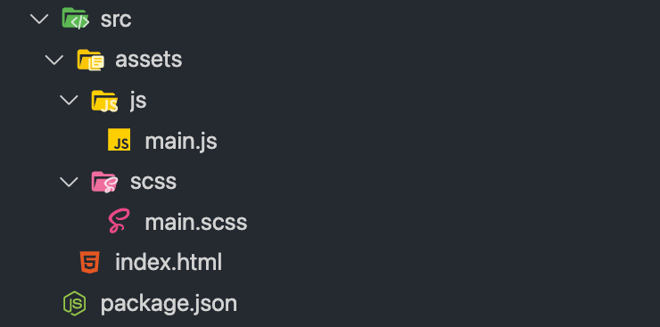
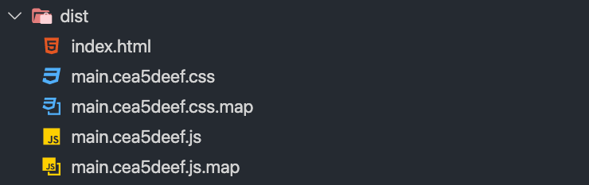

Zapewne kojarzysz Webpacka - najpopularniejszy bundler aplikacji webowych, deklasyfikujący konkurencję tym, jak często jest pobierany i późnej używany.

Ale właśnie jego konkurencję chciałbym Ci dziś pokazać.

> Mały disclaimer na starcie - w artykule opisuję wersję 1.x Parcela. W międzyczasie, wyszła natomiast [wersja 2.0](https://parceljs.org/docs/), która mocno ulepszyła jego działanie, jak i dokumentację.

import VideoInterlude from 'VideoInterlude';

<VideoInterlude id="e5enwi-SnPc" title="Parcel Bundler, czyli Webpack bez konfiguracji? 📦" />

## Dlaczego akurat [Parcel](https://parceljs.org/), gdy mamy Webpacka?

Ponieważ stawia się go w maksymalnie kilka minut.

A jeśli się postaramy, to wystarczy nam i kilkadziesiąt sekund. Co w kontrze do Webpacka, który znany jest z tego, że aby go postawić, trzeba albo użyć czegoś gotowego, albo przedzierać się przez linie kodu, sprawia, że Parcel staje się bardzo atrakcyjnym pomysłem.

A oczywiście, tak jak w przypadku Webpacka, dzięki niemu możemy bundlować nasze skrypty oraz style.

> Natomiast jedna mała uwaga - Parcel nie równa się Webpackowi pod kątem ilości wbudowanych funkcji i [nie pozwala sensownie modyfikować swojego domyślnego działania](https://github.com/parcel-bundler/parcel/issues/365), dlatego nie ma szans sprawdzić się u każdego i w każdym projekcie - idealny będzie dla małych stron i aplikacji, w których możemy chcieć poświęcić na konfigurację środowiska jak najmniej.

## W takim razie jak można go dodać do projektu?

Na początku, warto postawić nasz projekt (jeśli nie masz tego już za sobą):

```bash
npm init # gdy korzystasz z npma
yarn init # gdy korzystasz z yarna
```

Później, gdy to już jest, możemy dodać samego Parcela:

```bash
npm install parcel-bundler --save-dev # gdy korzystasz z npma
yarn add parcel-bundler --dev # gdy korzystasz z yarna
```

## Jak Parcel jest konfigurowany?

Pierwsza rzecz, jaką warto zrobić, aby go uruchomić, to zmienić lekko plik `package.json`, dodając 2 skrypty (aby łatwiej było nam je wykonywać):

```js
"scripts": {
  "start": "parcel <scieżka do głównego pliku aplikacji>",
  "build": "parcel build <scieżka do głównego pliku aplikacji>"
},
```

Oczywiście uzupełniając ścieżkę, głównym plikiem, na którym bazuje nasza aplikacja.

Dla przykładu, gdy moim plikiem podstawowym jest `index.html`, wrzucony do folderu `src`, to całość przybiera taką postać:

```js
"scripts": {
  "start": "parcel ./src/index.html",
  "build": "parcel build ./src/index.html"
},
```

I teraz, jesteśmy w stanie:

- włączyć nasłuchiwanie naszego pliku, komendą start;
- zbuildować cały projekt, komendą build.

Po wpisaniu jednej z tych dwóch komend Parcel przeszuka podpięty plik, w poszukiwaniu linków do assetów, jak i innych plików, odwzorowując ich strukturę, w folderze `dist` (pierwsza będzie robić to ciągle - jako że nasłuchuje pliki - druga zrobi to jednorazowo do wersji produkcyjnej).

> Dlatego też moje pliki wrzuciłem do folderu `src` - aby zachować lepszą strukturę, gdy cały wynikowy projekt znajdzie się właśnie w `dist`.

A! I jeszcze jedno, po odpaleniu nasłuchiwania plików komendą start, w ten sposób:

```bash
npm run start # gdy korzystasz z npma
yarn run start # gdy korzystasz z yarna
```

...widzimy stronę pod adresem localhost:1234. Dodatkowo odświeża się ona przy każdej zmianie, a jeśli dla plików JS, zastosujemy [Hot Module Replacement](https://parceljs.org/hmr.html), to zmiany pokazuje nawet bez odświeżania 🎉

## Nasz Parcel zaczyna działać dla plików JS, więc możemy dodać do niego np. kompilator SCSSa!

A robimy to mega prosto (podobnie jak robiłem to w [pierwszej części serii o Gutenbergu](/wordpress-gutenberg-001)), importując plik .scss, w pliku JavaScriptu!

Dokładnie w ten sposób:

```js
import '<scieżka do głównego pliku .scss>';
```

W moim przypadku, w gwoli ścisłości, będzie to wyglądać w ten oto sposób:

```js
import '../scss/main.scss';
```

Bo cała struktura projektu, w moim przypadku, prezentuje się tak:



I teraz, gdy odpalimy Parcela, pobierze on paczkę sass z npma lub yarna (w zależności od tego, czego Ty używasz) i automatycznie skompiluje nasz plik do CSSa!

## A jak to wygląda w przypadku globalnej instalacji paczki?

Bardzo podobnie, jak w przypadku lokalnej, natomiast tutaj nie mamy dostępu do pliku `package.json`, a przez to nie jesteśmy w stanie utworzyć własnych skryptów npma i musimy wrzucać ścieżkę do pliku, przy każdym wywołaniu.

Natomiast nie musimy instalować Parcela, dla każdego projektu - to chyba oczywisty benefit 🌷

Globalnie, instalujemy go komendą:

```bash
npm install -g parcel-bundler # gdy korzystasz z npma
yarn global add parcel-bundler # gdy korzystasz z yarna
```

I już w tej chwili, aby zacząć nasłuchiwać zmiany, dla tego samego pliku, w katalogu `src`, jak poprzednio, możemy skorzystać z komendy, którą wcześniej wrzucaliśmy do skryptów w pliku `package.json`:

```bash
parcel ./src/index.html
```

W ten oto sposób, bez stawiania osobnego projektu, odpalimy Parcela.

## I na koniec - co ujrzymy po zbuildowaniu całego projektu?

Po wpisaniu dla lokalnej instalacji Parcela:

```bash
npm run build # gdy korzystasz z npma
yarn run build # gdy korzystasz z yarna
```

...a dla globalnej:

```bash
parcel build ./src/index.html
```

...zobaczymy folder /build/ wyglądający w sposób zbliżony do tego:



I później, plik `index.html`, z tego folderu, możemy podpiąć jako główny, wrzucając stronę na produkcję ✨

## I to oczywiście część możliwości Parcela

Nie chcę próbować, w tym artykule streszczać dokumentacji, dlatego po resztę (m.in ukochany przez chyba wszystkich Code Splitting, Hot Module Replacement, integrację z Babelem, PostCSSem, inne typy assetów), odsyłam Cię jeszcze raz do [dokumentacji samego bundlera](https://parceljs.org/getting_started.html).

> Chociaż oczywiście - jeśli tylko chcesz, żebym rozwinął temat Parcela i jednak streścił trochę tej dokumentacji, to zawsze chętnie to zrobię, więc możesz dać znać w komentarzu, jeśli tylko Cię to interesuje!

I tu, na koniec, powstaje pytanie do Ciebie.

Czego używasz do bundlowania swoich assetów? Webpacka, Parcela, RollUpa, czy może czegoś zupełnie innego? I w sumie - dlaczego? Daj znać w komentarzu 🌸
