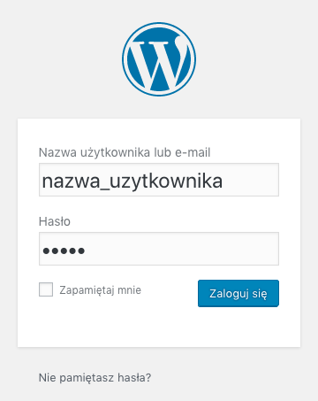
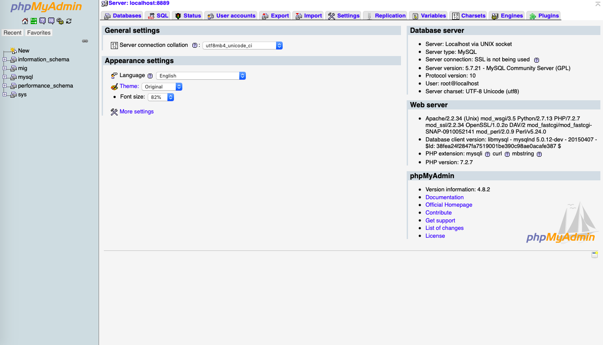
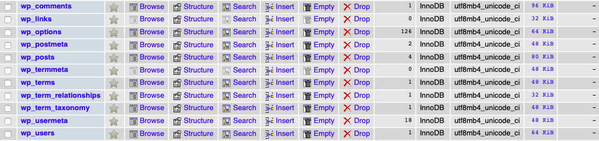
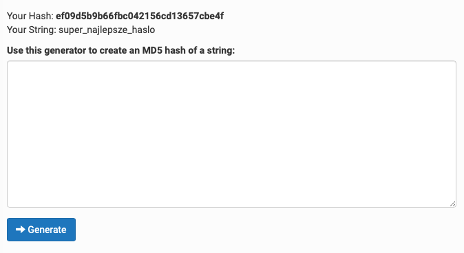

WordPress podobnie jak większość miejsc, w których możemy się zalogować udostępnił nam możliwość przypomnienia hasła za pomocą maila. Ale co w przypadku gdy z jakiegoś dziwnego powodu nie mamy dostępu do skrzynki pocztowej lub otrzymaliśmy stronę od klienta, do której ten nie zna hasła? W tej drugiej sytuacji przecież słabo będzie pisać do niego, aby przeszedł z nami przez proces przypominania tego hasła.

Oczywiście to tylko przykłady sytuacji, w których możemy uporać się z tym lepiej. Dlatego w tym artykule chcę pokazać Ci 2 sposoby, które pozwalają odzyskać (a konkretnie zresetować) hasło do naszego konta w WordPressie.

Pierwszy wymaga znajomości nazwy naszego użytkownika oraz dostępu do konta FTP, do drugiego z kolei potrzebujemy danych logowania do naszej bazy danych.

## Jak odzyskać hasło przez konto FTP?

Na początku zalogujmy się do swojego konta FTP i przejdźmy do plików naszej strony. Gdy już tam się znajdziemy spójrzmy na `wp-content` --> `themes` --> `nazwa_aktualnie_używanego_motywu`. Po wejściu w te ostatnie poszukajmy pliku `functions.php`.

Skopiujmy go na nasz komputer I otwórzmy w dowolnym edytorze kodu. Zaraz na początku za tagiem otwierającym `<?php` wklejmy taką oto linię kodu:

```php
wp_set_password( 'haslo', 'nazwa_uzytkownika' );
```

Linia ta pozwala nam zalogować się na wpisanego w niej użytkownika za pomocą hasła, które również podaliśmy. Oczywiście w miejscu nazwa_uzytkownika ma znaleźć się nazwa usera, do którego dostęp chcemy odzyskać.

Po wszystkim przenieśmy nasz plik z powrotem do folderu z motywem i spójrzmy na ekran logowania do WordPressa. Tam wpiszmy zdefiniowane wcześniej dane:



Mam nadzieję, że podobnie jak ja masz teraz przed oczami działający panel. Jeśli tak, to znów wejdźmy do pliku `functions.php` edytowanego w punkcie drugim*,* wykasujmy z niego linię resetującą hasło i oczywiście wgrajmy poprawiony plik od razu na serwer.

Po wszystkim możemy już wejść do zakładki "Użytkownicy" w panelu WordPressa i tam zmienić hasło dla naszego użytkownika na takie jakie nam się żywnie podoba.

A co w przypadku gdy nie znamy nazwy naszego użytkownika, ale za to mamy dostęp do bazy danych? To znaczy, że jesteśmy w dobrej sytuacji!

## Jest też drugi sposób - `phpMyAdmin` oraz nasza baza danych

Może znów nie przedłużajmy i od razu przejdźmy do działania:

Przechodzimy pod adres gdzie znajduje się nasz `phpmyadmin`, często jest to po prostu coś w rodzaju `https://adres-serwera/phpmyadmin`. Tam logujemy się do panelu zarządzania bazami danych i naszym oczom ukazuje się obraz tego typu:



W moim przypadku jest to phpmyadmin dość stary, Wasz może wyglądać troszkę inaczej, ale wszystkie elementy zawsze będą w tej samej pozycji, co u mnie.

Po lewej stronie widzimy kilka baz danych. Wejdźmy w należącą do naszej witryny i wśród tabel, które nam się wyświetlą wyszukajmy jednej z końcówką `users`. W moim przypadku będzie to `wp_users` (widoczne poniżej jako ostatnie):



Po wejściu w naszą tabelę pojawiają się wszyscy użytkownicy, akurat u mnie jest tylko jeden.


Oczywiście `admin`, najbezpieczniej na świecie. Ale to nieistotne, nas interesuje kolumna `user_pass`, w której widzimy jakiś bardzo dziwny ciąg znaków.

Po kliknięciu w "edit" wpisujemy nasze nowe hasło, ale właśnie - WordPress koduje hasła użytkowników w formacie MD5 (dlatego nasze hasło wygląda dość skomplikowanie). Wejdźmy na [jedną ze stron pozwalających na zamianę zwykłego tekstu na kod MD5](https://www.md5hashgenerator.com/), wpiszmy nasze wymarzone hasło i kliknijmy "Generate". W tym przypadku naszym oczom ukaże się coś w tym rodzaju:



Skopiujmy naszego hasha i wróćmy do panelu zarządzania bazą danych. Wklejmy go w te oto miejsce:


Po wszystkim kliknijmy "Go" w prawym dolnym rogu.

I to w sumie tyle. W tej chwili możemy wrócić już do ekranu logowania, wpisać nowe hasło i po tym oczywiście dostać się do panelu naszej witryny.

## Podsumowanie

Mam nadzieję, że gdy tylko zajdzie taka potrzeba, to opisane wyżej sposoby okażą się przydatne i już nigdy więcej dostanie się do panelu WordPressa nie będzie stanowiło dla Ciebie przeszkody. Powodzenia!
