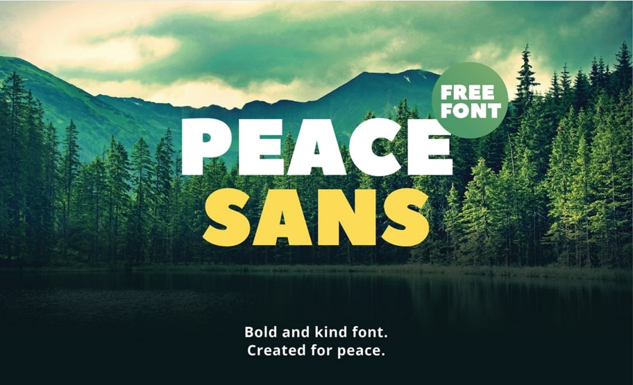
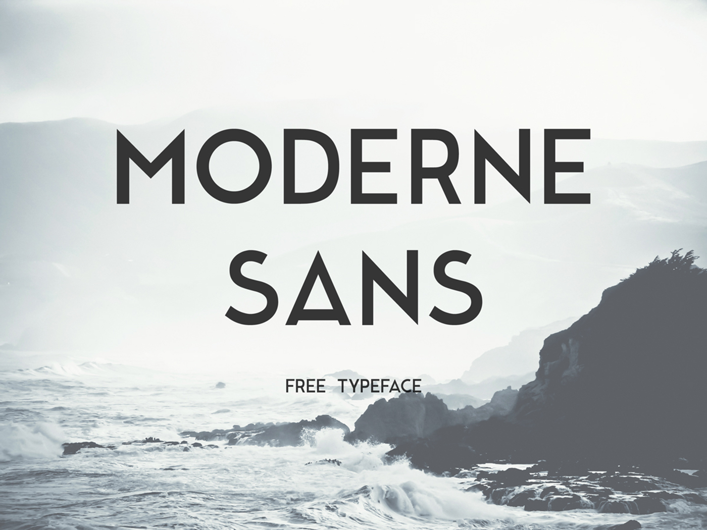
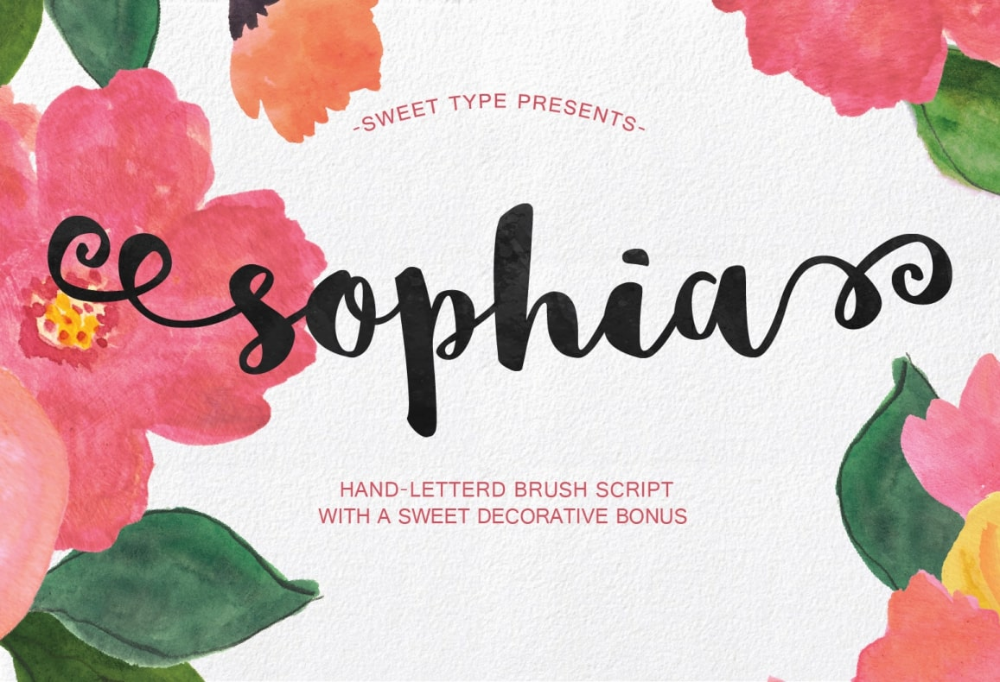
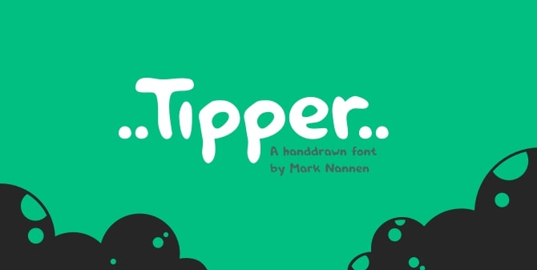
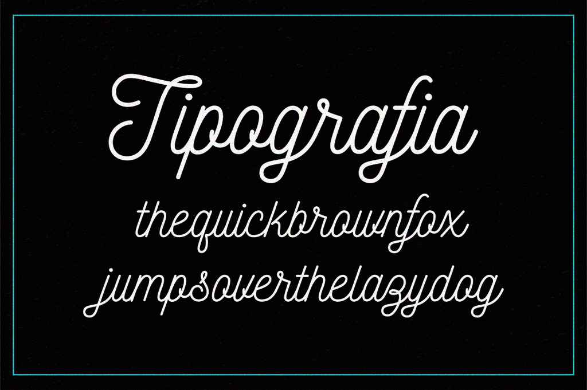
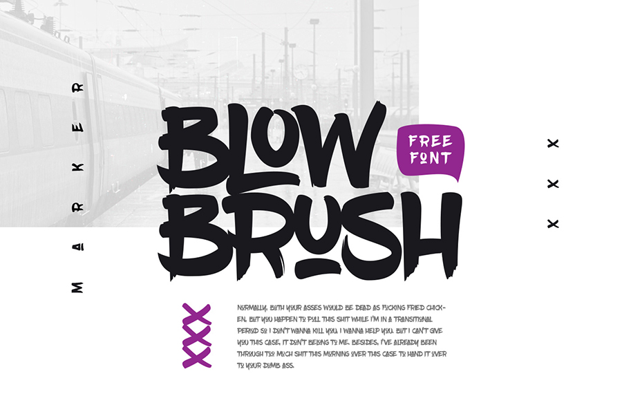
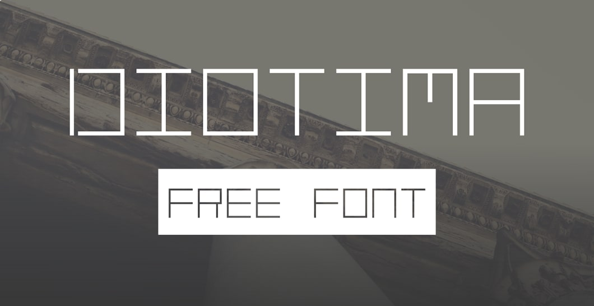
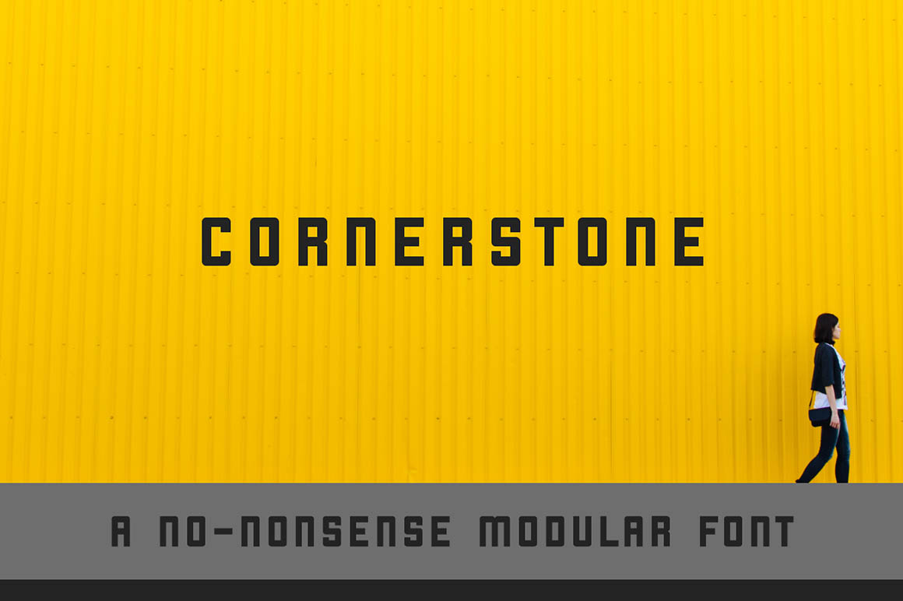
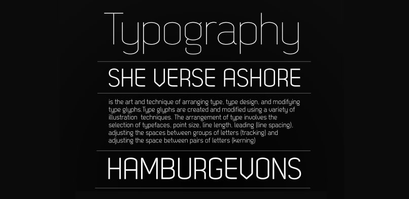

Całkiem możliwe, że znasz usługę Google\'a, o dość intuicyjnej nazwie: Google Fonts. Można tam znaleźć przeróżne kroje tekstu, które spełnią się świetnie, jako tekst na stronie internetowej.

Właśnie - tekst. Jedyny problem, jaki można zauważyć w tym serwisie, to to, że wszystkie fonty wyglądają bardzo podobnie. Nie znajdziemy tam ozdobnych krojów, takich jak chociażby ta ze zdjęcia na początku.

Na szczęście w takiej sytuacji nigdy nie jesteśmy bez wyjścia. Z pomocą przychodzi nam mnóstwo fontów, znajdujących się w internecie oraz dedykowana właściwość CSS odpowiedzialna za ich dodawanie do witryny internetowej! Właśnie o tym pomówimy w tym artykule.

## Jak instalować fonty z pliku lub linku?

Cała operacja dzieje się w CSS. Pierwszym krokiem jest dodanie naszego fontu, za pomocą takiego przykładowego kodu:

```css
@font-face {
  font-family: 'Nowy font';
  src: url(fonts/new.ttf) format('truetype');
}
```

W pierwszej lini nadajemy mu nazwę `Nowy font`, po której będziemy go wywoływać, po czym ustawiamy jego ścieżkę i typ pliku. `Url` tego konkretnego kroju to `fonts/new.ttf` (oczywiście w tym miejscu może znaleźć się link).

Jeszcze będąc w temacie formatu plików, to niestety istnieją przeglądarki które nie obsługują typu truetype i jeśli chcemy, aby nasz font działał idealnie, to możemy całość zaimportować wg. kodu np. ze [strony CSS Tricks](https://css-tricks.com/snippets/css/using-font-face/#article-header-id-0) ([na Everything Fonts](https://everythingfonts.com) z kolei można znaleźć świetne narzędzie, które pozwala na zmianę typu czcionki).

Z kolei już samo użycie prezentuje się w ten oto sposób:

```css
p {
  font-family: 'Nowy font';
}
```

Wykorzystujemy tu zwykłą właściwość CSSa odpowiedzialną za ustawienie konkretnego fontu (w tym przypadku jego nazwa to `Nowy font`) dla naszego elementu.

I to wszystko! Przejdę może już do drugiej części artykułu, w której pokażę Ci trochę świetnych czcionek!

## 10 ciekawych fontów

Oto lista 10 darmowych fontów, które, mam nadzieję okażą się przydatne dla Ciebie przy okazji tworzenia stron internetowych oraz grafik!

Podzieliłem je na dwie kategorie. Pierwsze 5 z nich zawiera polskie ogonki, w przeciwieństwie do kolejnych. Jest to spowodowane tym, że niestety mało tego typu czcionek w ogóle je posiada, a nie zawsze piszemy tekst który zawiera polskie znaki :)

### Fonty z polskimi ogonkami:

#### Numer 1: Peace Sans



Link do fontu: [Peace Sans](https://www.behance.net/gallery/34760019/Peace-Sans-FREE-FONT)

#### Numer 2: Moderne Sans



Link do fontu: [Moderne Sans](https://www.behance.net/gallery/15574861/Moderne-Sans-Free-Typeface)

#### Numer 3: Sophia



Link do fontu: [Sophia](https://www.behance.net/gallery/30281267/Sophia-Free-Handlettered-Brush-Script-F)

#### Numer 4: Tipper



Link do fontu: [Tipper](http://tipper.miyonki.nl)

#### Numer 5: Nickainley



Link do fontu: [Nickainley](http://www.fontfabric.com/nickainley-free-font/)

### Czcionki bez polskich ogonków:

#### Numer 1: Blow Brush



Link do fontu: [Blow Brush](https://www.behance.net/gallery/33043073/BlowBrush-free-font)

#### Numer 2: Diotima



Link do fontu: [Diotima](http://nathandawdy.com/portfolio/diotima/)

#### Numer 3: Moon


Link do fontu: [Moon](https://www.behance.net/gallery/23468357/Moon-Free-Font&quot%3B)

#### Numer 4: Cornerstone



Link do fontu: [Cornerstone](https://www.behance.net/gallery/29835665/toCorneners-Free-Font)

#### Numer 5: Dekar



Link do fontu: [Dekar](http://www.fontfabric.com/dekar-free-font/)

## Podsumowanie

Jak widać, tworząc strony internetowe nie musimy się ograniczać do impotowania przeznaczonych do tego czcionek z Google Fonts. W bardzo prosty sposób możemy dodać je samodzielnie!
