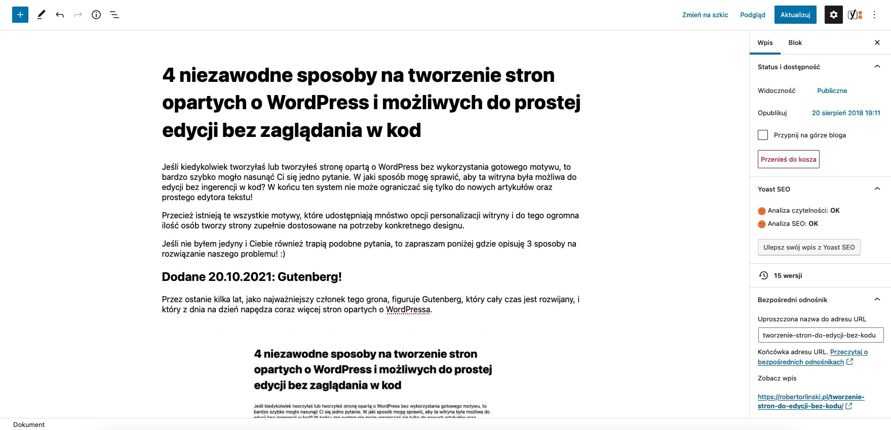
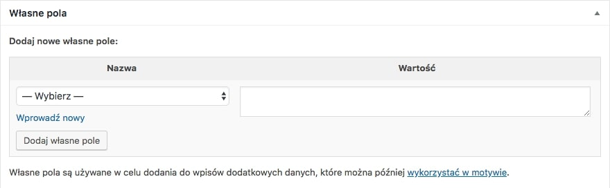

Jeśli kiedykolwiek tworzyłaś lub tworzyłeś stronę opartą o WordPress bez wykorzystania gotowego motywu, to bardzo szybko mogło nasunąć Ci się jedno pytanie. W jaki sposób mogę sprawić, aby ta witryna była możliwa do edycji bez ingerencji w kod? W końcu ten system nie może ograniczać się tylko do nowych artykułów oraz prostego edytora tekstu!

Przecież istnieją te wszystkie motywy, które udostępniają mnóstwo opcji personalizacji witryny i do tego ogromna ilość osób tworzy strony zupełnie dostosowane na potrzeby konkretnego designu.

Jeśli nie byłem jedyny i Ciebie również trapią podobne pytania, to zapraszam poniżej gdzie opisuję 3 sposoby na rozwiązanie naszego problemu! :)

## Dodane 20.10.2021: Gutenberg!

Przez ostanie kilka lat, jako najważniejszy członek tego grona, figuruje Gutenberg, który cały czas jest rozwijany, i który z dnia na dzień napędza coraz więcej stron opartych o WordPressa.

Jeśli chcesz się o nim dowiedzieć więcej, to cały czas tworzę [serię o tworzeniu własnych bloków](/wlasne-bloki-w-wordpress-gutenberg), możliwych później do wypełnienia treściami i dodania w ramach Gutenberga.

## Własne pola wbudowane w WordPress

Pierwszą możliwością jest rozwiązanie dość ubogie, ale mające szansę spełnić nasze oczekiwania. Są to tak zwane _Custom Fields_, które po pokazaniu ich przez Opcje ekranu pojawiają się poniżej pola edycji konkretnego wpisu lub strony w takiej oto postaci:

Jest to bardzo prosta opcja, pozwalająca nam wybrać zdefiniowane w kodzie pole i wypełnić je wartością, która zostanie wyrzucona na ekran w formie tekstu w miejscu, gdzie umieściliśmy funkcję z nazwą konkretnego pola.

Jeśli chcesz dowiedzieć się więcej lub poznać konkretną składnię tego rozwiązania, to na pewno możesz znaleźć je choćby na [stronie WordPressa](https://codex.wordpress.org/Custom_Fields).

## Advanced Custom Fields

W skrócie jest to punkt pierwszy na sterydach. Tak zwane ACF działają bardzo podobnie do pól domyślnie wbudowanych w WordPress, z tą istotną różnicą, że pozwalają na niebotycznie większe możliwości, a taką samą, a wg mnie nawet większą łatwość implementacji.

Od wstawienia tekstu w dane pole, edytora WYSIWYG, zdjęć, pól formularza, aż po tworzenie nowych elementów na stronie.

Co znacznie odróżnia je od pól WordPressowych, to na pewno to że ich wyświetlenie na stronie można podzielić na 3 kroki:

1. Po zainstalowaniu wtyczki przechodzimy w grupy pól i tworzymy nową grupę. W niej deklarujemy nasze pola i decydujemy w jakim miejscu panelu mają być widoczne, na przykład dla konkretnej strony.
2. Konkretne pole wywołujemy po nadanym mu tzw. _slugu_ za pomocą na przykład polecenia _echo get_field(\'nazwa-pola\')._
3. Przechodzimy w miejsce, do którego przypisaliśmy je podczas tworzenia w punkcie pierwszym i tam umieszczamy wartość.

Wybacz proszę jeśli wyżej przedstawiony opis sekwencji nie jest dla Ciebie wystarczający, ale rozpisywanie się o samej wtyczce na pewno zajęłoby więcej niż cała reszta artykułu. Aktualnie mogę zaprosić Cię na [oficjalną stronę ACF](https://www.advancedcustomfields.com/), a w przyszłości na pewno powstanie artykuł opisujący dokładniej te narzędzie. :)

## Edytory wizualne

Ostanim już sposobem będą wspomniane w podtytule edytory. Pozwalają nam na tworzenie predefiniowanych elementów, które później możemy przyjemnie wstawić za pomocą interfejsu konkretnego narzędzia.

Wymieniając przykłady, to jeśli moje informacje są prawdziwe, to tak wygląda najpopularniejsza trójka z nich:

- [Visual Composer](https://visualcomposer.io)
- [Elementor](https://elementor.com)
- [Beaver Builder](https://www.wpbeaverbuilder.com)

Każdy posiada sporą gamę elementów i pozwala nam opracowywać kolejne.

Oczywiście nie można zapomnieć, że edytorom wizualnym daleko do ideału (szczególnie gdy mówimy o powstałym za ich sprawą kodzie), a tworzenie konkretnych elementów jest znacznie trudniejsze niż w przypadku dwóch poprzednich sposobów, ale gdy liczy się łatwość edycji dla klienta, oraz relatywnie duża swoboda co do miejsca, w którym chcemy umieścić dany element, to właśnie tego typu narzędzia nie mają sobie równych.

## Podsumowanie

I tak oto prezentuje się te zestawienie. Mam nadzieję, że dzięki niemu udało Ci się dowiedzieć czegoś nowego, czegoś czego poznanie swoją drogą zajęło mi naprawdę sporo czasu, dlatego mocno cieszę się mogąc Ci je przekazać.
