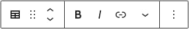
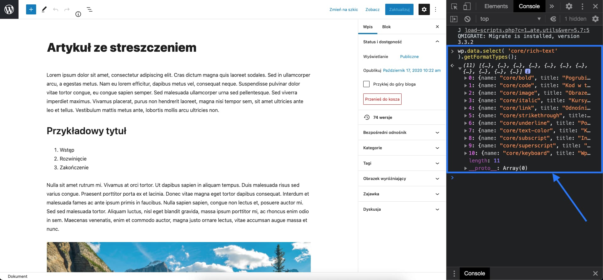
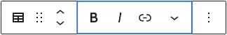
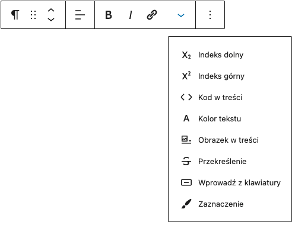

W tej części serii o tworzeniu bloków w Gutenbergu, pokażę Ci kolejne 4 komponenty wbudowane (i piąty przy okazji zadania domowego), które na pewno przydadzą Ci się podczas tworzenia własnych bloków i dodatkowo, jeszcze bardziej przyzwyczają Cię do siebie.

import VideoInterlude from 'VideoInterlude';

<VideoInterlude id="OpdXDQrzHwk" title="Własne bloki w WordPress Gutenberg #005 - toolbar" />

W tytule tego wpisu, możesz zauważyć, że powiemy sobie o toolbarze. Dla naszego bloku spisu treści (a precyzyjnie mówiąc - dla RichTextu, który jest tu bazą), prezentuje się on w ten oto sposób:



Dziś usuniemy z niego niektóre elementy (odpowiedzialne za kilka sposobów formatowania tekstu) i dodamy jeden nowy, aby mieć pod ręką tylko te rzeczy, które przydadzą się w spisie treści.

## Zacznijmy od usunięcia niektórych opcji formatowania z toolbara naszego RichTextu

Czyli de facto, od wybrania, jakie domyślne buttony będą się w nim znajdować. Bo tak, przyciski możemy usuwać, podając tablicę z grupą tych, które chcemy zostawić, w propsie do naszego RichTextu.

A props ten, to `allowedFormats`:

```jsx
<RichText
  tagName="h2"
  placeholder="Tytuł spisu treści"
  value={title}
  onChange={setTitle}
  allowedFormats={[
    'core/bold',
    'core/italic',
    'core/link',
    'core/text-color',
    'core/strikethrough',
  ]}
/>
```

Podając taką oto tablicę, mówimy naszemu Gutenbergowi, że dla tego konkretnego RichTextu (tutaj tytułu spisu treści), ma on wyświetlić te 5 konkretnych przycisków, pozwalających formatować konkretny tekst.

> Jeśli chcesz dowiedzieć się, jakie formaty są dostępne dla RichTextu w Twoim Gutenbergu i jak dokładnie się nazywają, to możesz wpisać następującą komendę w konsolę swojej przeglądarki:

```jsx
wp.data.select('core/rich-text').getFormatTypes();
```

W ten sposób:

[]()

## A teraz, dodajmy nowy przycisk

To z kolei, możemy zrobić dzięki edycji toolbara, już z poziomu kodu samego bloku. A potrzebować będziemy kilka wbudowanych komponentów, o których wspomniałem Ci na początku. Zaimportujmy je do naszego głównego pliku z blokiem spisu treści:

```jsx
import { Toolbar, ToolbarButton, Icon } from '@wordpress/components';
import { RichText, BlockControls } from '@wordpress/block-editor';
```

Oczywiście `RichText` z pierwszej linii jest tym samym, którego zaimportowałem w poprzedniej części kursu. `BlockControls` z kolei, jest importowany razem z nim, bo pochodzą z tej samej paczki.

Dodatkowo, jako że zaczęliśmy korzystać z nowej paczki, muszę umieścić informację o niej w pliku wtyczki (`table-of-contents.php`):

```jsx
wp_register_script(
  'table-of-contents',
  plugin_dir_url(__FILE__) . 'build/index.js',
  array('wp-blocks', 'wp-editor', 'wp-components')
);
```

> Przy okazji - w następnej części dodamy sporo dodatkowych zależności, więc przy okazji pokażę Ci, jak możemy robić to automatycznie, a przez to znacznie wygodniej 🎉

I teraz, jestem w stanie użyć naszych komponentów w funkcji `edit()`:

```jsx
edit({ attributes, setAttributes }) {
  // ...

  return (
    <div class="table-of-contents">

      <BlockControls>
        <Toolbar>
          <ToolbarButton
            label="Zaznaczenie"
            onClick={() => console.log("Przycisk został kliknięty!")}
          >
            <Icon icon="admin-customizer" />
          </ToolbarButton>
        </Toolbar>
      </BlockControls>

      <RichText .../>
      <RichText .../>
    </div>
  );
}
```

Jak możesz zauważyć, naszym dodatkowym przyciskiem jest tak naprawdę komponent `<ToolbarButton />`, który dołączamy do bloku w ramach komponentu `<Toolbar />`, który stanowi grupę na nasze buttony i zawiera się z kolei w komponencie `<BlockControls />`. On z kolei stanowi przestrzeń wszystkich narzędzi formatowania naszego bloku. Dokładnie tej:



Czyli de facto przestrzeni, do której będziemy w stanie dodać buttony, również za pomocą Format API, o którym powiemy sobie w następnej części serii.

I teraz jesteśmy w stanie zacząć bawić się z naszym nowo dodanym przyciskiem, jak z każdym innym komponentem. Dla przykładu, ja stworzę nowy atrybut, który będzie mówić nam, czy button jest aktywny i zmieniać jego stan (za pomocą propsa `isActive`):

```jsx
attributes: {
  // ...
  isHighlightButtonActive: {
    type: "boolean",
  },
},

edit({ attributes, setAttributes }) {
  const { title, list, isHighlightButtonActive } = attributes;

  // ...

  function setHighlightButtonState() {
    setAttributes({ isHighlightButtonActive: !isHighlightButtonActive });
  }

  return (
    <div class="table-of-contents">

      <BlockControls>
        <Toolbar>
          <ToolbarButton
            label="Zaznaczenie"
            className="highlight-button"
            onClick={setHighlightButtonState}
            isActive={isHighlightButtonActive}
          >
            <Icon icon="admin-customizer" />
          </ToolbarButton>
        </Toolbar>
      </BlockControls>

      <RichText .../>
      <RichText .../>
    </div>
  );
}
```

W kilku miejscach (dla przejrzystości) pominąłem kod, który napisaliśmy w poprzednich częściach serii. Całość znajdziesz na moim [GitHubie](https://github.com/robert-orlinski/gutenberg-blocks-course-files/tree/005).

## Co dalej?

Tak jak udało mi się wspomnieć, w następnej części powiem Ci o Format API, czyli zbiorze metod, z których Gutenberg pozwala nam korzystać, aby tworzyć nowe narzędzia formatowania. Dodamy możliwość zaznaczania poszczególnych tekstów <span style={{ backgroundColor: 'var(--highlight)' }}>w taki oto sposób 🌿</span>

> Jak mogłaś lub mogłeś zauważyć, w naszym nowym bloku często pojawiało się słówko highlight - to właśnie dlatego, że jego zadaniem niedługo podświetlanie tekstu na niebiesko.

## I oczywiście zadanie domowe!

Za pomocą wbudowanego komponentu [`<DropdownMenu />`](https://github.com/WordPress/gutenberg/tree/trunk/packages/components/src/dropdown-menu) spróbuj umieścić swoje dodatkowe przyciski, w ramach menu rozwijanego. Stwórz coś w tym rodzaju:



Jeśli tylko trafisz na jakiekolwiek trudności lub czymś będziesz chciał lub chciała się podzielić (w związku z zadaniem lub całym artykułem), koniecznie daj znać w komentarzu!
