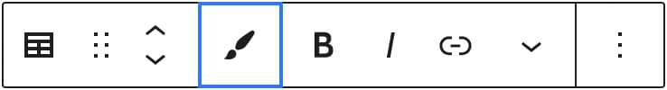

Dziś sprawimy, że utworzony w poprzedniej części przycisk, widoczny w toolbarze, stanie się w pełni funkcjonalny! Wszystko dzięki Format API i możliwości dodania własnego formatowania do bloków w WordPress Gutenbergu.

## Co będzie naszym celem?

Pozwolimy naszemu buttonowi:



...aplikować konkretne style dla zaznaczonego tekstu, tak samo jak dzieje się to w przypadku pogrubienia, kursywy i tym podobnych. W momencie, gdy klikniemy w sam przycisk, zaznaczony tekst zostanie zamknięty w spanie, któremu nadamy konkretne style.

import VideoInterlude from 'VideoInterlude';

<VideoInterlude id="UkKRCGuNOWY" title="Własne bloki w WordPress Gutenberg #006 - Format API" />

Wydaje się to nieskomplikowane, więc przejdźmy do rzeczy!

## Na początek standardowo - zaimportujmy zależności, które przydadzą się w pracy z Format API

W pliku .js samego bloku, dodamy 2 dodatkowe funkcje:

```jsx
import { registerFormatType, toggleFormat } from '@wordpress/rich-text';
```

A z racji, że jest to pierwszy raz, w którym importujemy cokolwiek z paczki `@wordpress/rich-text`, to samą zależność musimy też podpiąć w pliku PHP wtyczki.

## Ale tym razem zautomatyzujemy dodawanie zależności w pliku .php!

W momencie, gdy zajrzysz do tego pliku (zakładając, że tworzysz rzeczy równo ze mną), to Twoja funkcja rejestrująca skrypt z blokiem, wygląda w mniej więcej ten sposób:

```jsx
wp_register_script(
  'table-of-contents',
  plugin_dir_url(__FILE__) . 'build/index.js',
  array('wp-blocks', 'wp-editor', 'wp-components')
);
```

W ostatnim argumencie, masz tablicę z trzema zależnościami, a teraz musimy dodać czwartą. Dodatkowo w przyszłości, w miarę jak do naszego bloku będą dodawane kolejne funkcje, tych zależności będzie jeszcze więcej.

A co chyba najgorsze, przy każdym imporcie w pliku .js, musimy pamiętać o aktualizacji tej tablicy. Jest to upierdliwe.

I tu przychodzi rozwiązanie wszystkich tych problemów! Zajrzyj proszę do folderu `/build` w katalogu całej wtyczki, a znajdziesz tam plik o nazwie `index.asset.php`.

W nim znajdują się wszystkie zależności, z których korzysta nasz plik .js oraz dodatkowo wersja, którą też będziemy w stanie podpiąć do funkcji rejestrującej skrypt. Wersja, która zmienia się przy każdym buildzie pliku i usuwa problemy z pozostałym cachem w przeglądarce, które w przeciwnym razie mogłyby się pojawiać.

Okej, rozgadałem się, więc podepnijmy nasze zależności:

```php
$dependencies = include(plugin_dir_path(__FILE__) . 'build/index.asset.php');

wp_register_script(
  'table-of-contents',
  plugin_dir_url(__FILE__) . 'build/index.js',
  $dependencies['dependencies'],
  $dependencies['version'],
);
```

A teraz wróćmy do edycji samego bloku!

## Po pierwsze: Przenieśmy kod naszego toolbara do osobnego komponentu

U mnie będzie to wyglądać następująco:

```jsx
const HighlightButton = (props) => (
  <BlockControls>
    <Toolbar>
      <ToolbarButton
        label="Zaznaczenie"
        className="highlight-button"
        onClick={() => {
          props.onChange(toggleFormat(props.value, { type: 'custom-formats/highlight' }));
        }}
        isActive={props.isActive}
      >
        <Icon icon="admin-customizer" />
      </ToolbarButton>
    </Toolbar>
  </BlockControls>
);
```

Okej, przyznaję się - zrobiłem tu więcej, niż samo stworzenie funkcji i przeniesienie do niej kodu toolbara 😬 Ale już tłumaczę!

Najważniejsza zmiana, to funkcja, którą podpinam pod zdarzenie onClick. `setHighlightButtonState()` została usunięta (wywołanie, jak i deklaracja) i zastąpiona anonimową, która przełącza nasz nowy format. Do tego celu używamy metody `onChange()`, sprawdzającej, czy stan komponentu się zmienił. Z kolei w jej argumencie wrzucamy inną metodę - `toggleFormat()`, która zajmie się przełączaniem podanego formatu, dla zaznaczonego tekstu.

Dodatkowo informacja o zaznaczeniu konkretnego buttona (w propsie `isActive`) nie pochodzi już z naszej autorskiej funkcji, a z właściwości propsów - też o nazwie `isActive`.

> Dla jasności - razem z usunięciem funkcji `setHighlightButtonState()`, pozbyłem się też atrybutu `isHighlightButtonActive` i całej reszty kodu z nim związanej.

## Po drugie: Swórzmy sam format!

A do tego posłuży nam taki oto skrawek kodu:

```jsx
registerFormatType('custom-formats/highlight', {
  title: 'Zaznaczenie',
  tagName: 'span',
  className: 'highlight',
  edit: HighlightButton,
});
```

Korzystamy z pobranej funkcji i w argumentach podajemy identyfikator nowego formatu oraz obiekt zawierający:

- Ładną nazwę tegoż formatu;
- Tag, w który zostanie zamknięty zaznaczony tekst;
- Klasę przypisaną do tego tagu;
- Komponent przycisku, powiązanego z nowym formatem.

Dodatkowo, dzięki właściwości `attributes` (której nie użyję w przypadku tworzonego przez nas zaznaczenia), do konkretnego skrawku tekstu możemy przypisać atrybuty właściwe dla podanego elementu HTMLa. Te później będziemy edytować lub definiować w samym komponencie powiązanym z formatem.

Dla przykładu, tworząc format linku i chcąc edytować jego `href`, musielibyśmy zainicjować ten zamiar w obiekcie `attributes`:

```jsx
registerFormatType('custom-formats/link', {
  title: 'Link',
  tagName: 'a',
  className: 'custom-link',
  attributes: {
  	url: 'href',
  }
  edit: CustomLink,
});
```

Dzięki czemu później w metodzie `toggleFormat()`, w podpiętym komponencie, moglibyśmy edytować wartość atrybutu `href` odwołując się do klucza `url`, do którego został przypisany:

```jsx
// ...

toggleFormat(props.value, {
  type: 'custom-formats/link',
  attributes: { url: 'https://example.com' },
});

// ...
```

To mamy jasne. W takim razie wróćmy do poprzedniego skrawka kodu i zróbmy jeszcze jedną rzecz, której nam brakuje.

## Po trzecie: Pozwólmy nowemu formatowi, aplikować się dla spisu treści

Jak zapewne pamiętasz, w poprzedniej części serii, ograniczyliśmy dozwolone formaty dla dwóch RichTextów, które składają się na tworzony przez nas blok:

```jsx
allowedFormats={[
  'core/bold',
  'core/italic',
  'core/link',
  'core/text-color',
  'core/strikethrough',
]}
```

Więc aby nasz nowy format też mógł się tam aplikować, musimy go dodać do samej tablicy:

```jsx
allowedFormats={[
  'core/bold',
  'core/italic',
  'core/link',
  'core/text-color',
  'core/strikethrough',
  'custom-formats/highlight',
]}
```

## Po czwarte: Zdefiniujmy styl naszego formatu

Pamiętając, że nasz format jest de facto spanem o konkretnej klasie, na końcu pliku `/src/index.scss` dopiszę tylko taką regułę:

```css
.highlight {
  background-color: #e3f2fd;
}
```

Dzięki temu zaznaczony tekst otrzyma bardzo ładne, błękitne tło.

I to tyle! Dzięki tym czterem krokom ożywiliśmy nasz przycisk, widoczny w narzędziach formatowania!

## To na koniec zadanie domowe (a nawet 2!)

Po pierwsze, spróbuj użyć naszego nowego formatu (lub jakiegokolwiek innego) dla nagłówka naszego spisu treści i zobacz, co dzieje się na front-endzie. Podpowiem, że problem wyświetlania się tagów HTMLa leży w deklaracji atrybutów samego bloku.

I po drugie, dowiedz się (i przetestuj), w jaki sposób można ograniczyć wyświetlanie naszego przycisku, tylko do konkretnego komponentu (na przykład naszego spisu treści). Bo obecnie, jak możesz zauważyć, dodany przycisk aplikuje się dla spisu streści, ale też wszystkich innych elementów tekstowych w Gutenbergu: nagłówków, paragrafów, list itp.

Do tego na pewno przyda Ci się [link z dokumentacji Format API](https://developer.wordpress.org/block-editor/how-to-guides/format-api/2-toolbar-button/).

Gdy się z nimi uporasz (lub w razie jakichkolwiek problemów), daj znać w komentarzu. Kod, który dziś stworzyliśmy, oczywiście możesz sprawdzić w całości na [moim GitHubie](https://github.com/robert-orlinski/gutenberg-blocks-course-files/tree/006) 🌱
