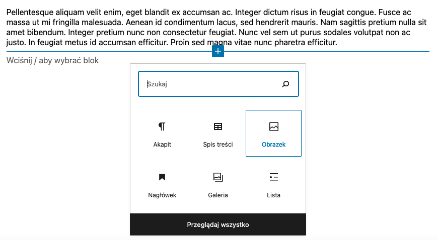
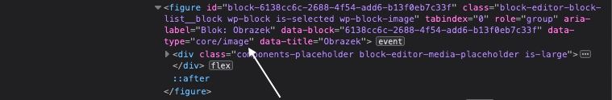
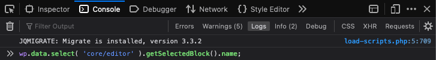
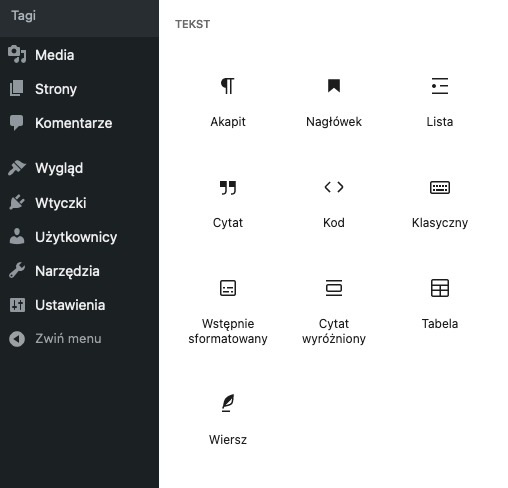
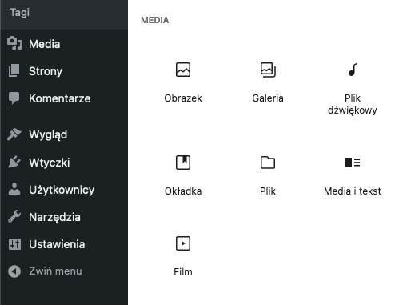
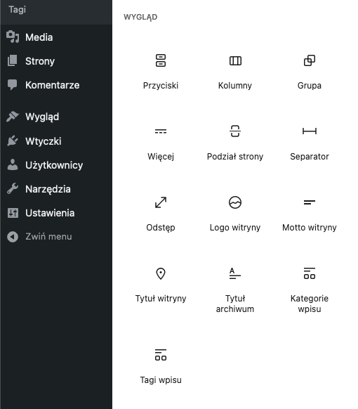
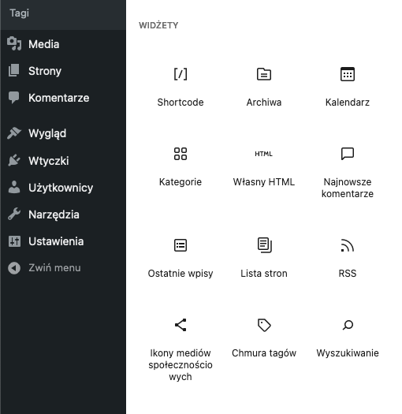
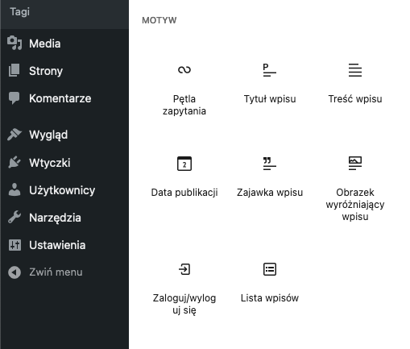
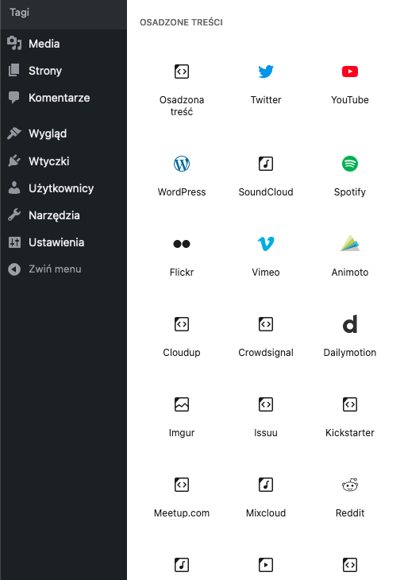

Jeśli chcemy stworzyć nowy przycisk formatowania, w ramach Format API, który ma pokazywać się dla konkretnych bloków, musimy sprawdzić, w jaki blok użytkownik kliknął, porównując jego typ z typami pożądanych bloków.

Podobnie musimy znać nazwy konkretnych bloków, gdy chcemy z poziomu kodu wyłączyć konkretne wbudowane bloki lub rozszerzyć możliwości któregoś z nich.

Ogólnie, aby operować na wbudowanych (lub dodanych przez wtyczki) blokach Gutenberga, musimy znać ich pełne nazwy (lub inaczej - typy). Dla przykładu, dla zdjęć będziemy mówić o ciągu tekstowym `core/image`.

Stąd też ta krótka część naszej serii o Gutenbergu, w której znajdziesz 2 rzeczy:

- 2 sposoby na wyciąganie pełnych nazw (tudzież typów) bloków Gutenberga;
- Listę typów wszystkich pełnych nazw bloków wbudowanych w ten edytor.

Lećmy! 🚀

import VideoInterlude from 'VideoInterlude';

<VideoInterlude
  id="E3dT9OFhc5U"
  title="Własne bloki w WordPress Gutenberg #007 - jak znaleźć typ (pełną nazwę) bloku Gutenberga?"
/>

## Okej, to skąd zdobyć tę pełną nazwę danego bloku?

Wystarczy dodać do artykułu lub strony dany blok z zaprezentowanego na początku wybieraka i sprawdzić jego kod, w narzędziach deweloperskich przeglądarki.

Dla przykładu, jeśli chcemy zobaczyć, jaki jest typ obrazka, możemy dodać go w następujący sposób:



Po czym sprawdzić jego kod:

[]()

I jak można zauważyć, zaznaczony element HTML, zawiera w sobie atrybut `data-type`, a jego wartością z kolei, jest poszukiwana przez nas nazwa! Dokładnie w tym miejscu:



I w ten oto sposób wiemy, że pełna nazwa bloku obrazka, to `core/image`!

Alternatywnie, możemy zajrzeć do konsoli w tych samych narzędziach deweloperskich i po zaznaczeniu konkretnego, już dodanego bloku, możemy wpisać następujący kod:

```js
wp.data.select('core/editor').getSelectedBlock().name;
```

W ten sposób:



...i kliknąć enter ✨ Za sprawą tej linii, ujrzymy nazwę zaznaczonego bloku w konsoli.

## Ale i tak - nie są to idealne sposoby, szczególnie gdy chcemy użyć w naszym kodzie kilku typów bloków

W końcu dla każdego z nich, musimy wybrać dany blok, na chwilę dodać go do edytora, a później sprawdzić jego typ!

Dlatego poniżej znajdziesz listę nazw wszystkich bloków wbudowanych w Gutenberga, wg ich kategorii. Wtedy wystarczy, że skopiujesz je po prostu stąd:

### Tekst:



Paragraf:

```shell
core/paragraph
```

Nagłówek:

```shell
core/heading
```

Lista:

```shell
core/list
```

Cytat:

```shell
core/quote
```

Kod:

```shell
core/code
```

Klasyczny edytor:

```shell
core/freeform
```

Wstępnie sformatowany tekst:

```shell
core/preformatted
```

Cytat wyróżniony:

```shell
core/pullquote
```

Paragraf:

```shell
core/paragraph
```

Tabela:

```shell
core/table
```

Wiersz:

```shell
core/verse
```

### Media:



Obrazek:

```shell
core/image
```

Galeria:

```shell
core/gallery
```

Audio:

```shell
core/audio
```

Okładka:

```shell
core/cover
```

Plik:

```shell
core/file
```

Media i tekst:

```shell
core/media-text
```

Film:

```shell
core/video
```

### Wygląd:



Przyciski:

```shell
core/buttons
```

Kolumny:

```shell
core/columns
```

Grupa:

```shell
core/group
```

Więcej:

```shell
core/more
```

Podział strony:

```shell
core/nextpage
```

Separator:

```shell
core/separator
```

Odstęp:

```shell
core/spacer
```

Logo witryny:

```shell
core/site-logo
```

Motto witryny:

```shell
core/site-tagline
```

Tytuł witryny:

```shell
core/site-title
```

Tytuł archiwum:

```shell
core/query-title
```

Kategorie i tagi wpisu (ich typ jest dokładnie taki sam):

```shell
core/post-terms
```

### Widżety:



Shortcode:

```shell
core/shortcode
```

Archiwa:

```shell
core/archives
```

Kalendarz:

```shell
core/calendar
```

Kategorie:

```shell
core/categories
```

Własny HTML:

```shell
core/html
```

Najnowsze komentarze:

```shell
core/latest-comments
```

Ostatnie wpisy:

```shell
core/latest-posts
```

Lista podstron:

```shell
core/page-list
```

RSS:

```shell
core/rss
```

Ikony mediów społecznościowych:

```shell
core/social-links
```

Chmura tagów:

```shell
core/tag-cloud
```

Wyszukiwanie:

```shell
core/search
```

### Motyw:



Pętla zapytania:

```shell
core/query
```

Tytuł wpisu:

```shell
core/post-title
```

Treść wpisu:

```shell
core/post-content
```

Data publikacji:

```shell
core/post-date
```

Zajawka:

```shell
core/post-excerpt
```

Obrazek wyróżniający wpisu:

```shell
core/post-featured-image
```

Zaloguj/wyloguj się:

```shell
core/loginout
```

Lista wpisów:

```shell
core/query
```

### Osadzone treści:



Tutaj, pomimo że bloków w teorii jest sporo, to tak naprawdę mamy do czynienia z jednym i tym samym blokiem z osadzoną treścią (poszczególne bloki różnią się tylko maską wpisywanego adresu).

Dlatego ich wspólna pełna nazwa, to:

```shell
core/embed
```

## I to byłoby na tyle!

Nie obawiaj się powracać do tego krótkiego materiału, przy okazji dodawania funkcji do Format API oraz nowych bloków Gutenberga.

Niech on Ci służy, a ja czym prędzej zabieram się do tworzenia nowego artykułu, tym razem o panelu bocznym!

Do zobaczenia dokładnie tam 😌
