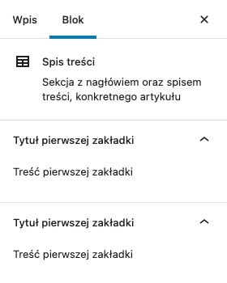

W części 5 i 6 tej serii, o Toolbarze i Format API, zajmowaliśmy się edycją paska górnego naszego blogu Gutenberga. Dziś natomiast, zbudujemy podwaliny pod edycję paska bocznego!

Także bez zbędnego przedłużania - działajmy!

import VideoInterlude from 'VideoInterlude';

<VideoInterlude
  id="a6CtXekVir8"
  title="Własne bloki w WordPress Gutenberg #008 – panel boczny (sidebar)"
/>

## Ale zanim to - rozwiązania dwóch zadań domowych z przedostatniej części!

### Zadanie domowe numer 1

> Spróbuj użyć naszego nowego formatu (lub jakiegokolwiek innego) dla nagłówka naszego spisu treści i zobacz, co dzieje się na front-endzie. Podpowiem, że problem wyświetlania się tagów HTMLa leży w deklaracji atrybutów samego bloku.

Tak jak było widać [w filmie na YouTubie](https://youtu.be/UkKRCGuNOWY), problem polegał na uciekaniu tagów HTML, użytych dla tytułu naszego spisu treści:


Tych samych tagów, jak na przykład dodaje nasz przycisk do zakreślenia części tekstu (przykład na zrzucie powyżej) lub opcje wbudowane już z samego Gutenberga (np. pogrubienie tekstu lub kursywa).

A rozwiązać można to dwojako:

Tak jak sugerowałem w treści artykułu i na filmie, możesz lekko zmienić atrybut tytułu - dokładnie podmienić wartość parametru `source` z `html`, na `children`:

```js
attributes: {
  title: {
    type: 'string',
    source: 'children',
    selector: 'h2',
  },
  // ...
},
```

Drugą opcją z kolei jest użycie atrybutu `dangerouslySetInnerHTML` w kodzie nagłówka, używanym na front-endzie, w ten oto sposób:

```js
return (
  <div class="table-of-contents-block">
    <h2 dangerouslySetInnerHTML={{ __html: title }} />
    <RichText.Content tagName="ol" value={list} />
  </div>
);
```

...natomiast to rozwiązanie zawsze będzie trochę słabsze.

Pomimo, że w tym przypadku użycie tej metody nie niesie za sobą większych zagrożeń, niż sposób pierwszy, to dobrze jest się przyzwyczajać do nieużywania jej - nie jest to dobra praktyka, bo potrafi te zagrożenia nieść, szczególnie gdy piszemy bardziej rozbudowane bloki lub tworzymy coś w Reactcie, będącym podstawą Gutenberga.

I poza tym, jeszcze w ramach trzeciej możliwości, możemy skorzystać z komponentu `<RichText.Content />` dla tytułu, podobnie jak robimy to dla listy pod nim 🎉

W ten sposób:

```jsx
return (
  <div class="table-of-contents-block">
    <RichText.Content tagName="h2" value={title} />
    <RichText.Content tagName="ol" value={list} />
  </div>
);
```

Wtedy źródłem naszego atrybutu title nie musi być już children, a bardziej intuicyjny html, tak samo jak w przypadku skorzystania z `dangerouslySetInnerHTML`.

### Zadanie domowe numer 2:

> Dowiedz się (i przetestuj), w jaki sposób można ograniczyć wyświetlanie naszego przycisku, tylko do konkretnego komponentu (na przykład naszego spisu treści). Bo obecnie, jak możesz zauważyć, dodany przycisk aplikuje się dla spisu streści, ale też wszystkich innych elementów tekstowych w Gutenbergu: nagłówków, paragrafów, list itp.
>
> Do tego na pewno przyda Ci się [link z dokumentacji Format API](https://developer.wordpress.org/block-editor/how-to-guides/format-api/2-toolbar-button/).

Aby tego dokonać i wyświetlać omawiany wtedy przycisk tylko dla tworzonego spisu treści, kod naszej funkcji `HighlightButton`, musielibyśmy przerobić mniej więcej w ten sposób:

```js
const HighlightButton = (props) => {
  const selectedBlock = useSelect((select) => {
    return select('core/block-editor').getSelectedBlock();
  }, []);

  if (selectedBlock && selectedBlock.name !== 'rob/table-of-contents') {
    return null;
  }

  return (
    <BlockControls>
      <Toolbar>
        <ToolbarButton
          label="Zaznaczenie"
          className="highlight-button"
          onClick={() => {
            props.onChange(toggleFormat(props.value, { type: 'custom-formats/highlight' }));
          }}
          isActive={props.isActive}
        >
          <Icon icon="admin-customizer" />
        </ToolbarButton>
      </Toolbar>
    </BlockControls>
  );
};
```

...dodatkowo importując metodę `useSelect` na górze pliku, w którym jesteśmy:

```js
import { useSelect } from '@wordpress/data';
```

Null zwracamy przed instrukcją `return`, w tym przypadku dla wszystkich bloków innych, niż nasz niestandardowy spis treści (czyli przycisk pokazujemy tylko dla wspomnianego spisu treści), ale możemy zwrócić go dla mniejszej ilości bloków lub tylko dla wybranych.

Listę wszystkich bloków wbudowanych już w Gutenberga (które możesz chcieć w tym warunku użyć, aby przycisk dla nich wyświetlić lub go schować), znajdziesz w [poprzedniej części tego kursu](/wordpress-gutenberg-007).

Pozwolę sobie nie tłumaczyć tego kodu mocniej, bo dość solidnie rozgadałem się o nim w [wersji wideo tego artykułu](https://youtu.be/a6CtXekVir8). Całym sobą Cię zapraszam do zerknięcia na nią!

## Huh, mamy to. To teraz zajmijmy się wymienionym w tytule panelem bocznym!

Na początku zaimportujmy sobie 2 komponenty, na górze naszego pliku:

```js
import { InspectorControls } from '@wordpress/block-editor';
import { PanelBody } from '@wordpress/components';
```

Jeśli pracujesz równo z ze mną, to wszystkie Twoje importy, będą wyglądać teraz mniej więcej tak:

```js
import './index.scss';

import { registerBlockType } from '@wordpress/blocks';
import { RichText, BlockControls, InspectorControls } from '@wordpress/block-editor';
import { Toolbar, ToolbarButton, Icon, PanelBody } from '@wordpress/components';
import { registerFormatType, toggleFormat } from '@wordpress/rich-text';
```

A później, na początku instrukcji `return` (zaraz po [reactowym fragmencie](https://reactjs.org/docs/fragments.html), który przy okazji dodałem, aby zwrócić 2 elementy obok siebie z metody `registerBlockType`), dodajemy przestrzeń edytowalną panelu bocznego:

```js
return (
  <>
    <InspectorControls></InspectorControls
   	// Kod spisu treści...
```

...do której teraz możemy dodawać zakładki (ile nam się żywnie podoba), dzięki komponentowi `<PanelBody />`:

```js
return (
  <>
    <InspectorControls>
      <PanelBody title="Tytuł pierwszej zakładki">
        <p>Treść pierwszej zakładki</p>
      </PanelBody>
      <PanelBody title="Tytuł pierwszej zakładki">
        <p>Treść pierwszej zakładki</p>
      </PanelBody>
    </InspectorControls>
    // Kod spisu treści...
```

Za sprawą powyższego kodu, po kliknięciu w nasz spis treści w edytorze, zobaczymy następującą treść w obrębie sidebara:



Wydaje mi się, że powyższego kodu nie ma co mocniej opisywać - wszystko jest tam intuicyjne ✨

Ale! Na pewno mogę wspomnieć jeszcze jakie atrybuty może przyjąć komponent `<PanelBody />`:

- `title` - tytuł zakładki, użyty powyżej;
- `opened` - nadpisuje wartość z atrybutu `initialOpen` oraz gdy ustawimy go na `true`, to cała zakładka nie będzie możliwa do zamknięcia (analogicznie z `false`);
- `className` - klasa dodana do elementu `.components-panel__body`, wyrzucanego przez komponent `<PanelBody />`;
- `icon` - ikonka, która pokaże się obok tytułu; może to być [dashikonka](https://developer.wordpress.org/resource/dashicons) lub kod komponentu naszej ikony;
- `onToggle` - funkcja, która wykona się przy okazji otwierania oraz zamykania panelu;
- `initialOpen` - czy zakładka jest otwarta? Domyślnie tak, dlatego domyślną wartością jest `true`.

## I tak naprawdę to byłoby na tyle!

Na ten moment, wszystko co musisz wiedzieć to fakt, że w `<PanelBody />` możesz wrzucić jakikolwiek kod [JSX](https://reactjs.org/docs/introducing-jsx.html) - w tym tonę wbudowanych komponentów Gutenberga, idealnie pasujących do sidebara.

Dokładnie to zrobimy w następnej części tej serii.

## Więc na koniec - zadanie domowe!

Tym razem poproszę Cię o pobawienie się panelem bocznym, przed przerobieniem następnej części tego kursu.

Zerknij na listę wszystkich, [wbudowanych komponentów](https://developer.wordpress.org/block-editor/reference-guides/components), które jesteś w stanie używać w ramach Gutenberga i spróbuj dodać niektóre z nich do panelu bocznego, a później obsłużyć w ramach naszego spisu treści (w panelu, jak i na front-endzie).

Nie bój się nieraz popsuć kodu i nie bój się zrobić czegoś bardzo, bardzo dziwnego lub nieprzydatnego.

Poeksperymentuj!

Do zobaczenia w następnej części 😌
