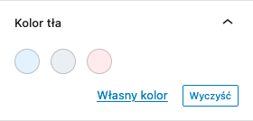

W ostatniej części tej serii, zbudowaliśmy podwaliny pod funkcjonalne elementy naszego panelu bocznego. Dziś dodajmy do niego 2 komponenty, aby mieć z niego prawdziwy pożytek!

A komponenty te, to wybierak kolorów, który posłuży do zmiany koloru tła oraz pole zakresu - ono z kolei pozwoli nam zmienić margines wewnętrzny tworzonego przez nas spisu treści.

Oba te elementy zrealizujemy dzięki wbudowanym już w Gutenberga komponentom. Lećmy 🎉

## Po pierwsze - kolorki!

Idealnym sposobem na pozwolenie osobie korzystającej z naszego bloku edytować tło spisu treści, będzie komponent o nazwie `<ColorPalette />`.

Pierwsza rzecz, którą zrobimy, aby z niego skorzystać, to oczywiście zaimportowanie go na górze pliczku z niestandardowym blokiem Gutenberga:

```jsx
import { ColorPalette } from '@wordpress/components';
```

Razem z resztą zaimportowanych elementów, prezentować się on będzie w sposób następujący:

```jsx
import { registerBlockType } from '@wordpress/blocks';
import { RichText, BlockControls, InspectorControls } from '@wordpress/block-editor';
import { Toolbar, ToolbarButton, Icon, PanelBody, ColorPalette } from '@wordpress/components';
import { registerFormatType, toggleFormat } from '@wordpress/rich-text';
import { useSelect } from '@wordpress/data';
```

A użyjemy go w ramach panelu bocznego, który po ostatniej części tej serii, wygląda następująco:

```jsx
<PanelBody title="Tytuł pierwszej zakładki">
  <p>Treść pierwszej zakładki</p>
</PanelBody>
<PanelBody title="Tytuł drugiej zakładki">
  <p>Treść drugiej zakładki</p>
</PanelBody>
```

Usuńmy drugą zakładkę, a pierwszą zamieńmy na coś takiego:

```jsx
<PanelBody title="Kolor tła">
  <ColorPalette
    colors={[
      { name: 'Niebieski', color: '#E3F2FD' },
      { name: 'Niebieski - przydymiony', color: '#ECEFF1' },
      { name: 'Czerwony', color: '#FFEBEE' },
    ]}
    value={backgroundColor}
    onChange={setBackgroundColor}
  />
</PanelBody>
```

Zaraz powiem Ci skąd bierzemy zmienną `backgroundColor` oraz funkcję `setBackgroundColor()`. Tymczasem warto powiedzieć, że to właśnie w ramach właściwości `colors` wrzucam wszystkie predefiniowane kolory, a dodatkowo w ramach samego wybieraka będę w stanie zaaplikować (jako administrator korzystający z naszego spisu treści) jakikolwiek kolor mi się żywnie podoba, bo po zastosowaniu powyższego kodu, sam wybierak wyglądać będzie następująco:



Jak widać, na dole mamy 2 przyciski - pierwszy pozwalający wybrać dowolny kolor ponad zdefiniowane oraz drugi, który umożliwia wyczyszczenie wybranego koloru (oczywiście już po tym, gdy jakiś kolor zostanie przez nas wybrany). W razie potrzeby, same przyciski jesteśmy w stanie schować za pomocą właściwości `disableCustomColors` i `clearable`:

```jsx
<ColorPalette
  // ...
  disableCustomColors={false}
  clearable={false}
/>
```

Domyślnie właściwości te są ustawione na `true`.

Okej - zdefiniujmy `backgroundColor` użyty wcześniej w propsie `value`. A zrobimy to w ramach nowego atrybutu (który później pobierzemy w metodzie `save()`).

```jsx
attributes: {
  // ...
  backgroundColor: {
    type: 'string',
  },
},
```

Warto to jeszcze pobrać w ramach metody `edit()`, razem z innymi:

```jsx
edit({ attributes, setAttributes }) {
    const { title, list, backgroundColor } = attributes;

  	// ...
```

I zaaplikować jego wartość dla elementu otulającego nasz spis treści, aby zmiany dokonane w ramach wybieraka, były od razu widoczne w panelu:

```jsx
return (
  <>
    <InspectorControls>
      <PanelBody title="Kolor tła">
        <ColorPalette
          colors={[
            { name: 'Niebieski', color: '#E3F2FD' },
            { name: 'Niebieski - przydymiony', color: '#ECEFF1' },
            { name: 'Czerwony', color: '#FFEBEE' },
          ]}
          value={backgroundColor}
          onChange={setBackgroundColor}
        />
      </PanelBody>
    </InspectorControls>
    <div class="table-of-contents-block" style={{
      backgroundColor: backgroundColor,
    }}>

    // ...
```

I dodatkowo, stwórzmy funkcję `setBackgroundColor()`, dzięki której będziemy mogli ten atrybut zmienić przy okazji zmiany koloru:

```jsx
function setBackgroundColor(newColor) {
  setAttributes({ backgroundColor: newColor });
}
```

Czy coś Ci ona przypomina? Na pewno może przypominać Ci 2 funkcje zadeklarowane obok niej w poprzednich częściach kursu: `setTitle()` i `setListContent()` - wszystkie one po prostu ustawiają wartość jednego z trzech przygotowanych przez nas atrybutów.

> Jeśli tworzysz spis treści równo ze mną, to na tym etapie sprawdź działanie dodanego wybieraka kolorów - powinien on w pełni działać, zmieniając tło naszego spisu treści w samym edytorze.
>
> Ale nie zmienia on w żaden sposób front-endu, co oznacza, że musimy dodać obsługę tego koloru również w metodzie `save()`!

Na koniec, aby zastosować zmiany na front-endzie, zedytuję metodę `save()` w następujący sposób:

```jsx
save({ attributes }) {
  const { title, list, backgroundColor } = attributes;

  return (
    <div class="table-of-contents-block" style={{
      backgroundColor: backgroundColor,
    }}>
      <RichText.Content tagName="h2" value={title} />
      <RichText.Content tagName="ol" value={list} />
    </div>
  );
},
```

Po tym co udało nam się już zrobić, ten kod powinien być dla Ciebie jasny. Jedyne co, to warto skrócić lekko zapis w propsie `style`, bo gdy w JavaScriptcie przypisujemy do pola zmienną o takiej samej nazwie co samo pole, to wystarczy, że nazwę tę zapiszemy tylko jeden raz:

```jsx
save({ attributes }) {
  const { title, list, backgroundColor } = attributes;

  return (
    <div class="table-of-contents-block" style={{
      backgroundColor,
    }}>
      <RichText.Content tagName="h2" value={title} />
      <RichText.Content tagName="ol" value={list} />
    </div>
  );
},
```

Tak samo oczywiście warto zrobić w funkcji `edit()`:

```jsx
return (
  <>
    <InspectorControls>
      <PanelBody title="Kolor tła">
        <ColorPalette
          colors={[
            { name: 'Niebieski', color: '#E3F2FD' },
            { name: 'Niebieski - przydymiony', color: '#ECEFF1' },
            { name: 'Czerwony', color: '#FFEBEE' },
          ]}
          value={backgroundColor}
          onChange={setBackgroundColor}
        />
      </PanelBody>
    </InspectorControls>
    <div class="table-of-contents-block" style={{
      backgroundColor,
    }}>

    // ...
```

I tak oto, wybór tła naszego spisu treści działa! Możemy teraz przejść do analogicznej funkcji - pola, które przejmie kontrolę nad marginesem wewnętrznym owego spisu treści.

## To teraz dodajmy możliwość zmiany paddingu!

W tym przypadku przez całość przejdę trochę szybciej, bo spora ilość kroków, po prostu się powtórzy.

Potrzebujemy kolejnego komponentu. Tym razem, choć idealnym kandydatem do tego zadania, byłby [`<DimensionControl />`](https://github.com/WordPress/gutenberg/tree/trunk/packages/components/src/dimension-control), to ja skorzystam z `<RangeControl />` z racji, że w momencie gdy piszę te słowa, `<DimensionControl />` cały czas jest w fazie eksperymentalnej i nie chcę, aby zapisy na jego temat za chwilkę przestały być aktualne.

Wobec tego, dodajemy `<RangeControl />` do reszty importów:

```jsx
import { registerBlockType } from '@wordpress/blocks';
import { RichText, BlockControls, InspectorControls } from '@wordpress/block-editor';
import {
  Toolbar,
  ToolbarButton,
  Icon,
  PanelBody,
  ColorPalette,
  RangeControl,
} from '@wordpress/components';
import { registerFormatType, toggleFormat } from '@wordpress/rich-text';
import { useSelect } from '@wordpress/data';
```

I użyjmy go obok wybieraka kolorów:

```jsx
<InspectorControls>
  // ...
  <PanelBody title="Odstęp wewnętrzny">
    <RangeControl value={padding} onChange={setPadding} initialPosition={0} />
  </PanelBody>
</InspectorControls>
```

Dodajemy atrybut `padding`:

```jsx
attributes: {
  // ...
  padding: {
    type: 'number',
  },
},
```

Pobierzmy go w metodach `edit()` i `save()`:

```jsx
const { title, list, backgroundColor, padding } = attributes;
```

Dodajmy do stylów kontenera, trzymającego nasz spis treści:

```jsx
<div
  class="table-of-contents-block"
  style={{
    backgroundColor,
    padding,
  }}
>
  // ...
</div>
```

I stwórzmy funkcję go aktualizującą:

```jsx
function setPadding(newPadding) {
  setAttributes({ padding: newPadding });
}
```

I mamy to 🥳

Od tej chwili jesteśmy w stanie zmieniać `padding` naszego spisu treści. Oczywiście jeśli Ty w swoim niestandardowym bloku Gutenberga chcesz pozwolić na definiowanie odstępów z każdej strony z osobna, to możesz utworzyć 2 lub 4 osobne pola, które administratora danej strony na WordPressie będzie w stanie zmieniać!

## I kilka słów na koniec!

Od teraz, w ramach stworzonego spisu treści, w bardzo przyjemny sposób jesteśmy w stanie zmienić kolor tła oraz odstęp wewnętrzny całej treści naszego bloku:


Tą częścią chciałem pokazać Ci, w jak prosty sposób możemy dostosować możliwości edycji tworzonych przez nas bloków!

W połączeniu z na przykład [blokami zagnieżdżonymi](https://developer.wordpress.org/block-editor/how-to-guides/block-tutorial/nested-blocks-inner-blocks/), daje nam to ogromne możliwości i to za małą cenę, patrząc na to, jak wiele rzeczy możemy stworzyć na bazie istniejących komponentów, wbudowanych w Gutenberga.

I co na koniec chce Ci powiedzieć, to to, że dziś wyjątkowo pozostawię Cię bez zadania domowego 😌 Następna część tego kursu, będzie prawdopodobnie ostatnią - pokażę Ci w niej, czego możesz się uczyć, aby wykorzystać zdobyte w ramach tej serii solidne podstawy, a dzięki zdobytej wiedzy tworzyć już bardziej skomplikowane bloki i komponenty.

Także do zobaczenia właśnie w niej - 10 części serii o tworzeniu własnych bloków Gutenberga!

PS. Kod z tej części, oczywiście znajdziesz [na moim GitHubie](https://github.com/robert-orlinski/gutenberg-blocks-course-files/tree/009) 🎉
