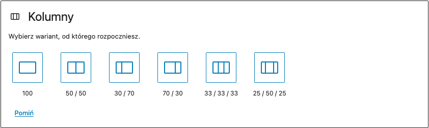
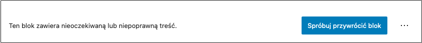

Nastał czas, aby w (mam nadzieję) sensowny sposób zakończyć serię o tworzeniu własnych bloków Gutenberga.

Ale z racji że podstawy, które przekazałem Ci w jej ramach, nie są wszystkim, co można zrobić w tej technologii, to w części, którą właśnie czytasz, przedstawię Ci tematy, których będziesz musiała lub musiał się nauczyć, aby robić po prostu większe rzeczy w Gutenbergu ✨

Oto ich lista:

## Bloki zagnieżdżone

Jak sama nazwa wskazuje - są to bloki Gutenberga, które mogą pełnić rolę kontenera na inne, podobne im bloki. Idealnym przykładem, wbudowanym w Gutenberga od jego początków, są kolumny:

Tworząc z kolei własne bloki zagnieżdżone, jesteśmy w stanie wybrać to, jakie elementy możemy później do nich wrzucić oraz na ich bazie tworzyć całe szablony, które będą wymuszać na nas użycie konkretnych bloków, w ustalonych przez nas miejscach.

Zakładam, że masz wiedzę z ostatnich 9 części tego kursu, więc najlepszym miejscem dla Ciebie, aby poczytać więcej na temat bloków zagnieżdżonych, będzie po prostu oficjalna dokumentacja Gutenberga:

> [Bloki zagnieżdżone - więcej informacji](https://developer.wordpress.org/block-editor/how-to-guides/block-tutorial/nested-blocks-inner-blocks/)

## Transformacje

Każda osoba, która od pewnego czasu pracuje z Gutenbergiem (czy to od strony edytorskiej, czy programistycznej) wie, że bloki możemy przemieniać w inne, wg reguł wbudowanych w Gutenberga lub utworzonych przez nas - programistów.

I właśnie tego drugiego - definiowania transformacji istniejących, jak i niestandardowych bloków na pewnym etapie przyjdzie Ci się nauczyć.

Po więcej odsyłam Cię do dokumentacji:

> [Transformacje - więcej informacji](https://developer.wordpress.org/block-editor/reference-guides/block-api/block-transforms/)

## Różnice pomiędzy blokami statycznymi, a dynamicznymi

Nie wspominałem o tym w serii, ale front-endu naszych bloków nie musimy zawsze definiować w Reactcie, a możemy zrobić to również w PHP - właśnie za sprawą tak zwanych bloków dynamicznych.

Nie korzysta się z nich zbyt często, bo bloki dynamiczne mają trochę ograniczeń, ale w dwóch przypadkach sprawdzają się świetnie:

- Gdy musimy wyświetlić informacje stricte dynamiczne, zaciągając je ówcześnie z API, bazy danych itp.
- Gdy często edytujemy kod danego bloku, bo z racji, że bloki dynamiczne nie zapisują kodu HTML w bazie danych (tak jak robią to statyczne - więcej na ten temat wspominałem w [części 3 tego kursu](/wordpress-gutenberg-003)), a tylko konkretne wartości, z których później korzysta kod PHP. Dzięki temu unikamy błędu, z którym na pewno miałeś lub miałaś okazję spotkać się już na swojej drodze z Gutenbergiem:

> [Bloki dynamiczne - więcej informacji](https://developer.wordpress.org/block-editor/how-to-guides/block-tutorial/creating-dynamic-blocks/)

## Full-site editing

Możliwość pełnej edycji strony na WordPressie za pomocą Gutenberga, a nie tylko stron i wpisów w obszarze, w ramach którego na to pozwolimy, to coś co od wielu, wielu miesięcy rozwijane jest przez zespół odpowiedzialny za Gutenberga, jak i przez pomagających im kontrybutorów.

Prędzej czy później może stać się to standardem, dlatego jeśli już teraz chcesz tworzyć edytowalne strony na WordPressie, które w 100% bazują na Gutenbergu, to dobrym startem będą:

> [Simple Site Design with Full Site Editing](https://learn.wordpress.org/course/simple-site-design-with-full-site-editing/) > [Full Site Editing - overview](https://developer.wordpress.org/block-editor/getting-started/full-site-editing/) > [Site Editor](https://wordpress.org/support/article/site-editor/)

## Wszelkie pozostałe, wbudowane w Gutenberga komponenty

Podczas kursu, poznaliśmy tylko kilka z nich, a w obecnej wersji Gutenberga (12.4.1) mamy ich kilkadziesiąt. I tak wiem - w jednej z poprzednich części serii podsyłałem Ci link do ich listy, ale w razie potrzeby robię to ponownie, abyś mógł lub mogła łatwo do tego wrócić.

> [Lista wszystkich komponentów wbudowanych w Gutenberga](https://github.com/WordPress/gutenberg/tree/trunk/packages/components/src)

## JavaScript (ES6+)

Bloki i komponenty Gutenberga tworzy się przede wszystkim w JavaScriptcie, dlatego aby pracować z nim efektywnie, warto naprawdę dobrze poznać ten język oraz wszelkie nowości, które przychodzą do nas z nowymi wersjami ECMAScript.

Jeśli czujesz, że trochę rzeczy w JSie pozostaje dla Ciebie nieznanych, to mogę polecić Ci przede wszystkim te 2 miejsca w sieci, z których prawdopodobnie dowiesz się najprawdopodobniej wszystkiego, czego potrzebujesz:

> [KursJS.pl](http://kursjs.pl/) > [Dokumentacja MDN](https://developer.mozilla.org/en-US/docs/Web/javascript)

## React i Redux

I ostatnia rzecz, której wg mnie warto się nauczyć, to React, w ramach którego składni tak naprawdę tworzymy nasze bloki!

Czy to wykorzystywany JSX, czy to hooki, czy to operacje na stanie naszego bloku za pomocą atrybutów - to wszystko pod spodem bazuje na Reactcie i zrozumienie tej biblioteki daje nieporównywalnie większe pojęcie o tym, co my w ramach tych niestandardowych bloków robimy.

Dodatkowo, warto zapoznać się z działaniem Reduxa, który nie uważam, że jest aż tak niezbędny jak znajomość składni Reacta, ale na pewno jest w stanie dać nam sporo dodatkowego zrozumienia, czego przykład pokazywałem w [odcinku 8 tej serii (dokładnie wersji wideo)](https://www.youtube.com/watch?v=a6CtXekVir8) - tam również wspominałem sporo o Reactcie i Reduxie per se.

Gdy mówimy o nauce Reacta, to tak jak wspominałem również w części 8, jestem ogromnym fanem oficjalnej dokumentacji Reacta:

> [Dokumentacja Reacta](https://reactjs.org/docs/getting-started.html)

A jeśli chodzi o Reduxa, to tutaj podobnie polecam Ci dokumentację, jak i jeden film na YouTubie, który świetnie wprowadzi ten temat (dobrze jest obejrzeć go przed zajrzeniem do dokumentacji, bo zrozumienie Reduxa nie jest czymś, co zawsze przychodzi od ręki).

> [Redux For Beginners | React Redux Tutorial](https://www.youtube.com/watch?v=CVpUuw9XSjY) > [Dokumentacja Reduxa](https://redux.js.org/introduction/getting-started)

## Posłowie

I to tyle ode mnie na dziś! Dziękuję Ci bardzo za te 10 części i mam nadzieję, że dały Ci one solidny wstęp do świata Gutenberga i lepsze zrozumienie, co było moim celem, motywującym do stworzenia tej serii.

Trzymam kciuki za to, że będziesz się rozwijać i tworzyć naprawdę duże rzeczy - w Gutenbergu, jak i ogólnie - jako programista lub programistka 🚀

Jeśli chcesz dodać coś od siebie, to zawsze zapraszam Cię do wysłania mi maila na [kontakt@robertorlinski.pl](mailto:kontakt@robertorlinski.pl) - chętnie dowiem się o Twoich wrażeniach po całej serii c:

Do usłyszenia przy okazji innych materiałów!
