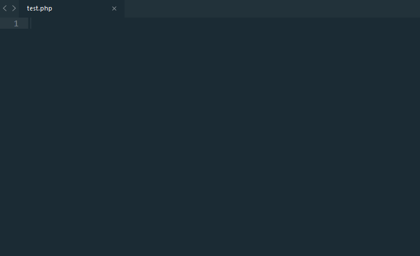
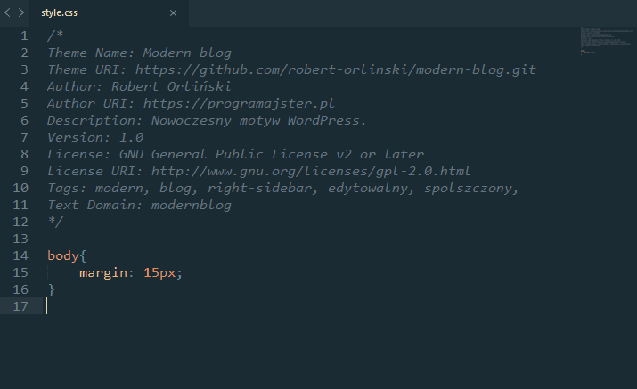
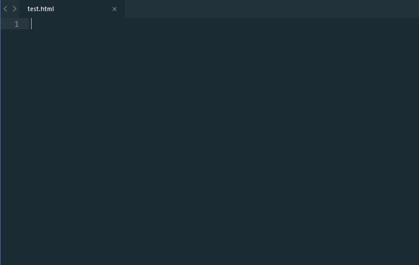
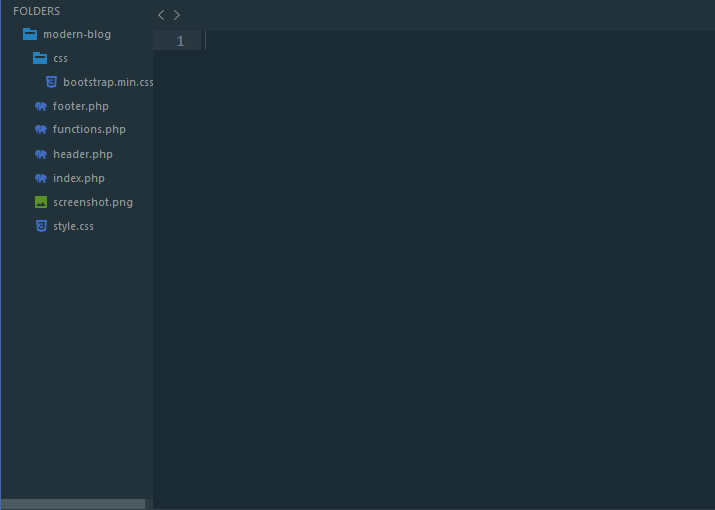

Dziś kontynuujemy temat, [rozpoczęty w jednym z ostatnich wpisów](./motywy-do-sublime-text-3), czyli dodatki do edytora Sublime Text 3. Wtedy były to motywy, dziś omówione zostaną wtyczki! :)

Poznasz dziś 7 najróżniejszych rozszerzeń, które sprawią, że Twoja praca stanie się znaczenie przyjemniejsza i bardziej efektywna. Zaczynajmy!

## 1. Package Control, czyli jak instalować wtyczki

Link do wtyczki: [Package Control](https://packagecontrol.io/).

Jest to narzędzie, które pozwala nam w bardzo prosty sposób dołączać wszelkie rozszerzenia. W celu zapoznania się ze sposobem jego instalacji, zapraszam Cię do [wpisu o motywach](./motywy-do-sublime-text-3). Tam wyjaśniłem wszystko krok po kroku :)

## 2. Emmet

Link do wtyczki: [Emmet](https://packagecontrol.io/packages/Emmet)

Tej wtyczki chyba nie trzeba nikomu przedstawiać. Świetne narzędzie, które sprawia, że nasza praca staje się znaczenie przyjemniejsza i bardziej efektywna.

Swoją drogą na [stronie Emmeta](https://docs.emmet.io/), możesz dowiedzieć się o wszystkich możliwościach, jakie oferuje sama wtyczka.

## 3. Git

Link do wtyczki: [Git](https://packagecontrol.io/packages/Git)

Świetna wtyczka, która integruje nasz edytor z systemem kontroli wersji, jakim jest właśnie Git. Wystarczy wejść w konsolę Siblime\'a (`Ctrl + Shift + P` lub `Cmd + Shift + P`) i już można cieszyć się wszystkimi poleceniami znanymi z Gita, w naszym edytorze!

## 4. Minify

Link do wtyczki: [Minify](https://packagecontrol.io/packages/Minify)

Kolejne rozszerzenie, które przenosi funkcjonalności innych programów prosto do naszego edytora! Wystarczy wejść w konkretny plik, wybrać z menu kontekstowego (po naciśnięciu prawym przyciskiem myszy) odpowiednią opcję albo wcisnąć jedną z następujących kombinacji klawiszy:

- `Ctrl + Alt + M` (`Cmd + Alt + M` dla Maców) - w ten sposób minifikujemy zawartość konkretnego pliku.
- `Ctrl + Alt + Shift + M` (`Cmd + Alt + Shift + M` dla Maców) - z kolei tak możemy nasz kod upiększyć.

## 5. Placeholders

Link do wtyczki: [Placeholders](https://packagecontrol.io/packages/Placeholders)

Rozszerzenie to pozwala nam na bardzo szybkie tworzenie tzw. dummy contentu, czyli przykładowych grafik oraz tekstu. Całość posiada relatywnie dużo opcji oraz działa w bardzo prosty sposób na zasadzie podpowiedzi do kodu.

## 6. ColorPicker

Link do wtyczki: [ColorPicker](https://packagecontrol.io/packages/ColorPicker)

Bardzo prosty dodatek, który po wciśnięciu kombinacji klawiszy `Ctrl + Shift + C` (`Cmd + Shift + C` na Macu) ukazuje nam nowe okienko, z którego możemy pobierać kolory.

## 7. Advanced​NewFile

Link do wtyczki: [Advanced​NewFile](https://packagecontrol.io/packages/AdvancedNewFile)

Ostatni już dodatek, który potrafi znacznie usprawnić proces tworzenia nowych plików w naszym projekcie. Wszystko odbywa się z poziomu konsoli, którą wywołujemy za pomocą skrótu klawiszowego `Ctrl + Alt + N` (`Cmd + Alt + N` dla Maców).

## Podsumowanie

Tak prezentuje się moje, bądź co bądź krótkie zestawienie najlepszych wtyczek do edytora tekstu, jakim jest Sublime Text 3. Mam nadzieję, że poznałeś dziś coś nowego!
