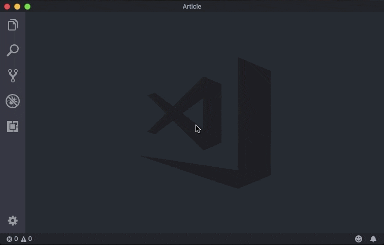
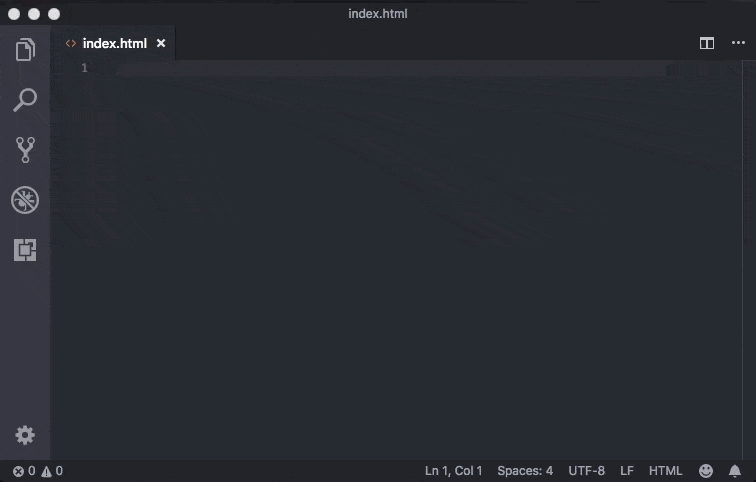
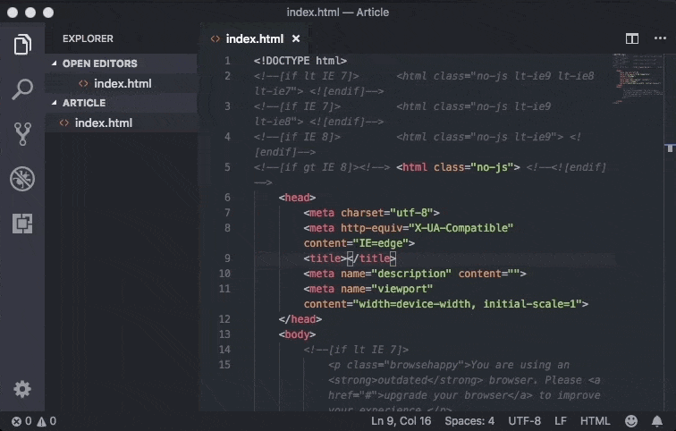
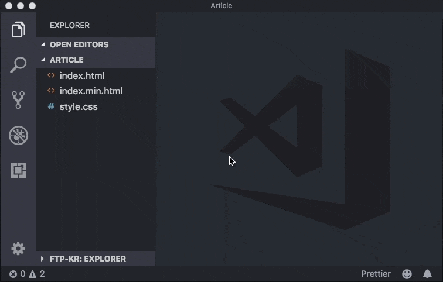
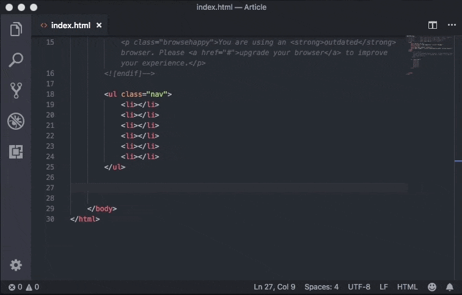
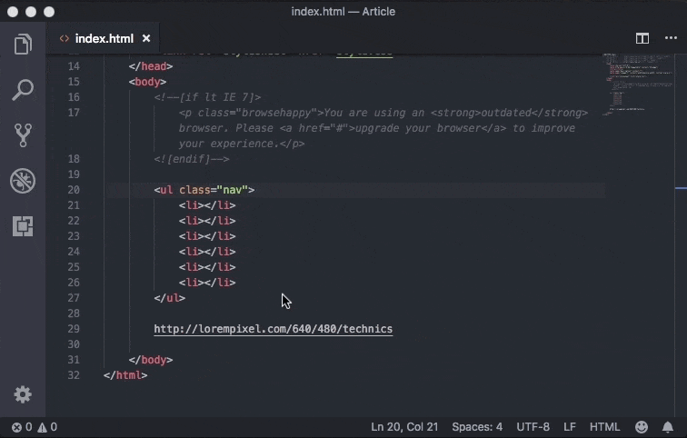
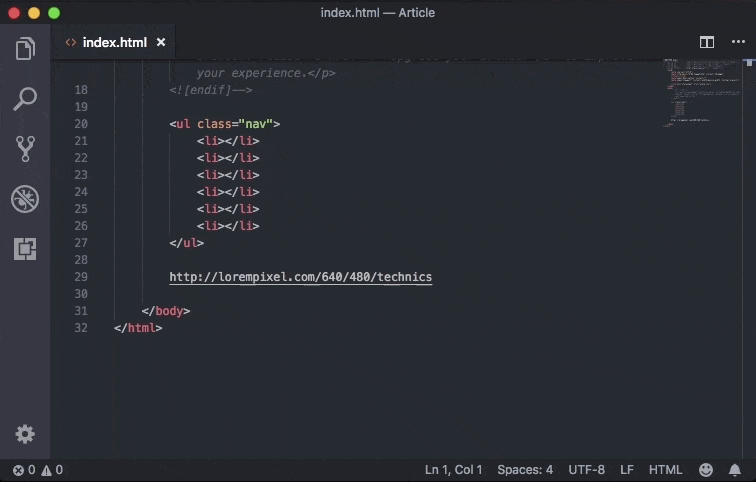
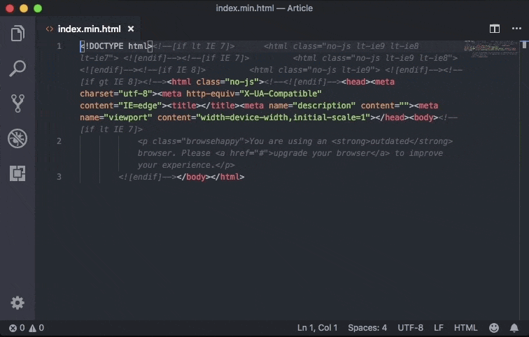
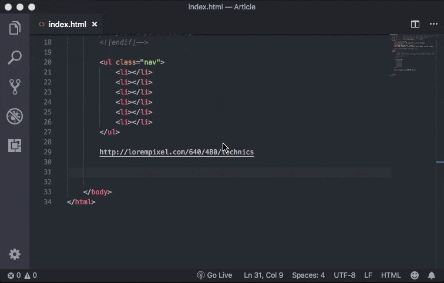
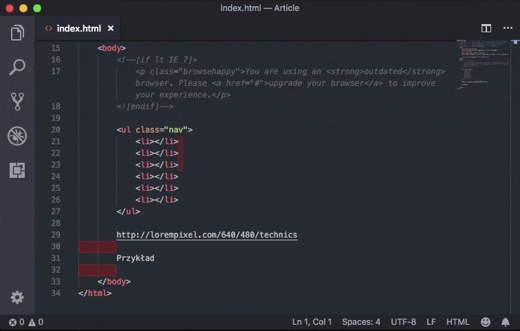

Prawie rok temu powstał wpis, w którym wymieniałem 7 wtyczek do edytora Sublime Text 3. Od tego czasu sporo się zmieniło, między innymi aplikacja, z której korzystam, bo już jakiś czas temu przesiadłem się na zyskujący obecnie najwięcej popularności twór Microsofu - Visual Studio Code.

Dlatego w tym wpisie chciałbym przekazać Ci 10 bardzo przydatnych dodatków, które umilają mi codzienną pracę z tym oprogramowaniem oraz sprawiają, że staje się bardziej efektywna. Zapraszam do lektury!

## Może na początku powiedzmy sobie jak w ogóle instalować dodatki:

W przypadku tego edytora jest znacznie prościej niż to miało miejsce w Sublime\'ie. Wystarczy, że klikniemy na ostatnią ikonę na bocznym pasku i po wysunięciu się panelu wpiszemy nazwę konkretnego dodatku.

Gdy znajdziemy pożądaną wtyczkę klikamy `Install`, po czym zostaje ona zainstalowana. Jedyne co nam pozostaje, to ponowne załadowanie edytora. Cały proces możesz zobaczyć na poniższym GIFie:

I to w sumie tyle, przejdźmy może do ciekawszej części czyli konkretnych dodatków!

## 1. [HTML Boilerplate](https://marketplace.visualstudio.com/items?itemName=sidthesloth.html5-boilerplate)

Jak widać, mamy do czynienia z bardzo prostą wtyczką, która pozwala nam na dodanie zestawu podstawowych tagów HTML do obecnie edytowanego pliku od razu po wpisaniu frazy _html_ oraz wybraniu opcji `html-boilerplate`.

## 2. [Minify](https://marketplace.visualstudio.com/items?itemName=HookyQR.minify)

Świetny plugin umożliwiający nam minifikację plików HTML, CSS oraz JavaScript. Po pojawieniu się konsoli (Ctr/Cmd + Shift + P) wpisujemy `>minify` i klikamy enter. Otrzymujemy nowy plik z końcówką `.min`, umieszczony w tym samym katalogu, co nasz oryginał.

## 3. [Ftp-kr](https://marketplace.visualstudio.com/items?itemName=ruakr.ftp-kr)

Bardzo dobry dodatek pozwalający nam na łatwą integrację z serwerem FTP. Oczywiście po odpowiedniej konfiguracji przedstawionej w załączonym GIFie.

## 4. [Vscode-faker](https://marketplace.visualstudio.com/items?itemName=deerawan.vscode-faker)

Kolejny świetny plugin, który tym razem pozwala nam na szybkie dodawanie przykładowej zawartości do naszych stron internetowych. Zaczynając od standardowego tekstu `lorem ipsum`, przez zdjęcia, a kończąc na adresach oraz wielu, wielu innych.

## 5. [CSS Peek](https://marketplace.visualstudio.com/items?itemName=pranaygp.vscode-css-peek)

Swego czasu zdarzyło mi się korzystać z edytora o nazwie Brackets, który miał bardzo ciekawą funkcję, a mianowicie bardzo szybki dostęp do styli CSS konkretnego selektora. Na szczęście w VS Code możemy korzystać z czegoś zbliżonego dzięki omawianemu dodatkowi.

Po instalacji CSS Peek, wystarczy, że przyciśniemy Control (lub Cmd w przypadku Maców) i najedziemy kursorem na konkretny element HTML, a pokażą się jego style. Z kolei po kliknięciu zostajemy przeniesieni do pliku CSS (tak jak to z resztą zostało pokazane na załączonym GIFie).

## 6. [Open in browser](https://marketplace.visualstudio.com/items?itemName=techer.open-in-browser)

Dość prosta wtyczka pozwalająca nam na bardzo szybkie otwieranie aktualnie edytowanego pliku w przeglądarce. W zależności od konkretnej opcji witryna uruchomi się w domyślnej lub wybranej przez nas przeglądarce.

## 7. [Prettier - Code formatter](https://marketplace.visualstudio.com/items?itemName=esbenp.prettier-vscode)

Bardzo potężny a jednocześnie niezwykle prosty w obsłudze dodatek, który za pomocą jednego polecenia lub nawet skrótu klawiszowego (Shift + Alt + F) pozwala nam na bardzo ładne formatowanie kodu HTML, CSS, JavaScript oraz TypeScript.

## 8. [Live Server](https://marketplace.visualstudio.com/items?itemName=ritwickdey.LiveServer)

Dla osób, które nie chcą korzystać z Gulpa przydatnym może okazać się Live Server, który w bardzo prosty sposób pozwala nam na edytowanie plików bez odświeżania przeglądarki.

## 9. [Trailing Spaces](https://marketplace.visualstudio.com/items?itemName=shardulm94.trailing-spaces)

Bardzo przyjemne narzędzie, które podświetla nam niepotrzebne spacje w kodzie oraz pozwala na ich łatwą eliminację.

## 10. [Atom One Dark Theme](https://marketplace.visualstudio.com/items?itemName=akamud.vscode-theme-onedark)

Ostatnia pozycja to niestandardowy dodatek, a dokładnie motyw. Wg mnie najładniejsza nakładka na nasz edytor, sprawiająca, że ten przypomina edytor Atom. Swoją drogą wszystkie media widoczne w tym artykule zostały przygotowane właśnie na tym motywie!

## Podsumowanie

Tak oto doszliśmy do końca naszego zestawienia. Mam nadzieję, że jak najwięcej z wymienionych dodatków okaże się dla Ciebie przydatne i umili codzienną pracę!
